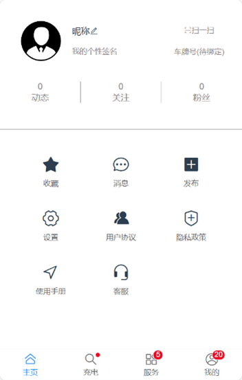

# 🛡️ 测试分析报告

## 1 引言

### 1.1 项目信息

易拜 E-bike 项目诞生于大学校园内电动车使用管理的迫切需求之中，旨在解决充电桩与停车位紧缺、购车渠道可信度与性价比问题，以及电动车安全事故频发等挑战。通过开发一款全新的软件平台，该项目不仅致力于解决大学生校内电动车交易、充电、维护等难题，还积极响应了大学生对电动车相关问题交流的强烈需求。该软件平台功能全面，涵盖了电动车买卖、充电桩状态查询、车友交流以及不文明行为反馈等实用功能，并通过精细化的用户体验优化，力求成为大学校园内电动车使用管理的首选工具。

本次软件测试报告聚焦于易拜 E-bike的1.0版本的全面测试。

### 1.2 测试目的

本次测试的主要目的是全面评估易拜 E-bike 1.0 版本的各项功能和性能，以确保软件能够满足用户需求并稳定、安全地运行。

具体而言，本次测试旨在验证软件的功能是否符合设计要求，发现并解决各单元潜在的错误和问题，同时验证接口的正确性、数据的一致性和完整性，以及各组件的集成运行状态。此外，也聚焦于软件的性能、可靠性、稳定性和安全性，以及软件的可用性，确保软件在实际使用中能够提供流畅、稳定且安全的服务，为用户带来良好的使用体验。

### 1.3 测试范围

|   模块   |         功能         |
| :----: | :----------------: |
|  主页-广场 |        主页-广场       |
|  主页-热榜 |    用于展示当前热度较高帖子    |
| 主页-搜索栏 |      用于进行关键词搜索     |
|   充电   |   用于查看当前各充电桩充电状态   |
| 服务-易维修 |   用于进行电动车上门维修服务预约  |
| 服务-易反馈 | 用于向保卫处方反馈消防安全及违停问题 |
| 服务-易安行 |     用于发布电动车安全信息    |
| 服务-易转让 |      用于进行二手车交易     |
|   我的   |   用于设置个人信息及软件设置设定  |

## 2 测试概况

### 2.1 测试执行概括

本次对本次对易拜 E-bike 1.0 版本的测试执行已全面完成，整个测试过程严格按照测试计划进行，时间范围覆盖了从系统开发到上线前（2024.4.3-2024.5.20）的所有关键阶段。

本次测试团队包含两人：黄楚丹和吴恺云。黄楚丹作为测试计划制定的主要责任人，负责全面规划和管理测试活动，重点聚焦于后端测试，确保后端功能的稳定性和性能达标；吴恺云作为测试过程的主要负责人，专注于前端测试和用户测试，确保用户界面的流畅性和用户体验的优质性。

测试计划的执行过程包括了功能性测试和非功能性测试两个方面。在功能性测试方面，着重验证了软件功能是否符合用户需求，对各个功能单元进行了详尽的测试，并发现了多个潜在错误和问题，及时与开发团队沟通并进行了修复。同时，还验证了接口的正确性、数据的一致性和完整性，以及各组件的集成运行状态，确保软件在功能上能够正常运行并满足设计要求。

在非功能性测试方面，重点关注了软件的性能、可靠性、稳定性和安全性。通过模拟各种实际使用场景，我们测试了软件的响应时间、吞吐量、并发处理能力等性能指标，并验证了软件在异常情况下的稳定性和可靠性。此外，我们还对软件的安全性进行了测试，确保用户数据的安全和隐私得到保护。

总体而言，本次测试执行顺利，测试计划得到了有效的执行，测试过程全面而深入，并及时发现和修改了相关问题，为易拜 E-bike 1.0 版本的上线提供了有力的保障。

### 2.2 测试结果概览

前端测试执行情况：

* 总测试用例数：80
* 通过的测试用例数：80
* 失败的测试用例数：0
* 测试所用设备数：6
* 通过设备数：6
* 测试执行时间：2024/5/15\~2024/5/17

本次测试发现，绝大部分功能表现良好，兼容性和并发性表现佳。但在显示细节仍存在部分bug，不影响功能实现。已通知开发团队修复已知缺陷，并对相关模块进行进一步的测试以确保稳定性。

后端测试执行情况：

* 总测试用例数：200
* 通过的测试用例数：190
* 失败的测试用例数：10
* 测试执行时间：2024/5/15\~2024/5/17

本次测试发现，绝大部分功能表现良好，但在“易安行”、“主页-广场”和“主页-热搜”功能中存在一些问题。已通知开发团队修复已知缺陷，并对相关模块进行进一步的测试以确保稳定性。

用户测试执行情况：

* 测试用户数：10
* 测试执行时间：2024/5/17\~2024/5/22

本次测试发现，用户反映良好，所提供用户手册及设计界面可以保证用户在理想时间内以理想使用感完成相关操作。

## 3 环境配置

* 设备1

| 设备品牌、型号 | 华为 MateBook X Pro 2021                             |
| ------- | -------------------------------------------------- |
| CPU个数   | 1 （11th Gen Intel(R) Core(TM) i7-1165G7 @ 2.80GHZ） |
| 物理核心数   | 4                                                  |
| 内存      | 512G                                               |
| 操作系统    | Windows 10家庭版64 位                                  |

* 设备2

| 设备品牌、型号 | HP ENVY x360 Convertible 13-ag0xxx                        |
| ------- | --------------------------------------------------------- |
| CPU个数   | 1（AMD Ryzen 3 2300U with Radeon Vega Mobile Gfx 2.00 GHz） |
| 物理核心数   | 4                                                         |
| 内存      | 512G                                                      |
| 操作系统    | Windows 10家庭版64 位                                         |

* 设备3

| 设备品牌、型号 | 华为 Mate30 Pro       |
| ------- | ------------------- |
| 内存      | 256G                |
| 操作系统    | HarmonyOS 4.0.0.116 |

* 设备4

| 设备品牌、型号 | Apple iPhone 12 MGH13CH/A |
| ------- | ------------------------- |
| 内存      | 256G                      |
| 操作系统    | iOS 17.4.1                |

* 设备5

| 设备品牌、型号 | Xiaomi Pad 5                   |
| ------- | ------------------------------ |
| 内存      | 6.0GB/128GB                    |
| 操作系统    | Xiaomi HyperOS 1.0.2.0.TKXCNXM |

* 设备6

| 设备品牌、型号 | Apple iPad Pro 11 |
| ------- | ----------------- |
| 内存      | 512G              |
| 操作系统    | iOS 17.4.1        |

## 前端测试分析

## 4 前端测试分析

在前端测试分析中，我们严谨地执行了测试计划，站在使用者的角度对易拜 E-bike 1.0 版本的前端功能、性能、兼容性等方面进行了全面而细致的测试。以下是测试执行情况和结果的详细概述。

### 4.1 功能测试

**4.1.1** **测试概述**

在功能测试方面，我们按照测试计划深入执行了一系列全面的测试流程，以确保易拜 E-bike 1.0 的前端功能稳定且符合用户需求。首先，我们通过模拟用户实际使用场景，对程序界面上的每一个功能点进行了详细的点击测试，确保点击后能够正确弹出对应的窗口，并允许用户输入相应的值。这不仅涵盖了基础功能的验证，也包括了交互逻辑和流程的完整性检查。

在初步的手机端测试完成后，我们进一步通过电脑端网页访问，对前端功能进行了深入的后端验证。这一步骤是为了确保在功能实现过程中，前端与后端的数据交互准确无误，不存在潜在的报错、乱码等风险。通过仔细查看后台数据，我们确保每一次操作都能在后端得到正确的响应和处理，从而进一步保证了功能的稳定性和可靠性。

**4.1.2** **测试内容及结果**

| 模块          | 测试内容描述                                          | 测试用例（部分）                                                                               | 测试结果 |
| ----------- | ----------------------------------------------- | -------------------------------------------------------------------------------------- | ---- |
| 首页-搜索       | 在搜索框内输入搜索内容测试是否能正确搜索                            | <p>(1)  常用字段，如“电动车”</p><p>(2)  超长搜索关键词（超过系统限制的最大字符数）</p><p>(3)  特殊字符</p><p>(4)  空白</p> | 通过   |
| 首页-搜索-搜索历史  | 验证搜索历史功能是否能正确显示用户之前搜索过的关键词，并且点击历史记录能正确跳转至相关搜索结果 | <p>(1)  搜索历史中的某一项</p><p>(2)  历史中的非法链接</p><p>(3)  进行多次搜索操作，查看历史是否按照预期进行滚动更新</p>         | 通过   |
| 首页-广场-帖子    | 验证帖子列表中的帖子是否能正常点击并展示帖子详情                        | -                                                                                      | 通过   |
| 首页-广场-帖子-评论 | 验证用户是否能在帖子详情页正常发表评论，并且评论内容能正确展示                 | <p>(1)  常用字段</p><p>(2)  超长评论内容</p><p>(3)  无效内容</p>                                     | 通过   |
| 首页-热榜-车型评分榜 | 验证车型评分榜是否能正常点击，并且能展示详细的车型评分信息，用户是否能正常进行评分操作     | -                                                                                      | 通过   |
| 首页-热榜-品牌热度榜 | 验证品牌热度榜是否能正常点击，并且能展示详细的品牌热度信息，用户是否能正常进行评分操作     | -                                                                                      | 通过   |
| 刷新测试        | 验证页面刷新是否影响当前功能                                  | -                                                                                      | 不通过  |
| 充电-公告栏      | 测试是否能正确查看公告栏信息                                  | -                                                                                      | 通过   |
| 充电-图片       | 验证充电模块是否能正常点击对应充电柜，并展示相关的充电信息                   | -                                                                                      | 通过   |
| 服务-易维修      | 验证用户是否能正常发布维修预约信息，并且能查看商家的回复消息                  | <p>(1) 常用字段</p><p>(2) 无效的维修预约信息（如空字段、非法时间等）</p><p> </p>                                | 通过   |
| 服务-易反馈      | 验证用户是否能正常提交反馈信息，并且系统能正确处理                       | <p>(1) 常用字段</p><p>(2) 超长反馈信息</p><p>(3) 无效内容</p>                                        | 通过   |
| 服务-易安行      | 验证安全信息模块是否能正常展示，用户是否能正常查看安全信息                   | -                                                                                      | 通过   |
| 服务-易转让      | 验证二手信息模块是否能正常显示，用户可以浏览二手物品信息                    | -                                                                                      | 通过   |
| 服务-易转让-购买   | 验证用户是否能正常下单购买二手物品，并显示正确的购买流程                    | <p>(1) 购买已售罄的二手物品</p><p>(2) 使用无效的支付方式进行购买</p>                                          | 通过   |
| 我的-动态       | 验证用户是否能正常查看自己已发布的动态                             | -                                                                                      | 通过   |
| 我的-关注       | 验证用户是否能正常查看自己所关注的其他用户                           | -                                                                                      | 通过   |
| 我的-粉丝       | 验证用户是否能正常查看关注自己的粉丝                              | -                                                                                      | 通过   |
| 我的-收藏       | 验证用户是否能正常收藏帖子，并在收藏夹中查看已收藏的帖子                    | -                                                                                      | 通过   |
| 我的-消息       | 验证用户是否能正常查看系统消息、评论回复等消息通知                       | <p>(1)  常用字段</p><p>(2)  超长内容</p><p>(3)  无效内容</p>                                       | 通过   |
| 我的-发布-发布动态  | 验证用户是否能正常发布新的动态，并显示在动态列表中                       | <p>(1)  常用字段</p><p>(2)  超长内容</p><p>(3)  无效内容</p>                                       | 通过   |
| 我的-发布-二手转让  | 验证用户是否能正常发布二手转让信息，并显示在二手转让列表中                   | <p>(1)  常用字段</p><p>(2)  超长内容</p><p>(3)  空白内容</p>                                       | 通过   |
| 我的-设置       | 验证用户是否能正常修改个人信息，包括昵称、头像等                        | <p>(1)  常用字段</p><p>(2)  超长内容</p><p>(3)  非法字符（特殊符号）</p><p>(4)  空白内容</p>                 | 通过   |
| 我的-设置-切换账号  | 验证用户是否能正常切换至其他账号，并保持原有账号信息的安全                   | -                                                                                      | 通过   |
| 我的-设置-退出登录  | 验证用户是否能正常退出当前账号，并返回到登录页面                        | -                                                                                      | 通过   |
| 我的-用户协议     | 验证用户是否能正常查看用户协议的内容                              | -                                                                                      | 通过   |
| 我的-隐私政策     | 验证用户是否能正常查看隐私政策，并能勾选/弃选同意选项                     | -                                                                                      | 通过   |
| 我的-使用手册     | 验证用户是否能正常查看应用的使用手册，获取帮助信息                       | -                                                                                      | 通过   |
| 我的-客服       | 验证用户是否能正常与客服进行在线沟通，并获得帮助                        | <p>(1)  常用字段</p><p>(2)  超长内容</p><p>(3)  无效内容</p>                                       | 通过   |
| 用户主页-用户动态   | 验证是否能正常查看该用户的动态列表，并正常加载动态内容                     | -                                                                                      | 通过   |
| 用户主页-二手转让   | 验证是否能正常查看该用户发布的二手转让信息                           | -                                                                                      | 通过   |
| 用户主页-关注     | 验证用户是否能正常关注其他用户，并在关注列表中显示                       | -                                                                                      | 通过   |
| 用户主页-私信     | 验证用户是否能正常发送和接收私信，并保持通信的私密性                      | <p>(1) 常用字段</p><p>(2) 超长内容</p><p>(3) 无效内容</p>                                          | 通过   |

**4.1.3** **问题统计与分析**

问题D001：系统经过刷新后会出现底部状态栏与上方功能界面不匹配情况。

<figure><figcaption><p>问题D001</p></figcaption></figure>

* 严重等级：C
* 状态：已提交给开发团队，已完成修复，已重新通过测试。

**4.1.4** **测试结论**

经过对系统进行全面的功能测试，我们针对各个模块的功能点进行了细致的检查和验证。整体而言，系统的功能实现较为完善，能够满足用户的基本需求。但在测试过程中，我们也发现了一些问题，并对这些问题进行了及时的处理和修复。

* **页面刷新问题：**在测试过程中，我们发现了系统经过刷新后会出现底部状态栏与上方功能界面不匹配的情况。经过与开发团队沟通并提交问题后，该问题已被修复，并在后续的测试中得到了验证，确认已解决。
* **功能验证：**充电模块、服务模块（易维修、易反馈、易安行、易转让）、我的模块（动态、关注、粉丝、收藏、消息、发布、设置等）、用户主页模块等，均按照测试计划进行了详细的测试。各模块功能正常，用户能够正常操作并获取到预期的结果。

#### 4.2 兼容性测试

**4.2.1** **测试概述**

在兼容性测试方面，我们严谨而细致地展开了全面的测试工作，以确保易拜 E-bike 1.0 的前端页面布局、功能实现以及性能表现在各种环境下都能达到用户的期望。我们针对市面上主流的操作系统、多样化的浏览器版本、不同品牌和型号的设备以及各异的屏幕分辨率，使用上述6个设备进行了广泛的测试。测试过程中，我们深入探索了不同功能的实现情况，模拟了用户可能采用的各种操作方式，包括改变程序的打开方式等，以全面检验软件在不同场景下的兼容性。

**4.2.2** **测试内容及结果**

| 测试设备 | 分辨率            | 所用软件                                       | 测试结果 | 备注                    |
| ---- | -------------- | ------------------------------------------ | ---- | --------------------- |
| 设备1  | 显示器3000×2000   | <p>Microsoft Edge</p><p>124.0.2478.105</p> | 通过   | 无特殊操作情况，常规浏览及功能实现     |
| 设备1  | 显示器3000×2000   | <p>Microsoft Edge</p><p>124.0.2478.105</p> | 通过   | 模拟窗口缩放、全屏模式           |
| 设备2  | 显示器1920×1080   | <p>Google Chrome</p><p>124.0.6367.208</p>  | 通过   | 测试多标签页切换、浏览器快捷键       |
| 设备4  | 手机 2400×1176   | <p>微信</p><p>8.0.49</p>                     | 通过   | 测试内嵌网页浏览、微信内分享        |
| 设备6  | 手机 2532x1170   | <p>QQ浏览器</p><p>15.1.0.0039</p>             | 通过   | 测试横屏/竖屏切换、手势操作        |
| 设备4  | 手机 2400×1176   | <p>华为浏览器</p><p>15.0.2.310</p>              | 通过   | 测试浏览器设置更改（如字体大小、无图模式） |
| 设备5  | iPad 2732×2048 | <p>Safari浏览器</p><p>14.2</p>                | 通过   | 测试多任务处理、分屏功能          |
| 设备5  | iPad 2732×2048 | <p>Safari浏览器</p><p>14.2</p>                | 通过   | 测试触控手势、外接键盘操作         |

**4.2.3** **测试结论**

经过对易拜 E-bike 1.0 前端页面在不同操作系统、浏览器版本、设备型号和屏幕分辨率下的兼容性测试，我们得出以下结论：

* **布局兼容性：**前端页面在不同设备和屏幕分辨率下的布局表现一致，元素排列整齐，未出现错位或重叠现象，保证了用户在不同设备上的视觉体验。
* **功能实现兼容性：**各项功能在不同浏览器和设备上均能正常实现，未出现功能缺失或异常行为，满足了用户在不同环境下的使用需求。
* **性能表现兼容性：**前端页面在各种测试环境下均能保持较好的性能，页面加载速度快，交互响应及时，未出现卡顿或延迟现象，保证了用户操作的流畅性。
* **用户操作兼容性：**模拟用户可能采用的各种操作方式，包括改变程序的打开方式等，系统均能正常响应并处理，未出现异常情况，证明了软件在不同操作方式下的兼容性。

#### 4.3 并发性测试

**4.3.1** **测试概述**

在并发性测试方面，本次并发性测试旨在模拟真实环境中的高并发场景，以评估系统的并发处理能力、响应时间和资源利用率。我们设计了多种并发场景，包括用户登录、发布评论、充电信息查看等核心业务流程，以全面检验软件在不同场景下的并发性。

**4.3.2** **测试内容及结果**

| 场景     | 并发数 | 取样数 | 平均响应时间（s） | 最大响应时间（s） | 最小响应时间（s） | 错误率（%） |
| ------ | --- | --- | --------- | --------- | --------- | ------ |
| 用户登录   | 10  | 100 | 0.5       | 1.0       | 0.2       | 0      |
| 搜索     | 20  | 100 | 0.8       | 1.5       | 0.3       | 0      |
| 发布帖子   | 5   | 100 | 1.2       | 2.0       | 0.5       | 0      |
| 发布评论   | 15  | 100 | 0.9       | 1.8       | 0.4       | 0      |
| 充电信息查看 | 20  | 100 | 0.6       | 1.2       | 0.2       | 0      |
| 反馈信息发布 | 10  | 100 | 1.0       | 1.7       | 0.3       | 0      |
| 维修订单下单 | 5   | 100 | 1.5       | 2.5       | 0.6       | 0      |
| 二手订单下单 | 5   | 100 | 1.3       | 2.3       | 0.5       | 0      |

**4.3.3** **测试结论**

经过对易拜 E-bike 1.0 不同并发场景下的测试，我们得出以下结论：

* 系统在用户登录、充电信息查看等轻量级操作场景下，表现出了优秀的并发处理能力和快速的响应时间，即使在较高的并发数下，也能保持稳定的性能和低错误率；
* 在发布帖子、发布评论、反馈信息发布等涉及内容创建和提交的场景中，虽然平均响应时间稍长，但系统依然能够高效地处理多个并发请求，没有出现明显的性能瓶颈或错误率上升的情况
* 对于维修订单下单和二手订单下单等涉及订单处理和交易的业务流程，系统同样展现出了良好的并发处理能力和稳定性，能够在短时间内处理大量并发请求，保证了交易的顺畅进行

## 5 后端测试分析

### 5.1 测试环境搭建

**5.1.1** **环境搭建过程**

1.  配置硬件

    根据测试需求准备相应的硬件设备，并确保能够正常运行。后端测试在设备2上执行。
2.  设置网络环境

    按照网络拓扑结构连接网络设备。配置网络参数，如IP地址、子网掩码、网关等。我们连接校园网。
3.  安装环境

    安装所需的环境包，配置数据库、Web服务器和应用服务器等。
4.  测试准备

    根据测试用例设计准备相应的测试数据。
5.  选择和配置测试工具

    安装并配置所需的测试工具。根据测试计划设置工具的参数和脚本。
6.  验证测试环境

    在开始正式测试之前，我们执行一些基本的验证测试，以确保测试环境的稳定性和可用性。
7.  创建数据库和索引

    `python manage.py makemigrations`

    `python manage.py migrate`

    `python manage.py rebuild_index`
8.  运行后端服务

    `python manage.py runserver`

```bash
python manage.py makemigrations
python manage.py migrate
python manage.py rebuild_index
```

1. 运行后端服务

```bash
python manage.py runserver
```

**5.1.2** **问题统计与分析**

问题D002：运行python manage.py makemigrations报错：迁移文件 0010\_alter\_bikeuser\_telephone\_alter\_bikeuser\_email 试图引用一个不存在的父迁移节点 '0009\_bikeuser\_telephone\_alter\_bikeuser\_email'。

* 严重等级：A
* 分析：依赖声明有误
* 状态：已提交给开发团队，已完成修复，已重新通过测试。

### 5.2 电动车相关信息测试（bike\_info）

**5.2.1** **测试概述**

本节测试主要对电动车信息管理进行了全面的功能验证，测试范围涵盖了字段验证、关联模型、序列化器以及视图等多个方面。测试旨在确保功能的正确性、稳定性和安全性。

**5.2.2** **测试内容及结果**

* 字段验证测试

| 编号    | 测试样例                                             | 结果 |
| ----- | ------------------------------------------------ | -- |
| TC001 | Bike类中brand边界测试                                  | 通过 |
| TC002 | Bike类中model边界测试                                  | 通过 |
| TC003 | Bike类中price边界测试                                  | 通过 |
| TC004 | Bike类中price边界测试                                  | 通过 |
| TC005 | Bike类中release\_date是否正确处理日期格式和默认值                | 通过 |
| TC006 | Bike类所有字段综合验证测试                                  | 通过 |
| TC007 | BikeImage类user\_post\_path 能够正确地根据 bike 实例生成文件路径 | 通过 |
| TC008 | BikeImage类方法返回的字符串是否正确                           | 通过 |
| TC009 | Bike类方法返回的字符串是否正确                                | 通过 |
| TC010 | BikeImage综合测试图像上传功能是否正常工作，包括文件的保存和路径处理           | 通过 |

* 关联模型测试

| 编号    | 测试样例                                                                            | 结果 |
| ----- | ------------------------------------------------------------------------------- | -- |
| TC011 | 测试 on\_delete=models.CASCADE：当 Bike 实例被删除时，相关联的 BikeImage 和 Channel 实例是否也相应地被删除 | 通过 |

* 序列化器测试

| 编号    | 测试样例                                                                 | 结果 |
| ----- | -------------------------------------------------------------------- | -- |
| TC012 | BikeImageSerializer类Base64 图片解码：确保当提供 Base64 编码的图片字符串时，能正确解码并保存为图像文件 | 通过 |
| TC013 | BikeImageSerializer类错误图片格式的验证：当图片数据不符合预期格式时，应抛出 ValidationError      | 通过 |
| TC014 | BikeSerializer类create方法                                              | 通过 |
| TC015 | BikeSerializer类update方法                                              | 通过 |
| TC016 | BikeSerializer类确认 channels 字段在序列化时正确展示，而在反序列化时为只读                    | 通过 |

* 视图测试

| 编号    | 测试样例                                          | 结果 |
| ----- | --------------------------------------------- | -- |
| TC017 | BikeIDListView类GET请求测试：获取所有电动自行车的ID列表         | 通过 |
| TC018 | BikeDetailView类GET请求测试：获取特定电动自行车的详细信息         | 通过 |
| TC019 | BikeListView类GET请求测试：获取所有电动自行车的列表             | 通过 |
| TC020 | ChannelIDListView类GET请求测试：获取所有销售渠道的ID列表       | 通过 |
| TC021 | ChannelListCreateAPIView类GET请求测试：获取所有销售渠道的列表  | 通过 |
| TC022 | ChannelDetailAPIView类GET请求测试：获取特定销售渠道的详细信息    | 通过 |
| TC023 | BikeDetailView类POST请求测试：创建一个新的电动自行车           | 通过 |
| TC024 | ChannelListCreateAPIView类POST请求测试：创建一个新的销售渠道  | 通过 |
| TC025 | BikeImageCreateView类POST请求测试：上传一个新的电动自行车图片    | 通过 |
| TC026 | BikeDetailView类PUT请求测试：更新一个特定的电动自行车的全部信息      | 通过 |
| TC027 | ChannelDetailAPIView类PUT请求测试：更新一个特定的销售渠道的全部信息 | 通过 |
| TC028 | BikeDetailView类DELETE请求测试：删除一个特定的电动自行车        | 通过 |
| TC029 | ChannelDetailAPIView类DELETE请求测试：删除一个特定的销售渠道   | 通过 |
| TC030 | BikeImageDeleteView类DELETE请求测试：删除一个特定的电动自行车图片 | 通过 |

**5.2.3** **测试结论**

所有测试用例均通过，这表明电动车信息管理系统的各项功能在测试阶段均表现良好，没有发现明显的问题或缺陷。我们可以得出以下结论：

* 系统中关于Bike和BikeImage的字段验证逻辑是准确且有效的，表明字段验证功能完善，能够有效防止无效或恶意数据的输入；
* 关联模型的设计和实现符合预期，能够确保数据的完整性和一致性；
* 序列化器功能强大且稳定，能够正确处理各种数据格式和异常情况；
* 系统成功处理了这些请求，能够正确返回电动车和销售渠道的列表、详细信息，支持创建、更新和删除操作。表明视图层能够为用户提供稳定、可靠的服务，满足用户的实际需求。

### 5.3 交易相关信息测试（exchange）

**5.3.1** **测试概述**

本节测试主要对电动车交易信息进行了全面的功能验证，测试范围涵盖了模型、序列化器、视图测试等多个方面。测试旨在确保功能的正确性、稳定性和安全性。

**5.3.2** **测试内容及结果**

* 字段验证测试

| 编号    | 测试样例                                                                   | 结果 |
| ----- | ---------------------------------------------------------------------- | -- |
| TC031 | Goods类中owner边界测试                                                       | 通过 |
| TC032 | Goods类中hash边界测试                                                        | 通过 |
| TC033 | Goods类中插入两个相同的hash，引发唯一性冲突错误                                           | 通过 |
| TC034 | Goods类中content边界测试                                                     | 通过 |
| TC035 | Goods类money错误格式引发错误                                                    | 通过 |
| TC036 | Goods类money边界测试                                                        | 通过 |
| TC037 | Goods类origin\_money同money测试                                            | 通过 |
| TC038 | Goods类send\_money同money测试                                              | 通过 |
| TC039 | Goods类classify边界测试                                                     | 通过 |
| TC040 | Goods类edit date是否正确设置当前日期和时间                                           | 通过 |
| TC041 | Goods类所有字段综合验证测试                                                       | 通过 |
| TC042 | GoodsImage类goods边界测试                                                   | 通过 |
| TC043 | GoodsImage类image测试文件是否被存储在正确的路径下，并且文件名是否正确生成。这包括检查路径中是否包含正确的用户名和商品哈希值。 | 通过 |
| TC044 | GoodsImage类image上传非图像文件引发错误                                            | 通过 |

* 关联模型测试

| 编号    | 测试样例                                                                 | 结果 |
| ----- | -------------------------------------------------------------------- | -- |
| TC045 | 测试 on\_delete=models.CASCADE：当删除 Goods 实例时，相关联的 GoodsImage 实例也被相应地删除 | 通过 |

* 序列化器测试

| 序号    | 测试样例                                     | 结果 |
| ----- | ---------------------------------------- | -- |
| TC046 | GoodsSerializer类序列化后的 JSON 输出是否包含所有正确的字段 | 通过 |
| TC047 | GoodsSerializer类edit\_date只读字段测试         | 通过 |
| TC048 | GoodsSerializer类完整性测试：使用不完整的数据进行反序列化引发错误 | 通过 |
| TC049 | GoodsSerializer类更新功能：更新一个现有的 Goods 实例的字段 | 通过 |

* 视图测试

| 序号    | 测试样例                                                      | 结果 |
| ----- | --------------------------------------------------------- | -- |
| TC050 | PublishView类POST有效请求测试：检查是否成功创建商品，且返回状态码为 201             | 通过 |
| TC051 | PublishView类POST无效请求测试：上传非图像文件（如文本文件），检查是否返回错误和状态码 400    | 通过 |
| TC052 | GetGoodsView类GET请求测试：是否能正确返回所有商品列表，包括商品详细信息。              | 通过 |
| TC053 | MyGoodsView类GET请求测试：用户是否能查看自己发布的商品列表，并验证信息的正确性和顺序         | 通过 |
| TC054 | GoodsDetailView类GET 请求测试：是否可以根据商品ID正确获取商品的详细信息            | 通过 |
| TC055 | GoodsDetailView类PUT请求测试：用户是否可以全面更新一个商品的所有信息，并检查更新后的数据的准确性 | 通过 |
| TC056 | GoodsDetailView类DELETE请求测试：用户是否可以成功删除指定的商品，并确认数据从数据库中移除   | 通过 |
| TC057 | MySearchView类GET请求测试：是否能根据关键词返回正确的商品结果，并处理没有结果的情况         | 通过 |

**5.3.3** **测试结论**

所有测试用例均通过，这表明电动车交易信息管理系统的各项功能在测试阶段均表现良好，没有发现明显的问题或缺陷。我们可以得出以下结论：

* Goods类中的各个字段应用的数据模型能够正确实现业务逻辑，符合设计规范，并能够有效地处理数据完整性和格式验证；
* 视图层正确响应不同类型的 HTTP 请求，恰当处理权限和数据验证，并能在遇到错误时返回适当的响应；
* 序列化器有效地处理数据的输入和输出，正确应用字段的读写权限，保护应用免受恶意数据影响；
* URL 配置正确无误，确保了请求能够顺利达到正确的处理函数，且文件服务配置得当，能够安全、有效地处理文件请求。

### 5.4 维修相关信息测试（maintenance）

**5.4.1** **测试概述**

本节测试主要对电动车维修信息进行了全面的功能验证，测试范围涵盖了模型、序列化器、视图测试等多个方面。测试旨在确保功能的正确性、稳定性和安全性。

**5.4.2** **测试内容及结果**

* 字段验证测试

| 编号    | 测试样例                                           | 结果 |
| ----- | ---------------------------------------------- | -- |
| TC058 | ServiceShop类中user边界测试                          | 通过 |
| TC059 | ServiceShop类中name边界测试                          | 通过 |
| TC060 | ServiceShop类中location边界测试                      | 通过 |
| TC061 | ServiceShop类中contact\_info边界测试                 | 通过 |
| TC062 | ServiceShop类综合验证                               | 通过 |
| TC063 | ServiceTip类title边界测试                           | 通过 |
| TC064 | ServiceTip类content边界测试                         | 通过 |
| TC065 | ServiceTip类category边界测试                        | 通过 |
| TC066 | Appointment类classify边界测试                       | 通过 |
| TC067 | Appointment类service\_type边界测试                  | 通过 |
| TC068 | Appointment类appointment\_time无效格式引发错误          | 通过 |
| TC069 | Appointment类status只接受定义的选择项                    | 通过 |
| TC070 | Appointment类status\_changed在 status 更改时字段是否被更新 | 通过 |
| TC071 | Appointment类tracker是否正确追踪字段变化                  | 通过 |
| TC072 | Appointment类综合验证                               | 通过 |

* 关联模型测试

| 序号    | 测试样例                                                           | 结果 |
| ----- | -------------------------------------------------------------- | -- |
| TC073 | 测试 on\_delete=models.CASCADE：当删除用户时，关联的 ServiceShop 实例是否也被正确删除 | 通过 |

* 序列化器测试

| 序号                       | 测试样例                                         | 结果 |
| ------------------------ | -------------------------------------------- | -- |
| TC074                    | ServiceShopSerializer类确认序列化器能正确处理和返回所有期望的字段  | 通过 |
| TC075                    | ServiceShopSerializer类确认序列化器能正确处理和返回所有期望的字段  | 通过 |
| <p>TC076</p><p>TC077</p> | ServiceTipSerializer类同ServiceShopSerializer  | 通过 |
| <p>TC078</p><p>TC079</p> | AppointmentSerializer类同ServiceShopSerializer | 通过 |

* 视图测试

| 序号    | 测试样例                                             |    |
| ----- | ------------------------------------------------ | -- |
| TC080 | ServiceShopList类GET请求测试：是否可以列出所有商家信息             | 通过 |
| TC081 | ServiceShopList类POST请求测试：能否成功创建商家，并检查数据验证与错误处理   | 通过 |
| TC082 | ServiceShopDetailList类GET请求测试：是否能根据ID准确返回商家的详细信息 | 通过 |
| TC083 | ServiceShopDetailList类PUT请求测试：是否可以更新指定商家的信息      | 通过 |
| TC084 | ServiceShopDetailList类DELETE请求测试：是否可以删除指定商家      | 通过 |
| TC085 | ServiceTipList类GET请求测试：是否能正确列出所有服务提示             | 通过 |
| TC086 | ServiceTipList类PUT请求测试：添加新的服务提示功能                | 通过 |
| TC087 | ServiceTipDetailList类GET请求测试：是否可以返回单个服务提示的详细信息   | 通过 |
| TC088 | ServiceTipDetailList类PUT请求测试：更新服务提示的功能           | 通过 |
| TC089 | ServiceTipDetailList类DELETE请求测试：是否可以删除服务提示       | 通过 |
| TC090 | AppointmentList类GET请求测试：是否只列出与当前登录用户相关的预约        | 通过 |
| TC091 | AppointmentList类POST请求测试：创建预约时是否自动关联到当前用户        | 通过 |
| TC092 | AppointmentDetail类GET请求测试：是否可以返回指定预约的详细信息        | 通过 |
| TC093 | AppointmentDetail类PUT请求测试：能否更新特定预约的信息            | 通过 |
| TC094 | AppointmentDetail类DELETE请求测试：是否可以删除特定预约          | 通过 |

**5.4.3** **测试结论**

所有测试用例均通过，这表明电动车维修信息管理系统的各项功能在测试阶段均表现良好，没有发现明显的问题或缺陷。我们可以得出以下结论：

* 模型层的数据完整性和约束条件得到了良好的遵守和实施；
* 应用正确处理了数据库级联删除逻辑；
* 序列化器能正确处理和返回所有预期字段，验证了数据的准确性和完整性；
* API端点正确处理GET、POST、PUT和DELETE请求，权限控制适当实施，数据安全性得到保障。

### 5.4 安全相关信息测试（safety）

**5.5.1** **测试概述**

本节测试主要对电动车安全信息（易安行）进行了全面的功能验证，测试范围涵盖了模型、序列化器、视图测试等多个方面。测试旨在确保功能的正确性、稳定性和安全性。

**5.5.2** **测试内容及结果**

* 字段验证测试

| 序号    | 测试样例                           | 结果 |
| ----- | ------------------------------ | -- |
| TC095 | Report类id 是否仅接受有效的 UUID 格式     | 通过 |
| TC096 | Report类id被修改引发错误               | 通过 |
| TC097 | Report类user赋值一个不存在的用户引发错误      | 通过 |
| TC098 | Report类location边界测试            | 通过 |
| TC099 | Report类description接受任意长度的文本    | 通过 |
| TC100 | Report类timestamp测试默认值          | 通过 |
| TC101 | Report类status使用不在选项范围内的状态值引发错误 | 通过 |
| TC102 | Report类image测试上传路径             | 通过 |
| TC103 | Report类image测试文件类型             | 通过 |
| TC104 | Report类\_\_str\_\_返回值测试        | 通过 |
| TC105 | Report类综合测试                    | 通过 |

* 关联模型测试

| 序号    | 测试样例                                                     | 结果 |
| ----- | -------------------------------------------------------- | -- |
| TC106 | 测试 on\_delete=models.CASCADE：当删除用户时，关联的 Report实例是否也被正确删除 | 通过 |

* 序列化器测试

| 序号    | 测试样例                                                           | 结果 |
| ----- | -------------------------------------------------------------- | -- |
| TC107 | ReportSerializer类确认序列化器能够正确转换成 JSON 格式                         | 通过 |
| TC108 | ReportSerializer类反序列化测试：提供错误格式引发错误                             | 通过 |
| TC109 | ReportSerializer类提供修改字段的 JSON 数据，测试序列化器是否能正确更新一个已存在的 Report 实例 | 通过 |

* 视图测试

| 序号    | 测试样例                                                                | 结果  |
| ----- | ------------------------------------------------------------------- | --- |
| TC110 | ReportAPIView类GET请求测试：是否可以获取所有报告的列表                                 | 不通过 |
| TC111 | ReportAPIView 类POST请求测试：能否成功创建新报告                                   | 不通过 |
| TC112 | ReportDetailView类GET有效请求测试：使用有效的报告 id 发起请求，确认返回的数据正确反映了请求的报告详情      | 不通过 |
| TC113 | ReportDetailView类GET无效请求测试：使用不存在的报告 id 发起请求，检查是否返回404状态码。           | 不通过 |
| TC114 | ReportDetailView类PUT请求测试：提交包含修改后的字段数据的 PUT 请求，确认报告被正确更新，返回的数据与提交的匹配 | 不通过 |
| TC115 | ReportDetailView类DELETE请求测试：对存在的报告发起 DELETE 请求，确认报告被删除，并返回204状态码    | 不通过 |

**5.5.3** **问题统计与分析**

问题D003：NoReverseMatch: Reverse for 'report-detail' with arguments '(UUID('ba0e1951-974c-427a-be8e-fd6402eab277'),)' not found. 1 pattern(s) tried: \['safety/reports/(?P\[0-9]+|\[A-Z]+)$']。

* 严重等级：A
* 分析：urls中path('post/\<int:pk>/', PostRetrieveUpdateDestroyView.as\_view(), name='post-edit') 使用了'\<int:pk>意味着该 URL仅接受整数类型的主键，然而在models.py中被定义为'UUID\`类型。
* 状态：已提交给开发团队，已完成修复，已重新通过测试。

**5.5.4** **测试结论**

初步测试结论：

* 从测试结果来看，绝大多数的测试用例均已通过，显示了系统在多数功能和性能方面的稳定性和准确性。然而，存在一些未通过的测试，这些问题集中在PostRetrieveUpdateDestroyView视图相关的操作上；
* 这些未通过的测试均因为在urls.py中对PostRetrieveUpdateDestroyView的路径使用了错误的参数类型。

最终测试结论：

* 在开发人员进行修改后，重新进行相关的测试，全部通过。这显示了系统的健壮性以及对错误的快速修复能力；
* 所有功能测试包括字段验证、关联模型测试、序列化器的操作和各视图层的请求处理均已通过。表明正确实现了业务逻辑需求、模型间的关系能够正确维持、数据正确地从数据库转换为JSON格式以及实现API端点的业务需求。

### 5.5 用户相关信息测试（users）

**5.6.1** **测试概述**

本节测试主要对用户信息（我的）进行了全面的功能验证，测试范围涵盖了模型、序列化器、视图测试等多个方面。测试旨在确保功能的正确性、稳定性和安全性。

**5.6.2** **测试内容及结果**

* 字段验证测试

| 编号    | 测试样例                                        | 结果 |
| ----- | ------------------------------------------- | -- |
| TC171 | BikeUser类nickname边界测试                       | 通过 |
| TC172 | BikeUser类avatar非预期类型测试                      | 通过 |
| TC173 | BikeUser类birthday边界测试                       | 通过 |
| TC174 | BikeUser类gender无效值测试                        | 通过 |
| TC175 | BikeUser类location边界测试                       | 通过 |
| TC176 | BikeUser类email非标准电子邮箱地址测试                   | 通过 |
| TC177 | BikeUser类telephone边界测试                      | 通过 |
| TC178 | VehiclePermit类permit\_number唯一性测试           | 通过 |
| TC179 | VehiclePermit类permit\_number边界测试            | 通过 |
| TC180 | VehiclePermit类issued\_date和expiry\_date接收范围 | 通过 |
| TC181 | VehiclePermit类owner\_name边界测试               | 通过 |
| TC182 | BikeUser类综合测试                               | 通过 |
| TC183 | VehiclePermit类综合测试                          | 通过 |

* 关联模型测试

| 编号    | 测试样例                            | 结果 |
| ----- | ------------------------------- | -- |
| TC184 | BikeUser类following 和 follower   | 通过 |
| TC185 | VehiclePermit类user：一个用户只能有一个通行证 | 通过 |

* 序列化器测试

| 编号    | 测试样例                                          | 结果 |
| ----- | --------------------------------------------- | -- |
| TC186 | VehiclePermitSerializer类create测试：正常数据         | 通过 |
| TC187 | VehiclePermitSerializer类create测试：非法数据         | 通过 |
| TC188 | VehiclePermitSerializer类create测试：重复创建相同用户的通行证 | 通过 |
| TC189 | UserSerializer类测试：正常数据                        | 通过 |
| TC190 | UserSerializer类following 和 follower关系处理       | 通过 |
| TC191 | MyTokenObtainPairSerializer类Token验证和扩展测试      | 通过 |

* 视图测试

| 编号    | 测试样例                                      | 结果 |
| ----- | ----------------------------------------- | -- |
| TC192 | UserCreateAPIView类POST请求测试：能否成功注册一个新用户    | 通过 |
| TC193 | UserLoginAPIView类POST请求测试：用户登录并获取 JWT 令牌  | 通过 |
| TC194 | TokenRefreshView类POST请求测试：刷新令牌功能是否正常      | 通过 |
| TC195 | UserProfileListView类GET请求测试：是否可以获取所有用户的列表 | 通过 |
| TC196 | UserPofileDetailView类GET请求测试：获取特定用户的详细信息  | 通过 |
| TC197 | UserPofileDetailView类PUT请求测试：更新用户信息       | 通过 |
| TC198 | UserPofileDetailView类DELETE请求测试：删除用户      | 通过 |
| TC199 | BindPermitView类POST请求测试：是否成功绑定车辆通行证       | 通过 |
| TC200 | UnbindPermitView类DELETE请求测试：能否成功解绑车辆通行证   | 通过 |

**5.6.3** **测试结论**

以上测试样例均通过，这表明电动车用户信息管理系统的各项功能在测试阶段均表现良好，没有发现明显的问题或缺陷。我们可以得出以下测试结论：

* 系统的各个功能部分（用户注册、登录、信息更新、删除、以及车辆通行证的绑定和解绑）均按预期工作。这表明后端API能够准确处理正常和边界条件的输入；
* 输入验证机制有效，可以阻止不合法或格式错误的数据被存储到数据库中。例如，用户密码经过加密处理，保证了敏感数据的安全性；
* 令牌刷新机制工作正常，增强了系统的安全性，确保了用户在延续会话时的身份验证；
* 系统能够妥善处理错误情况，如非法输入或请求不存在的资源时，能返回适当的错误信息和HTTP状态码。

## 6 用户测试分析

#### 6.1 测试执行情况和结果

在本次测试分析报告中，我们将详细阐述用户测试的全过程，以确保易拜 E-bike 1.0 版本能够满足广大用户的实际需求。我们精心选择了具有代表性的测试用户，设计了贴近真实使用场景的测试任务，并详细记录了整个测试过程。通过对测试数据的深入分析和用户反馈的收集，我们旨在为产品的优化和改进提供有力的依据。

#### 6.2 测试用户选择

在测试用户的选择上，我们考虑了不同背景的电动车大学生使用者。为了确保测试结果的广泛性和代表性，我们特别邀请了各学校、学院的在校学生参与测试。这样的用户群体能够覆盖我们产品的主要目标用户，并为我们提供不同角度和层面的反馈。

其中部分测试用户基础信息如下表：

| 称呼  | 性别 | 学校                       | 年级 | 专业                    | 电动车使用时长 | 电动车使用频次 |
| --- | -- | ------------------------ | -- | --------------------- | ------- | ------- |
| 熊同学 | 男  | <p>中山大学</p><p>（深圳校区）</p> | 大三 | <p>智能科学</p><p>与技术</p> | 1年      | 6次/天    |
| 林同学 | 男  | <p>中山大学</p><p>（深圳校区）</p> | 研一 | 微电子科学与工程              | 2年      | 4次/天    |
| 韩同学 | 女  | <p>中山大学</p><p>（东校园）</p>  | 大二 | 人文地理                  | 2年      | 8次/天    |
| 刘同学 | 男  | 南方科技大学                   | 博一 | 理论物理                  | 4年      | 2次/天    |

#### 6.3 测试场景设计

为了模拟真实的使用场景，我们设计了多个具有代表性的测试场景。这些场景包括电动车的购买、充电、维护、反馈以及与其他用户的发帖交流等。在每个场景中，我们都设置了具体的任务，如查找附近的充电桩、完成电动车的在线购买、发布车友交流帖、创建账号等。通过这些任务，我们能够全面评估用户在使用过程中的体验和感受。

具体测试场景设计内容如下：

| 测试场景    | 场景描述                           | 测试目标                  | 预期结果                             |
| ------- | ------------------------------ | --------------------- | -------------------------------- |
| 电动车充电   | 用户找到附近的充电桩，查看其占用情况和周围监控        | 测试充电桩搜索、占用情况和周围监控的准确性 | 用户能够准确找到充电桩，清晰、顺利查看相关信息          |
| 电动车维修预约 | 用户发现电动车出现故障，通过应用提交维修预约         | 测试维修流程的顺畅性            | 用户能够顺利提交维修请求，获得明确的商家接单信息         |
| 社交功能体验  | 用户加入电动车社区，参与讨论和发布动态            | 评估社交功能的易用性和互动性        | 用户能够轻松加入社区，发布动态和回复他人评论，获得良好的社交体验 |
| 反馈功能体验  | 用户发现校园内的电动车安全问题，通过应用向校方反馈      | 测试安全问题反馈流程的便捷性和有效性    | 用户能够顺利提交安全问题反馈，并获得校方的及时回复和处理     |
| 关键词搜索   | 用户在软件中搜索特定关键词，查找相关信息           | 测试搜索功能的准确性和响应速度       | 用户能够通过关键词搜索快速找到相关信息，搜索结果准确并满足需求  |
| 创建账号    | 新用户通过应用注册并创建账号                 | 测试账号创建流程的便捷性和用户信息的安全性 | 用户能够顺利完成账号创建，个人信息得到妥善保护          |
| 二手买卖    | 用户通过应用发布电动车二手信息、浏览购买二手电动车并进行购买 | 测试二手交易功能的易用性和交易流程的安全性 | 用户能够轻松发布或浏览二手电动车信息，交易流程安全并顺利完成   |

#### 6.4 测试过程及数据分析

在测试过程中，我们详细记录了每位测试用户的行为和反馈。我们观察了用户在完成任务时的操作流程、遇到的困难和问题，并记录了他们的实时反馈。同时，我们还利用录屏和录音工具，记录下了用户的操作过程和声音，以便后续进行深入的分析。

测试结果如下：

| 测试场景    | 最短完成时间  | 最长完成时间   | 平均完成时间   |
| ------- | ------- | -------- | -------- |
| 电动车充电   | 1min2s  | 3min36s  | 4min53s  |
| 电动车维修预约 | 3min23s | 6min42s  | 8min13s  |
| 社交功能体验  | 2min34s | 6min7s   | 5min24s  |
| 反馈功能体验  | 1min43s | 4min27s  | 9min36s  |
| 关键词搜索   | 9s      | 18s      | 48s      |
| 创建账号    | 4min8s  | 5min13s  | 8min35s  |
| 二手买卖    | 6min24s | 10min46s | 13min9s  |

可见，完成相关测试场景所用时间都在可接受范围内。参加测试的同学在用户手册的辅助下均可以快速、明晰地完成相关操作，未出现无法找到相关操作区域无法完成操作的情况。

### 6.5 反馈问题收集及分析

在测试结束后，我们通过问卷调查和访谈等方式收集了测试用户的反馈意见。我们询问了用户对产品的整体满意度、对各个功能的评价以及在使用过程中遇到的问题和建议等。

用户所反馈的主要问题如下：

1. 维修进度无法实时查看，不清楚当前维修情况；
2. 动态发布功能有限，不支持上传多种媒体格式；

可见，以上反馈问题并不涉及底层的功能实现错误，而在于进一步提升用户的使用感受。说明产品在功能实现上表现稳定，但在用户体验方面仍有提升的空间。为了解决这些问题，我们在未来需要进行更丰富的用户测试听取多方意见以分析当前软件在功能方面的缺陷，在完成基础功能的基础上进一步提升用户的使用体验。

### 6.6 解决情况

为了有效应对上述问题，我们已组织项目组进行了深入的讨论和分析，并将这些反馈纳入后续版本的优化计划中。

## 7 测试总结与建议

### 7.1 测试结果总述

本次测试针对软件的前端与后端的全部模块进行了全面的功能验证，以确保各模块能够正常工作并满足用户需求。同时还采取了用户测试。测试范围涵盖了主页（广场、热榜、搜索栏）、充电、服务（易维修、易反馈、易安行、易转让）以及“我的”模块，同时包括了后端的服务器端应用程序、API接口、数据库操作等。

前端测试具体功能点总结如下：

**1.主页**

* 广场：测试了帖子列表的展示，包括帖子内容、图片、发布者信息、点赞和评论功能等；
* 热榜：测试了热度较高的帖子排序逻辑，确保帖子按照热度正确展示；
* 搜索：测试了关键词搜索功能，验证搜索结果的准确性和相关性。

**2.充电**

* 充电桩状态查看：测试了充电桩信息的展示，包括位置、充电状态、电价等；
* 公告查看：测试了当前充电公告的展示。

**3.服务**

* 易维修：测试了电动车上门维修服务的预约流程，包括选择服务类型、填写车辆信息、选择时间和地点等；
* 易反馈：测试了消防安全及违停问题的反馈流程，包括问题描述、图片上传、位置定位等；
* 易安行：测试了电动车安全信息的发布和查看功能；
* 易转让：测试了二手车交易信息的发布、浏览和联系卖家功能。

**4.我的**

* 个人信息查看和设置：测试了用户个人信息的查看和编辑功能；
* 各类信息查看：测试了消息、用户手册、隐私信息等信息的查看功能；
* 账号设置：测试了注册、登陆、登出账号的功能；
* 信息发布功能：测试了发布帖子、发布二手信息等发布功能

后端测试具体内容总结如下：

**1.服务器端应用程序**

* 验证应用程序的逻辑正确性，确保业务逻辑的实现符合需求；
* 测试应用程序的性能，确保在高并发场景下能够稳定运行；
* 验证应用程序的安全性，包括输入验证、权限控制等。

**2.API接口**

* 验证API接口的可用性，确保前端能够正确调用并获取数据；
* 测试API接口的性能和响应时间，确保数据交互的流畅性；
* 验证API接口的安全性，包括认证、授权等机制的实现。

**3.数据库操作**

* 验证数据库操作的正确性，包括数据的增删改查等；
* 测试数据库的ACID属性、CRUD操作、模式等；
* 验证业务规则的一致性、安全性和性能等。

用户测试具体内容总结如下：

**1.创建场景测试**

通过创建场景让用户完成相应任务确定当前设计可以让用户在合理时间内完成相关操作。

**2.用户建议反馈**

通过收集反馈信息为下一版本的更新提供支持。

### 7.2 改进建议与优化方案

经过全面的测试，前端与后端系统整体表现良好，但也发现了一些问题和待改进之处：

* **前端部分：**前端部分细节会出现bug，导致显示错误但不影响正常使用，已全部发现并解决。此外，部分服务模块的交互设计不够简便，需优化。
* **后端部分：**后端代码中涉及逻辑错误和性能问题，导致部分功能无法正常工作或性能下降的情况，已全部发现并解决。但部分API接口的响应时间较长，需进行性能优化；部分数据库操作存在安全风险，需加强安全验证。

### 7.3 未来测试方向

随着技术的不断发展和产品功能的持续迭代，测试工作也需要不断适应新的需求和挑战。针对未来测试：

**1.扩展测试覆盖范围**

考虑增加更多边界条件和异常场景的测试，确保系统在非标准操作或极端条件下也能稳定运行。

建立或扩展自动化测试框架，尤其是对常用操作和关键路径的自动化测试，确保快速迭代时的代码质量和功能完整性。

**2.持续集成和部署（CI/CD）**

将自动化测试集成到开发流程中，实现每次代码变更后都能自动运行测试用例，并快速反馈测试结果。这有助于提高测试效率，减少人为错误，并加速产品迭代速度。

**3.用户验收测试**

定期与实际用户合作进行用户验收测试（UAT），确保功能符合用户需求和期望。

**4.监控和日志**

在生产环境中实施监控和日志记录策略，以便实时跟踪应用性能和及时响应可能的问题。

**5.回归测试**

维持回归测试的常规执行，特别是在应用经历重大更新或添加新功能后，确保现有功能不受影响。

## 8 结论

本次测试覆盖了前端与后端的所有功能和模块以及用户测试。

280个测试用例，提出缺陷10个（此结果不包括用户所提交问题）；本次测试所编写的全部测试用例全部执行通过。无功能不可用及影响流程问题，无功能实现有误不能操作问题，可交付用户验收使用。测试结果显示系统整体表现良好，但在部分细节上仍需进一步优化和改进。

测试过程中，因系统为试用版，前期仅添加必填项校验，其他校验均未添加，因此测试前期仅测试数据必填项及功能、业务流相关测试，系统后期陆续添加相应校验，后续验证相关联问题。

结论：当前E-bike1.0版本可以交付上线。
