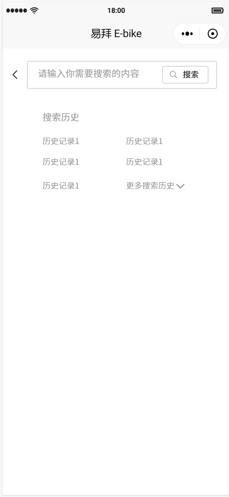
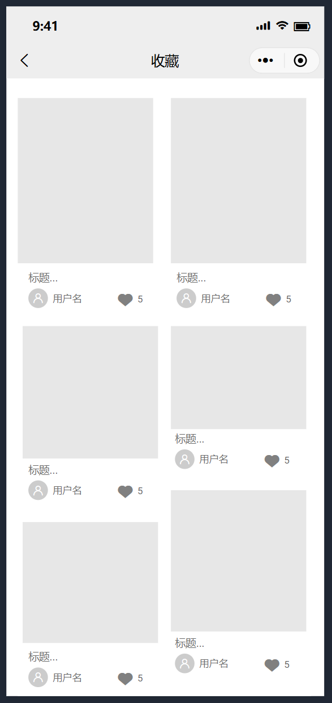

# 📝 软件需求说明书

## 1 概述

### 1.1 目的

易拜 E-bike 项目旨在针对当前大学校园内电动车使用管理的迫切需求，提供一套全面、高效、安全的解决方案。项目的核心目的在于：

1. **解决管理难题**：通过软件平台实现电动车买卖、充电桩查询、车友交流等功能的快速、便捷操作，减少用户在处理相关事务上的无效时间，提高校园内电动车相关事务的处理效率；
2. **优化用户体验**：通过全面的功能设计和精细化的用户体验优化，确保软件平台功能完善、用户友好，成为大学校园内电动车使用管理的首选工具；
3. **构建和谐生态**：致力于消除校内电动车使用中的不文明行为，通过软件平台促进车友间的交流互动，构建更加和谐、有序的校园电动车生态；
4. **确保使用安全**：针对校园内电动车使用中的充电桩不足、安全问题频发等特定问题，提供切实有效的解决方案，保障用户使用的安全和便捷；
5. **持续服务与支持**：在完成软件平台开发后，提供详细的用户操作手册和必要的技术支持与维护服务，确保用户能够快速掌握软件平台的使用方法，并在后续使用中持续获得稳定、可靠的服务支持。

### 1.2 背景

在当前大学校园内，随着电动车作为通勤工具的使用日益普及，电动车管理问题逐渐凸显。面对充电桩与停车位资源紧张、购车渠道多样且质量参差不齐、以及电动车使用中的安全隐患等问题，易拜E-bike软件项目应运而生。本项目旨在通过软件技术，为大学校园内的电动车用户提供一站式的管理服务，包括电动车交易、充电、维护以及社区交流等功能，从而构建一个安全、便捷、有序的校园电动车使用环境。

### 1.3 定义、首字母缩写词和缩略语

| 缩写                      | 全称                                          | 中文名称         |
| ----------------------- | ------------------------------------------- | ------------ |
| SE                      | Software Engineering                        | 软件工程         |
| BURS                    | Business and User Requirement Specification | 业务和用户需求规格说明书 |
| MRD                     | Market requirement document                 | 市场需求文档       |
| 
PRD

 
   | Product requirement document                | 产品需求文档       |
| 
BRS 

 
  | Business Requirement Specification          | 业务需求说明书      |
| 
WSR  

 
 | Weekly Status Report                        | 项目周报         |
| PM                      | Program Manager                             | 项目经理         |
| LLD                     | Low Level Design                            | 详细设计         |
| OOA                     | Object Oriented Analysis                    | 面向对象分析       |
| STP                     | System Testing plan                         | 系统测试计划       |
| STC                     | System Testing Cases                        | 系统测试用例       |
| ITP                     | Integration Testing plan                    | 集成测试计划       |

### 1.4 参考资料

\[1][wen-ti-ding-yi-ji-ke-hang-xing-fen-xi.md](wen-ti-ding-yi-ji-ke-hang-xing-fen-xi.md "mention")

\[2]计算机软件开发规范 GB8566-88

\[3]计算机软件产品开发文件编制指南 GB8567-88&#x20;

\[4]计算机软件需求说明编制指南 GB9385-88&#x20;

\[5]计算机软件测试文件编制规范 GB9386-88

## 2 整体说明

### 2.1 用例模型

<figure><figcaption>
用例模型图
</figcaption></figure>

### 2.2 假设与依赖关系

* 假设
  * **用户基础**：假设校园内已经有足够数量的电动车用户和潜在用户，他们对使用该平台感兴趣。
  * **政策支持**：假设校园管理层长期稳定支持电动车使用，并可能提供必要的政策和场地支持。
  * **市场调研**：假设市场调研结果准确，反映了用户的真实需求和偏好。
  * **第三方服务**：假设第三方服务提供商（如地图服务等）将提供稳定可靠的服务。
  * **法律法规**：假设项目符合所有相关的法律法规，包括数据保护和电子商务法规。
  * **资金和资源**：假设项目团队能够获得足够的资金和资源来完成项目。
  * **用户接受度**：假设用户愿意接受并适应新平台的使用。
* 约束
  * **第三方服务**：项目依赖于第三方服务的正常运作，如地图服务、云服务等。
  * **校园合作**：项目可能依赖于与校园管理部门的合作，以获得必要的支持和资源。
  * **政策变化**：依赖于对政府和校园管理层政策变化的敏感性，以便及时调整项目策略。
  * **用户教育**：依赖于有效的用户教育和培训，以确保用户能够充分利用平台。

## 2.3 具体需求

* 电动自行车信息展示（类似中深校园的购买渠道）
  * 相似产品：大众点评、美团
  * 细分功能
    * 电动车信息分类汇总（品牌、价格、评价、上市日期等），每款电动车需要单独信息页
    * 为每款电动车提供购买渠道和售后渠道等
    * 按某种指标排序
    * 按条件筛选和搜索
    * 智能推荐算法
  * 模块设计
    * 作为软件主要的子功能放在首页Tab里
    * 后端
      * 分类控制器：一组SQL控制查询内容
      * 数据表设计
      * 智能推荐算法，为特定用户返回推荐内容列表
    * 前端
* 充电桩监控（雨天开设情况，日常充电柜占用情况）
  * 相似产品：长盛泰富小程序、丰巢、各种预约软件
  * 细分功能
    * 地图展示和定位功能
    * 扫码充电
    * 图例帮助说明
    * 获取天气、拥挤程度等特殊信息，给出充电桩是否可用
    * 获取充电桩监控和占用信息并设法展示
  * 模块设计
    * 作为软件的主要子功能放在首页Tab里
    * 后端
      * 应该不需要数据库，去调别人的API，每个子功能一个函数即可
      * 地图API：可以用高德或者腾讯地图的API
      * 信息API：调长盛泰富API
    * 前端
* 电动车维修保养预约（需要与车行老板沟通，轮胎更换，设备更新）
  * 相似产品：各类车辆品牌的客服软件
  * 细分功能
    * 商家列表，筛选和搜索功能
    * 服务贴士列表，如轮胎、后视镜、钥匙、保养等相关信息
    * 填写表单，发起预约
    * 跟踪和查询预约进度和服务进度，完成提醒
  * 模块设计
    * 作为子功能放在服务页中
    * 后端
      * 主要是数据库读写，与信息展示共享数据库，需要详细设计
      * 预约模块设计，具体流程和业务实现
        * 比如，一旦数据库表单被修改，触发提醒，如何实现
        * 如何实现该控制器类，需要【监听】数据库更新
        * 商家如何更新服务信息
    * 前端
* 电动自行车消防安全监测与排查（是否存在占用楼道或应急通道等违停现象，提供举报平台）
  * 相似产品：交通违章举报平台、12123
  * 细分功能
    * 相关信息展示，比如消防规则和违规判断方法
    * 举办表单填写和提交
    * 提醒保卫处
  * 模块设计
    * 作为子功能放在服务页中
    * 后端
      * 表单数据库，提交表单写数据库，定时读数据库未处理表单提交保卫处
      * 保卫处接口
* 【首页】车小圈（车友交流平台，排行榜（品牌，评分，热度……））
  * 相似产品：车小圈、小红书、虎扑
  * 细分功能
    * 帖子编辑、发布和展示
    * 评论、点赞、收藏、关注和私信
    * 个性化推荐
    * 电动车排行榜
  * 模块设计
    * 作为主页
    * 后端
      * ctrl+c, ctrl+v
      * 魔改开源项目的接口和数据库，使其符合项目规范
* 二手转让（类似咸鱼的沟通平台）
  * 相似产品：闲鱼
  * 细分功能
    * 二手帖子编辑、发布和展示
    * 评论和私信
    * 购买流程
    * 对接车小圈
  * 模块设计
    * 作为子功能放在服务页中
* 用户信息
  * 细分功能
    * 昵称、签名
    * 绑定车牌/通行证
    * 动态、收藏、关注、粉丝（对接车小圈）
  * 模块设计
    * 抽象为核心服务，为其它服务编写适配器
    * 后端
      * 设计用户数据表
      * 对接校方通行证
      * 消息sessions列表数据库

### 2.4 原型设计

本项目开发的UI原型设计使用如下开源平台，点击外部连接，即可查看设计部门的UI原型设计。


UI原型设计平台-慕客



UI原型设计平台-墨刀


下面展示一些原型设计图，小程序的最终界面设计详见用户手册。在UI设计中，我们将小程序分为“首页”，“充电”，“服务”，“我的”这4个主界面。

#### **2.4.1 首页**

在【首页】中，若我们下滑界面，则用户头像，搜索框和广告位都会隐藏，此时只有页眉和滑动工具栏一直置顶。

<figure><figcaption>
【首页】-【广场】
</figcaption></figure>

 

<figure><figcaption>
【首页】-【广场】-下滑页
</figcaption></figure>

 

<figure><figcaption>
【首页】-【广场】-详情页
</figcaption></figure>

<figure><figcaption>
【首页】-【热榜】
</figcaption></figure>

 

<figure><figcaption>
【首页】-【热榜】-下滑页
</figcaption></figure>

 

<figure><figcaption>
【首页】-【搜索】
</figcaption></figure>

 

<figure><figcaption>
【首页】-【搜索】-详情页
</figcaption></figure>

#### **2.4.2 充电**

在【充电】页面中，我们首先放置了校内充电柜选择按键，并介绍了充电柜的具体位置。同时，放置公告栏和详情电话，直观展示阴雨天气或特殊情况的信息通知。

点击校内对应电动车辆充电位置，可看到该处当前的充电柜占用信息，其中充电柜的颜色变化和进度条代表当前占用的拥挤程度。红色代表极度拥挤，绿色代表当前充电柜的空闲位置较多。

进一步点击充电柜可得充电信息详情页，其中绿色，灰色，红色三个图例分别代表正常，占用和故障信息显示。“车位情况”的按键用于查询当前充电柜附近的车辆摆放情况，避免出现即使有空闲充电口，也因为该充电柜附近车辆过于拥挤而无法充电，导致白跑一趟的情况。

<figure><figcaption>
【充电】
</figcaption></figure>

 

<figure><figcaption>
【充电】-【充电桩】
</figcaption></figure>

 

<figure><figcaption>
【充电】-【充电桩】-详情页
</figcaption></figure>

#### **2.4.3 服务**

在【服务】部分中，我们主要设置了4个主界面，分别是“易维修”，“易反馈”，“易安行”，“易转让”。

其中，“易转让”界面设计参考了【首页】-【广场】，但其标题和详情页中，需要给出预设转让金额。

<figure><figcaption>
【服务】
</figcaption></figure>

 

<figure><figcaption>
【服务】-【易维修】
</figcaption></figure>

 

<figure><figcaption>
【服务】-【易反馈】
</figcaption></figure>

<figure><figcaption>
【服务】-【易安行】
</figcaption></figure>

 

<figure><figcaption>
【服务】-【易转让】
</figcaption></figure>

 

<figure><figcaption>
【服务】-【易转让】-详情页
</figcaption></figure>

#### **2.4.4 我的**

在【我的】界面，主要是进行用户个人隐私设置，并提供一些功能性服务。点击所有的用户头像都会跳转到对应的用户主页界面，该界面中可以展示当前用户的动态和二手转让发布信息，并且还可以对该用户进行关注和私信。

此外，【我的】-【设置】界面中，用户可以修改个人昵称，头像，性别，个性签名，车牌绑定以及联系方式，并且还可以切换账号或退出登录。

【我的】-【客服】界面主要参照微信聊天界面进行设计。而在【我的】-【发布】界面中，可以发布动态或二手转让信息，二手转让的发布界面相较于发布动态的界面，要多一个预想价格的设置。

<figure><figcaption>
【我的】
</figcaption></figure>

 

<figure><figcaption>
【我的】-头像-点击跳转用户主页-用户动态
</figcaption></figure>

 

<figure><figcaption>
【我的】-头像-点击跳转用户主页-二手转让
</figcaption></figure>

<figure><figcaption>
【我的】-【收藏】
</figcaption></figure>

 

<figure><figcaption>
【我的】-【消息】
</figcaption></figure>

 

<figure><figcaption>
【我的】-【用户协议】
</figcaption></figure>

<figure><figcaption>
【我的】-【设置】
</figcaption></figure>

 

<figure><figcaption>
【我的】-【客服】
</figcaption></figure>

 

<figure><figcaption>
【我的】-【隐私政策】
</figcaption></figure>

<figure><figcaption>
【我的】-【发布】-【发布动态】
</figcaption></figure>

 

<figure><figcaption>
【我的】-【发布】-【二手转让】
</figcaption></figure>

## 3 支持信息

### 3.1 学校保卫处采访

#### **3.1.1 采访文稿**

采访时间：2024/4/18

采访人：黄楚丹、刘畅

被采访人：保卫处管理层成员

采访内容：&#x20;

Q：您好，我是21级智科专业的一名学生，我们团队近期打算开发一个面向大学生的校园电动自行车多功能平台，希望能够与学校保卫处进行沟通交流，听取您的意见和建议，共同完善我们的项目。我们预计在这个平台中添加电动车的违停举报功能，以帮助提高校园交通管理的效率，并改善校园交通秩序。请问您对此有什么看法？

A：我觉得你们的想法很好。但有一些问题需要注意，比如这个小程序挂名在什么地方，是否在管委会官网下？未来我们全校范围电动单车管理将加强，所有电动车需要办理校园通行证，不规范的不能通行（没牌的）。因为举报涉及到隐私问题，如果有人违反纪律可以向单位报告，但不会公布因为涉及到隐私。所以有纠纷不好处理，需要全方位思考。我觉得平台可以作为建言献策的地方，提醒有关部门的，可能好做一点。

Q：对于学生举报违停车辆的机制，您有何建议？

A：首先，大家拍了车牌我们是查不到人，交管才能查到。违规行为如占用公共道路，可以借用平台告知保卫处，让保卫处去解决。但是有些问题不归保卫处管（责任划分），希望同学们可以组建一个秩序维护队。平台可以招募志愿者，这样如果有轻微的乱象可以根据平台去指挥。以防保卫处来的不及时。

Q：在平台使用过程中，您对于用户数据隐私和信息安全方面有何关注或建议？

A：现在记录车牌查到人会困难，以后上了通行证的牌号就可以对应到车主。这个小程序要说明告知同学，不是官方的，志愿者是自愿维护的。室内不该停、拉线充电等违规行为完全可以举报，保卫处会查出是谁。此外，涉及消防安全的也可以举报。被举报多了的同学可以罚款。发现了可以劝阻。

Q：您认为我们的平台还可以添加哪些功能或改进，以更好地满足校园交通管理的需求？例如，若校内发生一些小型撞车事故，我们平台可以提供与保卫处直接沟通的便捷渠道。

A：我觉得平台不一定要举报，但是可以把信息公开给保卫处。同时要注意不卖广告、不做人身攻击，制作一个真正为大家着想的平台。但是就还有一个问题是谁来和保卫处沟通，举报等信息谁来看，这可能会导致保卫处工作量上升。

#### 3.1.2 采访分析

**3.1.2.1 核心观点总结**

* **想法认可**：学校保卫处对开发校园电动自行车多功能平台的想法表示认可，认为这是一个有助于提高校园交通管理效率和改善交通秩序的好主意。
* **注意事项**：保卫处提出了一些需要注意的问题，包括平台的归属、电动车的通行证管理、隐私保护、责任划分以及用户数据隐私和信息安全等。
* **建议与改进**：保卫处建议平台可以作为建言献策和秩序维护的工具，同时提出了用户举报违停车辆、违规行为的处理机制，以及平台功能扩展的方向。

**3.1.2.2 详细分析**

（1）平台的归属与电动车管理

* 保卫处强调平台需要与校方有明确的合作关系，以避免误解和纠纷。
* 电动车将实行通行证管理，无牌车辆将无法通行，这可能对平台的用户群体和使用范围产生影响。

（2）隐私保护与责任划分

* 保卫处对隐私保护非常重视，认为举报功能需要谨慎处理，避免侵犯用户隐私。
* 对于违规行为，保卫处建议学生组建秩序维护队，协助管理，而不是直接通过平台举报。

（3）用户数据隐私与信息安全

* 保卫处指出，平台需要明确告知用户其非官方性质，并强调志愿者是自愿维护的。
* 涉及到消防安全的违规行为可以举报，但平台需要明确其功能和责任范围。

（4）功能扩展与建议

* 保卫处建议平台不仅限于举报功能，还可以作为信息公开和建言献策的平台。
* 平台需要避免广告和人身攻击，真正为学生和校园交通管理服务。
* 对于与保卫处直接沟通的渠道，保卫处表示需要关注工作量上升的问题，并建议合理规划和分配资源。

**3.1.2.3 结论**

* **明确合作关系**：在开发平台前，与校方和保卫处建立明确的合作关系，确保平台的合法性和有效性。
* **加强隐私保护**：在设计和实施举报功能时，要特别关注用户隐私保护，确保用户信息安全。
* **扩展功能范围**：除了举报功能外，可以考虑添加建言献策、信息查询、安全教育等功能，提高平台的综合性和实用性。
* **建立合作机制**：与保卫处建立有效的合作机制，确保平台能够及时反馈和处理各类交通违规行为，提高校园交通管理的效率和水平。

### 3.2 在校学生采访

#### **3.2.1 采访文稿**

采访时间：2024/4/10

采访人：吴恺云

被采访人：使用电动车的在校大学生

* **同学1**

Q：你对学校电动车充电和维修方面有什么意见吗？

A：对于修车，我觉得我们学校修车还是很不方便，学校内没有维修点，在东园外也没有，还需要跑很远去西边修，如果车坏了会很麻烦。

Q：假设有一个专属于大学内的电动车生态程序，您的理想中这个生态应具备什么功能？

A：它可能提供的就是你在手机上就可以看到哪里有充电桩空余，可以去充电；然后可以及时叫到帮忙修车的上门服务。

Q：假设这个生态还会提供车行信息、车小圈和二手车买卖等功能，这些功能会不会吸引你去使用这个软件？

A：肯定会。但也需要看功能实现程度和便利程度，若实现程度不好还是会选择直接去西园找老板。

Q：假设这个生态具有五个基础功能：电动车购买、充电桩监控、预约维修、车友圈和二手转让，你可以按照你的需求对此排个序吗？

A：我觉得应该是：充电桩监控、预约维修、电动车购买、二手转让、车友圈。

* **同学2**

Q：假设有一个专属于大学内的电动车生态程序，您的理想中这个生态应具备什么功能？

A：通过这个程序，第一，最好可以登记每个用户的车牌和手机号，同时也要注意保护隐私。如果有电动车卡住了别人的车位，或有什么事故，用户可以通过搜索功能或者反映功能，通过车牌号通知到车主，实现实时沟通。第二，如果可以各平台的充电桩二维码，更是大有可为。

Q：假设这个生态还会提供车行信息、修车接单、车小圈和二手车买卖等功能，这些功能会不会吸引你去使用这个软件？

A：我觉得修车功能大大吸引我。

Q：在校园内，你是否觉得有些地方存在电动自行车违停等安全问题？你认为本生态应该采取什么措施来解决这个问题？

A：虽然大家的违规行为特别多，但是解决是很棘手的。我认为可以做一个类似校园集市的圈子，若有人出现违规行为，可以上传公开，或者可以输入车牌号一键举报。

Q：你有没有参与过类似车友交流平台的社群？你觉得这样的平台对你有什么价值？你希望在这样的平台上看到什么样的功能？

A：虽然这里面的内容实用价值一般，但确实丰富多彩 ，给我提供了很多情绪价值。

Q：假设这个生态具有五个基础功能：电动车购买、充电桩监控、预约维修、车友圈和二手转让，你可以按照你的需求对此排个序吗？

A：充电桩监控、预约维修、电动车购买、二手转让、车友圈。

* **同学3**

Q：假设这个生态还会提供车行信息、修车预约、车小圈和二手车买卖等功能，这些功能会不会吸引你去使用这个软件？

A：会的，除了车友圈。

Q：对于二手转让平台，你觉得什么样的功能是最重要的？

A：我认为安全最重要。

Q：假设这个生态具有五个基础功能：电动车购买、充电桩监控、预约维修、车友圈和二手转让，你可以按照你的需求对此排个序吗？

A：充电桩监控、预约维修、二手转让、电动车购买、车友圈。

#### 3.2.2 采访分析

**3.2.2.1 核心观点总结**

* **需求与期望**：采访中的同学们普遍表达了对电动车在校园内充电和维修的便捷性需求，同时他们也对一个专属于大学内的电动车生态程序充满期待。
* **功能偏好**：同学们对充电桩监控、预约维修和电动车购买功能表达出较大兴趣偏好，对车友圈和二手转让兴趣较低。
* **建议与改进**：同学们表达了对隐私保护和安全的重视，建议本软件需要注重对于学生车辆隐私信息的保护。同时也提出了对于监督、反馈功能的建议。

**3.2.2.2 详细分析**

（1）充电与维修的强烈需求

* 同学们普遍认为校内充电不便，希望电动车生态程序能提供充电桩监控功能，方便他们随时找到可用的充电桩。
* 同学们普遍认为校内电动车维修不便，希望平台能提供预约维修服务，减少维修的等待时间，提升便捷性。

（2）隐私保护

* 同学们认为在平台上登记车牌和手机号是合理的，但强调要保护个人隐私，避免信息泄露。
* 同学们支持设立反馈机制，但希望平台方和校方能够谨慎处理反馈信息，避免误报和侵犯隐私。

（3）社区互动与情感需求

* 虽然同学们对车友圈的需求相对较低，但他们也认可了社区平台在提供信息交流和情感支持方面的价值。

（4）二手转让的需求

* 同学们对二手转让有一定需求，且普遍强调安全性是最重要的，包括交易安全和产品质量安全。

**3.2.2.3 结论**

* **聚焦基础功能**：在开发电动车生态程序时，应优先关注并优化充电桩监控、预约维修等基础且需求最大的功能，以满足同学们的实际生活需要。
* **强化安全与隐私保护**：在设计和实施平台功能时，要特别关注用户隐私保护和数据安全，确保用户信息安全和隐私不受侵犯。同时也需要注意交易安全和产品质量安全，确保用户能够在一个安全、可靠的环境中进行二手交易。
* **拓展功能范围**：虽然同学们对社交功能的需求相对较低，但平台仍可以考虑加入一些社区元素，为用户提供信息交流和情感支持。同时，也有同学提出应丰富反馈机制，包括安全反馈、违规反馈等。

### 3.3 长盛泰富采访

#### **3.3.1 采访文稿**

采访时间：2024/4/21

采访人：唐锦洲

被采访人：长盛泰富

Q：由于校园内充电柜有时可能处于拥挤状态，导致一些同学到达充电柜后却没有位置充电。我们期望可以提供一个方案可以为用户查询充电柜的附近的拥挤程度。基于此功能，我们的想法是对充电柜的摄像头采集的信息进行图像分析，检测充电柜附近的电动车停放数量或空位来判断是否拥挤。我们使用的监控数据将会进行合理的隐私保护，不会直接提供给用户，只提供拥挤程度或空位情况的信息。如果我们的产品计划在现实中投入使用并有意向与贵公司合作，请问是否可以申请调用贵公司充电桩的监控数据呢？

A：可以调用的，通过充电柜下方电话联系校方负责人获取即可。所得到的数据包含充电柜附近监控信息及充电柜占用信息。

#### 3.3.2 采访分析

**3.3.2.1 核心观点总结**

* **需求识别**：长盛泰富方对解决校园内充电柜拥挤问题的需求表示理解，并认可通过图像分析技术来查询充电柜附近拥挤程度的方案。
* **数据共享意愿**：公司表达可以通过校方调用其充电桩的监控数据以支持此方案的实施。

**3.3.2.2 详细分析**

（1）需求与解决方案

* 软件项目负责人识别出校园内充电柜拥挤的问题，并提出了通过图像分析技术检测充电柜附近电动车停放数量或空位来判断拥挤程度的方案。
* 长盛泰富方对对此方案表示理解和认可，认为这是一个有效的解决方式。

（2）数据共享

* 长盛泰富方认同了调用其充电桩的监控数据的可行性，以支持图像分析技术的实施。
* 长盛泰富方提供了获取数据的方式，即通过充电柜下方电话联系校方负责人，并表示数据的丰富程度满足了软件需求。

**3.3.2.3 结论**

* **数据调用可行性**：长盛泰富方认可软件开发方解决方法的可行性，可提供充电桩的监控数据以支持解决校园内充电柜拥挤问题的方案。
* **数据使用与隐私保护**：双方对于数据的使用和隐私保护达成了共识，允许使用数据用于分析充电柜的拥挤程度。
* **实施步骤**：采访方可以通过长盛泰富方提供的校方联系方式获取监控数据，并利用图像分析技术实施查询充电柜拥挤程度的方案。

### 3.4 车行老板采访

#### **3.4.1 采访文稿**

采访时间：2024/4/18

采访人：刘书睿、刘子豪

被采访人：学校附近车行老板

* **老板1**

Q：您现在电动车销量中，有多少是来自中大学生的呢？这些学生一般都是从哪里看到您的车行信息的呢？

A：这个很难说，但是经常有中大的学生来这边买车。他们一般都是从美团啊或者大众点评什么的，也有一些人就是路过这就进来看一下。

Q：您觉得现在线上的这种展示渠道畅通吗？或者说这种展示是否有效呢？给您车行带来的生意多不多呢？

A：这个通过线上渠道看到我们的车行信息来看车的很多，但是真的在这买，就是最后成交的不是很多。我觉得可能是这些学生啊，太想到处比一比价钱了，所以到我这也就是来看看。

Q：那您觉得如果有一个线上的平台，车行可以把自己的信息展示上去，学生可以提前在平台上进行比较，比较之后再来店里看车，您觉得成交效率会不会高一些呢？

A：这个可以啊，你们平台有没有坑位费啊，还是抽佣金啊？

Q：我们这边软件调研需求的阶段，具体的商业模式也得等我们充分调研完需求以后才能确定。

A：哦，之前其实也有类似的平台来找过我们，我们也叫过钱，展示过，但是最后效果都一般，因为那个平台本身就没有多少流量，看的人也不是很多。我们还在抖音上找人给我们宣传过，最后效果也不是很好吧。

Q：那您觉得一种什么样的模式对于你们车行是比较有利的呢？

A：至少我觉得一开始我们加入的时候，你们不能收我们佣金，毕竟我们也不知道你们能有多少用户。所以一开始你们可以免费入驻，后面再慢慢的，流量起来以后再开始收佣金。

* **老板2**

Q：老板您这边有车辆维修的业务吗？一般都是通过什么渠道发展这种维修业务呢？

A：我这有啊，一般都是到店直接维修，我们还有一个群，群里都是我的客户，他们可以在群里直接找我，我就可以上门维修，只要不是太远的就可以。

Q：老板那有中大的学生找您修理电动车吗？

A：有啊，我在中大也有群呀

Q：那您觉得如果把修理自行车这种业务做成网约车这种模式，对于你们会有业务提升吗？就是在一个线上平台上，用户发布修理订单，你们抢单修理。

A：哎呀，本来修车的就没有多少，而且我们忙起来一天都不看手机，很难去抢单的，再说了，修车也不怎么挣钱，都是给用户做售后嘛。

#### 3.4.2 采访分析

**3.4.2.1 核心观点总结**

* **市场认知**：车行老板们认识到中大学生是电动车销售的重要客户群，并认同线上展示渠道的存在感。
* **线上平台效果**：老板们对线上平台展示效果持保留态度，认为虽然能吸引潜在客户到店，但转化率不高。
* **维修业务**：车行通常提供维修服务，并依赖现有客户群发展业务，对网约车式维修模式持保留态度。
* **商业模式建议**：对于线上平台的商业模式，老板们更倾向于免费入驻模式，待平台流量稳定后再考虑收费。

**3.4.2.2 详细分析**

（1）市场与客户群体来源

* 老板们普遍认为中大学生是其主要客户群体之一，他们通过美团、大众点评等类似的线上平台了解到车行信息。
* 路过店面和线上平台是学生获知车行信息的主要途径。

（2）线上平台效果与商业模式

* 车行老板普遍认为线上平台能吸引潜在客户到店，但成交率不高，这可能是因为学生喜欢多方比较价格。
* 车行老板对于线上平台的商业模式持谨慎态度，更倾向于免费入驻模式，以避免初期投入过大但效果不佳。

（3）维修业务与网约车模式

* 车行通常提供维修服务，并依赖现有客户群和微信群发展业务。
* 老板们对网约车式维修模式持保留态度，认为修车订单量不大，利润较低，且车行工作忙碌时难以实时接单。

**3.4.2.3 结论**

* **免费入驻模式**：软件在初期采用免费入驻模式，以吸引更多车行入驻，增加平台曝光度，提高用户选择范围。
* **提升平台转化率**：软件应研究如何提高转化率，例如通过提供更详细的产品信息、用户评价、优惠活动等方式，吸引客户下单。
* **优化预约维修服务形式**：车行可以利用现有客户群和微信群，提供更加便捷的维修服务。因此需要软件进一步探索更高效、高利润的线上维修预约机制 ，以吸引车行老板入驻，为用户提供预约维修、上门取送等增值服务。
* **合作与共赢**：平台应关注车行的实际需求，提供定制化的解决方案，以满足其业务发展需求，以加强与车行方合作，共同探索提高销售和服务质量的方法，实现共赢。

### 3.5 《校园电动自行车多功能平台用户需求》调查问卷

#### 3.5.1 问卷概述

调查时间：2024/4/16

问卷制作人：沈鹏飞、刘畅、刘子豪

调查对象：在校大学生

调查方式：线上问卷

样本量：114

#### 3.5.2 用户基本信息

* 在校大学生占比：98.24%
* 培养层次分布：

<figure><figcaption>
培养层次分布柱状图
</figcaption></figure>

#### 3.5.3 出行习惯

（1）主要出行方式

<figure><figcaption>
根据您的日常通勤情况选择您的座驾
</figcaption></figure>

分析：

* **电动车成为主流**：骑自己的电动车成为大学生日常通勤的主要方式，这一结果反映出电动车在校园内的普及程度较高，且因其便捷、灵活的特点受到大学生的青睐。
* **步行与自行车占一定比例**：这部分学生可能因为上课地点距离宿舍较近，步行或骑行成为更为便捷的选择。
* **搭乘他人车辆与共享电动车/单车占比较小：**搭乘他人车辆和共享电动车/单车作为出行方式的比例相对较低，这可能与搭乘他人车辆的随机性和共享电动车/单车的覆盖范围、使用便利性有关。

结论与建议：

* **电动车市场需求旺盛：**鉴于电动车在大学生中的普及程度和受欢迎程度，我们的平台应提供全面的服务支持，包括电动车租赁、维修、充电等一站式解决方案。
* **提高服务质量：**通过优化服务流程、提高服务质量，提升用户对平台的满意度和忠诚度。

\
（2）出行工具购买渠道

<figure><figcaption>
您是通过什么渠道了解购买到当前出行工具？
</figcaption></figure>

分析：

* **朋友推荐的影响力：**朋友推荐附近车行是大学生购买电动车自行车最主要的渠道。这表明在校园环境中，口碑传播和人际推荐对于购买决策具有显著影响。因此，校园电动车自行车多功能平台在推广过程中，应充分利用口碑传播和人际推荐的力量，鼓励学生之间分享使用体验和购买渠道。
* **网络平台的便捷性：**大学生对于线上购物的接受度和依赖度较高。这意味着校园电动车自行车多功能平台在推广过程中，应重视线上渠道的布局和运营，提供便捷的在线购买和售后服务，以满足学生的线上购物需求。
* **自主寻找车行的意愿：**大学生在购买电动车自行车时，具有较强的自主性和探索精神。对于这部分学生，校园电动车自行车多功能平台可以通过提供丰富的产品信息和购买指南，帮助他们更快速、准确地找到适合自己的产品。

结论与建议：

* **重视口碑传播和人际推荐：**校园电动车自行车多功能平台在推广过程中，应充分利用口碑传播和人际推荐的力量。可以通过举办线下活动、邀请学生试用产品、鼓励用户分享使用体验等方式，提高品牌知名度和美誉度。
* **加强线上渠道建设：**针对大学生对线上购物的需求，校园电动车自行车多功能平台应加强线上渠道的建设和运营。可以开发自己的线上商城或入驻知名电商平台，提供便捷的在线购买和售后服务，提升用户购物体验。
* **提供丰富的产品信息和购买指南：**为满足部分大学生自主寻找车行的需求，校园电动车自行车多功能平台应提供丰富的产品信息和购买指南。可以通过官方网站、社交媒体等渠道发布产品介绍、使用教程、购买建议等内容，帮助学生更快速、准确地找到适合自己的产品。

#### 3.5.4 **维修与充电困扰**

（1）维修便利性

<figure><figcaption>
您认为自己当前的出行工具是否方便维修呢？
</figcaption></figure>

分析：

* **上门维修服务的受欢迎程度：**尽管上门维修服务占比仅为20.29%，但其高便利性仍得到了部分学生的认可。上门维修服务能够大大节省学生的时间和精力，尤其对于学业繁忙的大学生来说，这一服务显得尤为重要。因此，校园电动车自行车多功能平台可以考虑引入或加强与上门维修服务商的合作，以提供更为便捷的服务。
* **近距离维修点的普及情况：**超过一半的学生认为维修较为方便，主要原因是车行距离住所较近。这表明在校园内或周边地区，电动车自行车维修点的布局相对合理，能够满足大部分学生的维修需求。然而，仍有改进空间，如增加维修点的数量或优化其分布，以进一步提高维修便利性。
* **远距离维修点的挑战：**27.54%的学生认为维修很不方便，主要原因是车行距离住所较远，维修来回时间较长。这部分学生在维修过程中可能会面临较大的困扰，不仅增加了时间成本，还可能影响他们的日常生活。因此，校园电动车自行车多功能平台需要关注这部分学生的需求，通过提供更为便捷的维修服务或引导其前往合适的维修点来解决问题。

结论与建议：

* **引入或加强上门维修服务：**为了进一步提升学生的维修便利性，校园电动车自行车多功能平台可以考虑引入或加强与上门维修服务商的合作。通过提供上门维修服务，可以大大节省学生的时间和精力，提高维修效率。
* **提供维修指南和推荐：**为了帮助学生更好地解决维修问题，校园电动车自行车多功能平台可以提供详细的维修指南和推荐可靠的维修点。通过提供这些信息，学生可以更加便捷地找到适合自己的维修方案，减少不必要的困扰。
* **加强平台内的维修服务支持：**校园电动车自行车多功能平台可以在平台内增设维修服务板块，提供线上咨询、预约维修、维修进度查询等功能。这样可以方便学生随时了解维修情况，提高维修服务的透明度和效率。

（2）充电困扰

<figure><figcaption>
您平时给电动车充电时是否存在以下困扰
</figcaption></figure>

分析：

* **充电口资源紧张：**数据显示，超过八成的学生在充电时遇到没有空闲充电口的情况。这表明校园内电动车自行车充电口资源紧张，难以满足学生的需求。校园电动车自行车多功能平台应考虑增加充电口的数量或优化其布局，以提高充电效率。
* **充电口使用信息不透明：**许多学生担心在天气变化时无法得知充电柜/桩是否还开设充电口，这反映了充电口使用信息的不透明性。校园电动车自行车多功能平台应提供实时更新的充电口状态信息，如剩余空闲充电口数量、充电柜/桩是否开放等，以便学生随时了解并合理安排充电时间。
* **维修信息更新不及时：**超过六成的学生反映，在充电柜/桩维修时无法及时得知维修信息，导致无法充电。这要求校园电动车自行车多功能平台加强维修信息的更新和发布，确保学生能够在第一时间了解到充电柜/桩的维修情况，避免不必要的困扰。

结论与建议：

* **提供实时充电口状态信息：**平台应提供实时更新的充电口状态信息，包括剩余空闲充电口数量、充电柜/桩是否开放等，以便学生随时了解并合理安排充电时间。
* **加强维修信息更新与发布：**平台应建立及时、有效的维修信息更新和发布机制，确保学生能够在第一时间了解到充电柜/桩的维修情况，避免不必要的困扰。
* **收集用户反馈并持续改进：**平台应定期收集用户的反馈和建议，针对用户反映的问题进行持续改进和优化，以提供更加便捷、高效的电动车自行车充电服务。

（3）毕业处理

<figure><figcaption>
您毕业之后预计如何处理当前的出行工具呢？
</figcaption></figure>

分析：

* **带回家继续使用：**对于这部分学生，校园电动车自行车多功能平台可以考虑提供长期的售后服务和维修支持，以确保他们在毕业后仍能够继续享受到优质的出行体验。
* **二手转让：**高达78.26%的学生选择将电动车自行车进行二手转让，这表明二手市场在学生中具有较高的接受度和需求。因此，校园电动车自行车多功能平台可以积极搭建二手交易平台，提供便捷的转让渠道和交易保障，以满足学生的需求，并促进资源的循环利用。
* **未确定：**有2.9%的学生表示对毕业后电动车自行车的处理方式还不确定，这部分学生可能还在考虑各种因素或寻求更合适的解决方案。平台可以通过提供多种选择和建议，帮助他们做出更明智的决策。

结论与建议：

* **加强售后服务和维修支持：**针对选择带回家继续使用的学生，平台应加强售后服务和维修支持，确保他们在毕业后仍能够享受到优质的出行体验。
* **鼓励二手转让和回收处理：**针对选择留在学校或还未确定处理方式的学生，平台应鼓励他们将电动车自行车进行二手转让或回收处理，以减少资源浪费和环境污染。
* **搭建二手交易平台：**为了满足大多数学生将电动车自行车进行二手转让的需求，平台应积极搭建二手交易平台，提供便捷的转让渠道和交易保障，促进资源的循环利用。
* **提供多样化解决方案：**平台应提供多样化的解决方案，以满足不同学生的需求。例如，提供回收服务、维修服务、租赁服务等，以满足学生在不同阶段的出行需求。

#### 3.5.5 **平台功能需求**

功能的需求程度（完全无所谓）0---------10（我可太需要了呀）

（1）提供学校附近电动自行车的购买渠道

平均分：5.98

<figure><figcaption>
提供学校附近电动自行车的购买渠道
</figcaption></figure>

分析：该功能的需求程度中等偏上，表明大部分学生对于通过平台购买电动自行车有一定的兴趣。平台可以考虑与周边车行合作，提供线上购买、线下提车或送货上门的服务，以满足学生的购车需求。

（2）提供学校附近车行的商品信息和客户评价

平均分：7.17

<figure><figcaption>
提供学校附近车行的商品信息和客户评价
</figcaption></figure>

分析：该功能的需求程度较高，学生对于了解车行商品信息和客户评价有较强的需求。平台可以整合周边车行的商品信息，并提供客户评价功能，帮助学生做出更明智的购车选择。

（3）实时监控当前校内充电桩及充电柜的使用情况（包括但不限于当前充电柜/桩的占领情况，以及晴雨天或维修时期的开设情况）

平均分：8.63

<figure><figcaption>
实时监控当前校内充电桩及充电柜的使用情况
</figcaption></figure>

分析：该功能的需求程度非常高，说明学生对于充电桩及充电柜的实时监控有迫切需求。平台应开发实时监控系统，提供充电桩/柜的占用情况、开设情况等信息，帮助学生更便捷地找到可用的充电设施。

（4）提供电动自行车上门保养维护的实时接单机制

平均分：7.33

<figure><figcaption>
提供电动自行车上门保养维护的实时接单机制
</figcaption></figure>

分析：该功能的需求程度也较高，学生对于电动自行车的保养维护有一定的需求。平台可以建立上门保养维护的实时接单机制，提供便捷的保养维护服务，解决学生的后顾之忧。

（5）提供占用楼道或应急通道等违停现象的举报功能

平均分：7.34

<figure><figcaption>
提供占用楼道或应急通道等违停现象的举报功能
</figcaption></figure>

分析：该功能的需求程度也较高，学生希望通过平台对违停现象进行举报。平台可以开发举报功能，鼓励学生积极参与校园电动车的规范管理，共同维护校园秩序。

（6）提供车友的交流评论功能（包括但不限于对车行及其商品进行评分，以及展示车行和商品的喜爱度排名）

平均分：6.25

<figure><figcaption>
提供车友的交流评论功能
</figcaption></figure>

分析：该功能的需求程度中等，学生对于车友交流评论功能有一定的兴趣。平台可以建立车友社区，提供交流评论功能，让学生分享骑行经验、交流车辆使用心得，增进彼此之间的了解和友谊。

（7）提供校内电动自行车的二手转让平台，如毕业后个人二手车的回收转让

平均分：8.37

<figure><figcaption>
提供校内电动自行车的二手转让平台
</figcaption></figure>

分析：该功能的需求程度非常高，学生对于校内电动自行车的二手转让平台有强烈需求。平台可以开发二手转让功能，提供信息发布、交易撮合等服务，帮助学生更便捷地处理毕业后的二手车问题。

结论与建议：

* **加强实时监控系统的开发**：鉴于学生对于充电桩及充电柜的实时监控功能需求强烈，平台应优先加强该功能的开发和完善。
* **完善二手转让平台**：学生对于校内电动自行车的二手转让平台也有较高需求，平台应尽快建立并完善该功能，以满足学生的实际需求。
* **鼓励车友交流与评价**：通过提供车友交流评论功能，可以促进车友之间的互动和交流，增强平台的社区氛围和用户黏性。
* **建立保养维护接单机制**：提供上门保养维护的实时接单机制，可以为学生提供更加便捷的服务体验，增强平台的竞争力。
* **与车行合作提供购车渠道**：与周边车行合作，提供线上购买、线下提车或送货上门的服务，可以满足学生的购车需求，同时增加平台的收入来源。

#### 3.5.6 **了解和使用服务途径**

（1）了解途径

<figure><figcaption>
您更愿意通过什么方式了解和使用我们提供的服务？
</figcaption></figure>

分析：

* **学校官方推广：**学校官方推广的综合得分最高，且被选为第一位的比例超过六成。这表明学生高度信任学校官方发布的信息，并愿意通过官方渠道了解和使用平台服务。因此，平台应加强与学校的合作，利用学校官方资源进行推广，提高服务的知名度和可信度。
* **同学或朋友推荐：**同学或朋友推荐的综合得分排名第二，且被选为第一位的比例接近四成。这反映了学生之间的社交影响力对服务推广的重要性。平台应鼓励用户向身边的同学或朋友推荐服务，同时可以考虑设置推荐奖励机制，以激发用户的推荐积极性。
* **线下宣传活动：**线下宣传活动的综合得分排名第三，但被选为第三位的比例最高。这表明虽然线下宣传活动的直接吸引力可能不如其他方式，但其覆盖范围广、互动性强等特点使得它在学生中仍有一定的市场。平台应继续开展多样化的线下宣传活动，提高服务的曝光度和参与度。
* **社交媒体广告：**社交媒体广告的综合得分排名第四，但被选为第二、三位的比例均较高。这表明社交媒体在学生中的普及度较高，且具有一定的广告效果。平台应充分利用社交媒体平台进行广告投放和营销宣传，同时关注广告内容的创意性和互动性，以吸引更多学生的关注。

结论与建议：

* **加强与学校合作**：利用学校官方资源进行推广，提高服务的知名度和可信度。
* **激发用户推荐积极性**：鼓励用户向身边的同学或朋友推荐服务，并设置推荐奖励机制。
* **继续开展线下宣传活动**：提高服务的曝光度和参与度，同时注重活动的创意性和互动性。
* **充分利用社交媒体平台**：进行广告投放和营销宣传，关注广告内容的创意性和互动性。
* **关注用户需求和偏好**：在探索新的推广方式时，充分考虑学生的需求和偏好，避免采用效果不佳的方式。

（2）使用方式

<figure><figcaption>
您更希望这个平台以什么样的形式展现？
</figcaption></figure>

分析：

* **微信小程序：**选择率为77.36%。微信小程序以其轻便、无需安装、即用即走的特点，深受用户喜爱。在校园环境中，用户可以随时随地通过微信小程序查询、使用平台功能，方便快捷。因此，微信小程序成为用户首选的展现形式。
* **官方网站：**选择率为24.69%。官方网站作为传统的互联网应用展现形式，具有信息全面、权威性强等优点。然而，在校园环境中，用户更倾向于使用轻便、快捷的应用，因此官方网站的首选率相对较低。但官方网站仍然是平台不可或缺的一部分，可以为用户提供详细的信息介绍和交互体验。
* **手机APP：**选择率为12.66%。手机APP作为另一种常见的应用展现形式，具有功能丰富、交互性强等优点。然而，在校园环境中，用户可能不愿意为单一功能安装多个APP，导致手机APP的首选率较低。但手机APP仍然具有一定的市场潜力，特别是当平台功能逐渐丰富、用户体验不断提升时，手机APP的受欢迎程度可能会增加。

结论与建议：

* **优先发展微信小程序**：鉴于微信小程序的高首选率和用户喜爱程度，平台应优先发展微信小程序，提供全面、便捷的服务体验。同时，不断优化微信小程序的界面设计和功能布局，提高用户体验。
* **完善官方网站**：官方网站作为平台的重要组成部分，应提供详细的信息介绍和交互体验。平台应不断完善官方网站的内容和功能，提高信息更新的及时性和准确性，同时加强网站的互动性和用户体验。
* **审慎开发手机APP**：虽然手机APP具有一定的市场潜力，但在校园环境中用户可能不愿意为单一功能安装多个APP。因此，平台在开发手机APP时应充分考虑用户需求和市场趋势，避免盲目跟风或投入过多资源。如确有必要开发手机APP，应注重功能丰富性和用户体验的提升。
* **探索新的展现形式**：随着科技的不断进步和市场需求的不断变化，平台应积极探索新的展现形式，如虚拟现实（VR）、增强现实（AR）等新技术应用。这些新技术可以为用户提供更加沉浸式的体验和服务，提高平台的竞争力和吸引力。但在探索新的展现形式时，应充分考虑技术成熟度、用户接受度和成本效益等因素。

#### 3.5.7 其他建议

针对我们的平台，有用户提出以下其他建议：

* 多安装充电桩
* 全面化的便捷路线分析
* 提供上门维修服务 提供充足充电桩和位置使用情况信息
