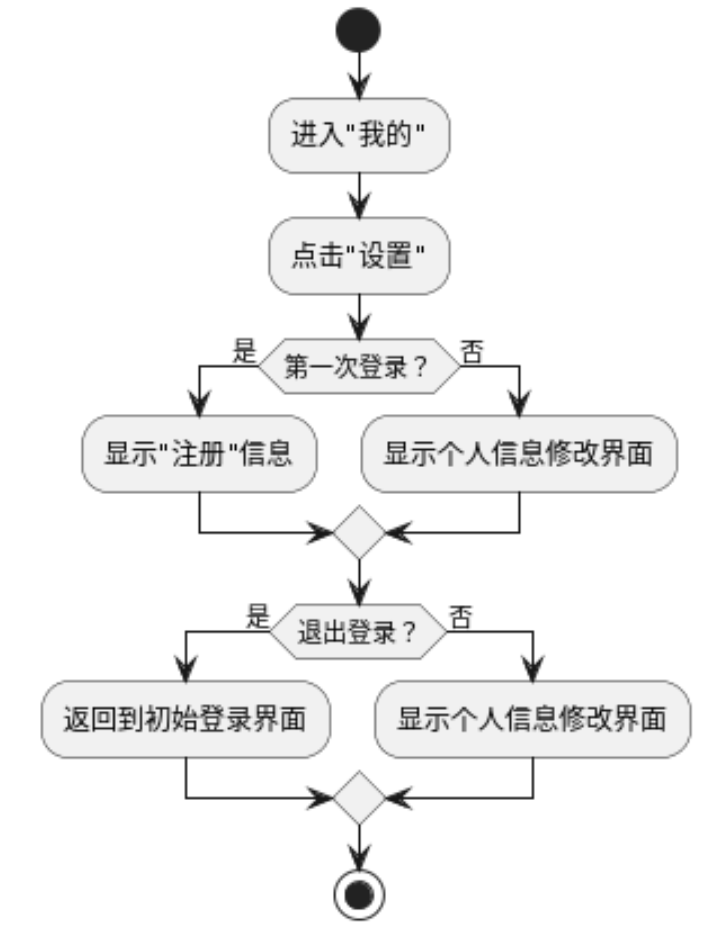

# ⚙️ 设计说明书

## 1 引言

### 1.1 编写目的

​ ​ 本说明书是对E-bike的详细说明，以便用户及项目开发人员了解产品详细的设计与实现。为开发人员提供开发参考书。以下叙述将结合文字描述、伪代码，图表等来描述ebike的详细设计和相关的模块描述。本报告的预期读者有客户、项目经理、开发人员以及跟该项目相关的其他竞争人员。&#x20;

### 1.2 项目背景

| 项目名称 | E-bike          |
| ---- | --------------- |
| 开发团队 | SevenAutomen    |
| 预期用户 | 在校已有或准备购买电动车的学生 |
| 实施团队 | SevenAutomen    |

### 1.3 定义


### 1.4 参考资料

\[1][ebike-team.ebike项目开发计划](xiang-mu-kai-fa-ji-hua.md)

\[2][ebike-team.ebike软件需求说明书](ruan-jian-xu-qiu-shuo-ming-shu.md)

## 2 总体设计

### 2.1 需求概述

1. 电动车销售信息展示
2. 第三方电动车消费点评
3. 二手电动车交易
4. 车友社交
5. 电动车充电信息服务

### 2.2 系统结构设计

#### 2.2.1 系统框架结构

本软件整体使用前后端分离架构，并借助 RESTful API 标准进行前后端通信。其中，前端基于 Vue3 进行开发，而后端则使用 Django 框架。

#### 2.2.2 业务逻辑结构

<figure><figcaption><p>业务逻辑架构图</p></figcaption></figure>

#### **2.2.3用户服务业务模块**

该模块主要包括用户注册、登录、与账户管理等基础功能。它确保用户可以顺利地注册并登录到平台，进行个人信息的管理和维护。

1. **用户注册**：用户通过填写必要的个人信息进行注册。
2. **用户登录**：用户通过账号和密码进行登录。
3. **用户管理**：包括用户信息的查看和修改，以及密码的重置等功能。

#### **2.2.4 社交服务业务模块**

该模块提供了用户之间的互动功能，增加用户粘性和活跃度。

1. **互动功能**：包括评论、点赞、收藏、关注等功能，用户可以在平台上与其他用户互动。
2. **车小屋**：用户可以在这里发布帖子和展示信息。
3. **评论与私信**：用户可以对帖子进行评论，并通过私信功能进行一对一的交流。

#### **2.2.5 信息服务业务模块**

该模块主要为用户提供电动车相关的信息展示及搜索功能，方便用户获取所需信息。

1. **电动车分栏**：展示电动车分类及详细信息。
2. **搜索**：提供信息的搜索功能，帮助用户快速找到所需信息。
3. **售后通道**：提供售后服务入口，用户可以通过此通道查询售后相关信息。

#### **2.2.6 交易市场业务模块**

该模块为用户提供交易相关的服务，包括信息发布与展示。

1. **交易信息发布**：用户可以在平台上发布交易相关的信息。
2. **交易内容展示**：平台会展示所有用户发布的交易信息。

#### **2.2.7 维修保养业务模块**

该模块为用户提供电动车的维修和保养服务。

1. **商家列表**：展示可提供维修保养服务的商家信息。
2. **服务安排**：用户可以在线预约维修和保养服务。
3. **预约查询**：用户可以查询自己的预约状态。

#### **2.2.8 充电桩监控业务模块**

该模块为用户提供充电桩相关的监控和信息服务。

1. **校园地图**：展示校园内充电桩的分布情况。
2. **实时充电**：显示充电桩的实时使用情况。
3. **天气和提醒**：提供与充电相关的天气信息及提醒服务。

#### **2.2.9 后台管理服务模块**

该模块提供平台运营和管理的后台支持。

1. **用户管理**：包括学生用户、商家用户、教职工用户的管理。
2. **权限设置**：对不同用户类型设置相应的权限。
3. **数据统计与分析**：对平台数据进行统计和分析，提供运营决策支持。
4. **邮件服务配置**：配置平台的邮件服务功能，支持邮件的发送控制。

#### 2.2.10 软件分层结构

<figure><figcaption><p>系统分层架构图</p></figcaption></figure>

本软件的分层架构如下：

1. **用户层**：
   * **手机浏览器**：用户通过手机浏览器访问系统。
   * **电脑浏览器**：用户通过电脑浏览器访问系统。
   * **微信小程序**：用户通过微信小程序访问系统。
2. **通信层**：
   * **CDN**：用于加速内容传输，提高访问速度。
   * **WebSocket**：实现实时双向数据传输。
   * **HTTP/HTTPS**：确保数据传输的安全性和可靠性。
3. **接口层**：
   * **RESTful API**：标准化接口，支持前后端通信和数据交互。
   * **Search API**：提供搜索服务的接口，支持复杂搜索查询。
   * **WebSocket API**：支持实时消息传递的接口。
4. **功能层**：
   * **搜索引擎 Whoosh**：提供高效的全文搜索功能。
   * **即时通讯 IM**：支持用户之间的即时消息交流。
   * **推荐系统 LSTUR**：基于用户行为和偏好提供个性化推荐服务。
   * **定时任务 crontab**：定时执行后台任务，提高系统自动化和效率。
5. **数据层**：
   * **用户服务 Schema**：定义用户相关的数据结构和存储规范。
   * **社交服务 Schema**：定义社交功能相关的数据结构和存储规范。
   * **维修服务 Schema**：定义维修服务相关的数据结构和存储规范。
   * **充电服务 Schema**：定义充电服务相关的数据结构和存储规范。

#### 2.2.11 软件技术架构

<figure><figcaption><p>软件技术架构图</p></figcaption></figure>

本软件的技术架构如下：

1. **用户层**：
   * **手机浏览器**，具有通过移动设备访问系统的功能
   * **电脑浏览器**，具有通过桌面设备访问系统的功能
   * **微信小程序**，具有通过微信平台访问系统的功能
2. **通信层**：
   * **CDN**，具有加速内容传输和提高访问速度的功能
   * **WebSocket**，具有支持实时双向数据传输的功能
   * **HTTP/HTTPS**，具有确保数据在网络上传输安全性和可靠性的功能
3. **服务层**：
   * **用户服务**，具有管理和处理用户相关操作的功能
   * **社交服务**，具有提供社交互动和交流的功能
   * **维修服务**，具有管理和调度维修服务的功能
   * **充电服务**，具有提供电动车充电相关服务的功能
   * **举报服务**，具有接收和处理用户举报的功能
   * **电动车信息提供服务**，具有提供电动车相关信息的功能
4. **技术架构层**：
   * **前端**：
     * **Vue3**，具有构建用户界面的功能
     * **组件**，包括首页、充电、服务、我的等模块，具有各自对应的功能
   * **中间件**：
     * **Redis**，具有缓存和提高数据访问速度的功能
     * **Haystack**，具有实现搜索功能的能力
     * **定时任务**，具有定时执行后台任务的功能
   * **后端**：
     * **Django (MVC)**，具有构建后端逻辑和处理请求的功能
     * **Woosh 搜索服务**，具有提供高效文本检索的功能
     * **LSTUR 推荐系统**，具有根据用户行为和偏好进行个性化推荐的功能
     * **Django Admin 管理终端**，具有管理和维护系统的功能
     * **日志管理**，具有记录和分析系统日志的功能
     * **配置管理**，具有管理系统配置的功能
5. **数据层**：
   * **PostgreSQL**，具有关系型数据库存储和管理数据的功能
   * **MySQL**，具有关系型数据库存储和管理数据的功能
   * **SQLite**，具有轻量级数据库存储和管理数据的功能

#### 2.2.12 软件部署架构

本软件的系统部署架构较为简单，考虑到资源限制和用户数量，我们采取单机部署前端+后端的模式。

### 2.3 后端架构设计

#### 2.3.1 DjangoMVT架构

Django是一个高级的Web框架，它通过鼓励快速开发和干净、实用的设计来促进Web开发。Django遵循MVT架构模式，即模型(Model)、视图(View)和模板(Template)。

* M 表示模型（Model）：模型层负责定义应用程序的数据结构，并与数据库进行交互。Django的ORM（对象关系映射）使得开发者可以用Python类和对象来操作数据库，而无需编写SQL查询。模型通常映射到数据库中的表，每个模型类代表一张表中的结构。
* T 表示模板 (Template)：模板层负责呈现数据，它定义了如何在HTML中展示数据。Django的模板语言 (Django Template Language, DTL) 提供了强大的功能，如模板继承、模板标签和过滤器，以便动态生成HTML页面。
* V 表示视图（View）：视图层包含业务逻辑并负责处理用户请求，视图可以是函数视图 (Function-based views, FBV) 或类视图 (Class-based views, CBV)。视图接收一个Web请求，处理数据并返回一个Web响应（通常是HTML、JSON或XML）。

除了以上三层之外，还需要 URL 分发器和中间件。Django使用URLconf来将URL路由到相应的视图，路由层确保每个URL请求都能正确地被处理。而中间件是在请求和响应处理过程中的钩子，它们可以用于各种任务，如会话管理、身份认证、跨站请求伪造 (CSRF) 保护等。

<figure><figcaption><p>DjangoMVT架构图</p></figcaption></figure>

#### 2.3.2 前后端分离设计

前后端分离是一种现代Web开发模式，其核心思想是将前端（用户界面）和后端（业务逻辑和数据存储）分离开来，各自独立开发和部署。前后端分离的架构可以提高开发效率、增强代码的可维护性，并允许前后端团队并行工作。

1. **前端：** 前端负责呈现用户界面，处理用户输入，并与后端进行通信。现代前端通常使用JavaScript框架或库来构建单页应用（Single Page Applications, SPA），例如Vue.js、React或Angular。

* **用户 (User)**: 用户通过浏览器访问应用。
* **DNS (域名系统, Route53)**: 将用户的域名请求解析到应用的服务器IP地址。
* **负载均衡器 (Load Balancer, ALB)**: 分发用户请求到多个前端服务器，确保高可用性和负载均衡。
* **Nginx**: 用于处理静态资源（HTML、CSS、JavaScript等），并将API请求代理到后端服务器。
* **前端应用 (Vue.js)**: 使用JavaScript框架构建的单页应用，负责与用户交互和显示数据。

2. **后端：**后端负责处理业务逻辑、数据存储和与前端的通信。后端通常由Web框架和数据库组成，例如Django和PostgreSQL。

* **API网关 (API Gateway)**: 充当前端和后端之间的中介，处理API请求并转发到适当的后端服务。
* **Django**: 一个高级Python Web框架，负责处理业务逻辑和与数据库的交互。
* **数据库 (PostgreSQL)**: 存储应用数据，Django通过ORM（对象关系映射）与其交互。
* **SSL/TLS**: 确保前后端通信的安全性，通过加密保护数据传输。

使用前后端分离架构具有如下好处：

1. **开发效率高**: 前端和后端可以并行开发，前端开发者可以专注于用户界面和体验，而后端开发者可以专注于业务逻辑和数据处理。
2. **技术选型灵活**: 前后端分离允许使用不同的技术栈，前端可以选择适合的JavaScript框架，后端可以选择适合的Web框架和数据库。
3. **代码可维护性强**: 前后端代码独立，互不依赖，方便维护和升级。
4. **更好的用户体验**: 单页应用（SPA）可以提供更快的响应和更流畅的用户体验。

<figure><figcaption><p>前后端分离架构图</p></figcaption></figure>

#### 2.3.3 RESTful API

RESTful 是一个现在非常流行的词汇，它是一种软件架构风格，提供了一组设计原则和约束条件，主要用于客户端和服务器交互类的软件。基于这种风格设计的软件可以更简洁、更有层次、更易于实现缓存等机制。

* RESTful 中的 REST（英文：Representational State Transfer，简称 REST）描述了一个架构样式的网络系统，比如 web 应用程序。它首次出现在 2000 年 Roy Fielding 的博士论文中，他是 HTTP 规范的主要编写者之一。
* REST 指的是一组架构约束条件和原则。满足这些约束条件和原则的应用程序或设计就是 RESTful。Web 应用程序最重要的 REST 原则是，**客户端和服务器之间的交互在请求之间是无状态的**。从客户端到服务器的每个请求都必须包含理解请求所必需的信息。如果服务器在请求之间的任何时间点重启，客户端不会得到通知。此外，无状态请求可以由任何可用服务器回答，这十分适合云计算之类的环境。客户端可以缓存数据以改进性能。
* 在服务器端，应用程序状态和功能可以分为各种资源。资源是一个有趣的概念实体，它向客户端公开。资源的例子有：应用程序对象、数据库记录、算法等等。每个资源都使用 URI (Universal Resource Identifier) 得到一个唯一的地址。所有资源都共享统一的接口，以便在客户端和服务器之间传输状态。使用的是标准的 HTTP 方法，比如 GET、PUT、POST 和 DELETE。**Hypermedia 是应用程序状态的引擎**，资源表示通过超链接互联。
* 另一个重要的 REST 原则是**分层系统**，这表示组件无法了解它与之交互的中间层以外的组件。通过将系统知识限制在单个层，可以限制整个系统的复杂性，促进了底层的独立性。
* 当 REST 架构的约束条件作为一个整体应用时，将生成一个可以扩展到大量客户端的应用程序。它还降低了客户端和服务器之间的交互延迟。统一界面简化了整个系统架构，改进了子系统之间交互的可见性。REST 简化了客户端和服务器的实现。

RESTful 的架构风格和原则提供了一种简洁而高效的方法来设计网络应用程序，使其更容易扩展和维护。这也是为什么 RESTful 在现代软件开发中如此受欢迎的原因。

#### 2.3.4 使用 DRF 实现 RESTful API

Django REST framework (DRF) 是一个强大的工具集，帮助开发者快速构建 Web APIs。它建立在 Django 框架之上，提供了简单、灵活且高效的方式来创建 RESTful API。

* **序列化**：DRF 提供了强大的序列化机制，能够将复杂的数据类型（如 Django 模型实例）转换为 Python 数据类型，并且能够轻松地将这些数据类型渲染为 JSON、XML 或其他内容类型。序列化器还支持数据验证，确保数据在被保存到数据库之前是有效的。
* **视图集和路由器**：DRF 提供了视图集和路由器，简化了视图逻辑的编写。视图集允许开发者将一组相关的视图逻辑集中在一个类中，而路由器则自动为这些视图集生成 URL 路由，使得 URL 配置变得简单而直观。
* **认证和权限**：DRF 内置了多种认证和权限控制机制，如基于令牌的认证、Session 认证、OAuth 等。开发者可以根据应用需求，选择合适的认证方式，并通过自定义权限类来控制不同用户对资源的访问权限。
* **分页和过滤**：DRF 提供了强大的分页和过滤功能，允许开发者轻松地对返回的数据进行分页和筛选，提高 API 的性能和用户体验。
* **异常处理**：DRF 提供了统一的异常处理机制，能够捕获视图中的异常并返回一致的错误响应，提升了 API 的健壮性和可维护性。
* **文档生成**：DRF 支持自动生成 Swagger API 文档，开发者可以通过配置，使 API 文档与代码同步更新，方便开发者和用户了解 API 的使用方法和参数要求。

通过使用 Django REST framework，开发者可以快速、高效地构建符合 REST 架构风格的 Web API，并且借助其丰富的功能集，能够应对复杂的业务需求和场景。

<figure><figcaption><p>DRF框架结构</p></figcaption></figure>

#### 2.3.5 Django Auth 设计

Django 用户认证（Auth）组件一般用在用户的登录注册上，用于判断当前的用户是否合法，并跳转到登陆成功或失败页面。

本软件使用 JWT 认证进行用户鉴权：

* **JWT 认证**: JSON Web Token (JWT) 是一种用于在客户端和服务器之间传输声明的紧凑、安全的方式。JWT 通常用于认证和授权，提供了一种无状态的认证机制。每个 JWT 包含三部分：头部（Header）、载荷（Payload）和签名（Signature）。JWT 认证的流程如下：
  1. 用户通过登录接口提交用户名和密码。
  2. 服务器验证用户凭证，成功后生成一个 JWT，并将其返回给客户端。
  3. 客户端存储 JWT（通常存储在 localStorage 或 sessionStorage 中）。
  4. 客户端在后续请求中将 JWT 添加到 HTTP 请求头部中（通常是 `Authorization: Bearer <token>`）。
  5. 服务器通过验证 JWT 的有效性来确认用户身份，并授权相应的操作。
* **集成 Django Auth 和 JWT**: 在 Django 中集成 JWT 认证可以使用 `django-rest-framework-simplejwt` 库。该库与 Django REST framework 无缝集成，提供了生成和验证 JWT 的功能。开发者可以使用该库定义自定义的认证视图，并将其集成到现有的 API 中，实现基于 JWT 的认证和授权。
* **优点**: 使用 JWT 认证的主要优点包括：
  * **无状态**：JWT 是无状态的，服务器不需要存储会话信息，减轻了服务器负担。
  * **安全性**：JWT 可以使用签名和加密来确保令牌的安全性和完整性。
  * **灵活性**：JWT 可以在多个系统之间传递，适用于分布式系统和微服务架构。
  * **标准化**：JWT 是一种标准化的认证机制，支持多种编程语言和框架。

通过结合 Django 自带的身份认证系统和 JWT 认证机制，本软件实现了一个安全、灵活和高效的认证和授权系统，满足现代 Web 应用的需求。

#### 2.3.6 Django ORM

Django 对各种数据库提供了很好的支持，包括：PostgreSQL、MySQL、SQLite、Oracle。Django 模型使用自带的对象关系映射（Object Relational Mapping，简称 ORM ）用于实现面向对象编程语言里不同类型系统的数据之间的转换。

* ORM 在业务逻辑层和数据库层之间充当了桥梁的作用。
* ORM 是通过使用描述对象和数据库之间的映射的元数据，将程序中的对象自动持久化到数据库中。

使用 ORM 的好处：

* 提高开发效率。
* 不同数据库可以平滑切换。

#### 2.3.7 搜索引擎设计

本软件使用 Whoosh 作为搜索引擎的后端，并通过 Django Haystack 集成到 Django 应用中。Whoosh 是一个快速、功能强大、面向文本的搜索引擎库，特别适合需要全文搜索功能的应用。Django Haystack 则提供了一个统一的搜索接口，使得不同的搜索后端能够无缝集成到 Django 项目中。

* Whoosh 是一个开源的全文搜索和索引库，使用纯 Python 编写，适用于小型到中型的数据集。它提供了强大的索引和搜索功能，支持多种查询类型、高亮显示和分页等功能。Whoosh 的设计非常灵活，可以根据不同需求自定义索引和搜索行为。
* Django Haystack 是一个模块化的搜索框架，旨在为 Django 应用提供统一的搜索接口。它支持多种搜索后端，包括 Whoosh、Elasticsearch、Solr 等。Haystack 通过抽象出搜索引擎的具体实现，提供了一致的 API，使开发者可以轻松地在不同搜索后端之间切换。

本软件设计旨在利用 Whoosh 和 Django Haystack 实现高效的全文搜索功能。其主要设计思路如下：

1. **搜索后端**：采用 Whoosh 作为搜索后端，利用其高效的索引和搜索能力，处理文本数据的存储和检索。
2. **统一搜索接口**：通过 Django Haystack 提供的统一接口，实现搜索功能的模块化和抽象化，使得搜索功能与具体的搜索引擎实现解耦。
3. **配置管理**：在 Django 项目的配置文件中，定义 Whoosh 后端的相关配置，包括索引路径、存储类型等参数，确保系统可以根据需求灵活调整。
4. **索引管理**：设计搜索索引类，定义需要索引的模型和字段，并确保这些字段在索引中正确配置。索引管理包括创建、更新、删除和优化等操作。
5. **查询处理**：使用 Haystack 提供的搜索接口，执行查询并处理结果。支持多种查询类型、高亮显示、分页和排序等功能，满足用户的搜索需求。

### 2.4 前端架构设计

#### 2.4.1 前端架构概述

**1) 技术栈**

“易拜”小程序的前端技术栈选用Vue.js框架进行开发。Vue.js是一款用于构建用户界面的渐进式JavaScript框架，具有轻量、灵活、组件化的特点，适合构建复杂的单页应用程序（SPA）

* **框架：**Vue.js
* **工具：**Webpack用于模块打包，Babel用于代码转译
* **语言：**JavaScript（主要）、TypeScript（部分模块使用）

此外，项目使用了以下辅助工具和库：

* **Vue Router：**用于管理应用的路由，确保不同页面之间的平滑导航。
* **Vuex：**用于全局状态管理，帮助管理和维护应用中的共享状态。
* **Axios：**用于进行HTTP请求，方便与后端进行数据交互。
* **Element UI：**用于提供丰富的UI组件库，简化UI开发。

**2) 项目结构**

“易拜”项目的前端代码目录结构如下：

```
EBike-vue
├─ .env
├─ .gitignore
├─ babel.config.js
├─ img
├─ jsconfig.json
├─ package-lock.json
├─ package.json
├─ public
│  ├─ favicon.ico
│  ├─ icon.ico
│  ├─ img
│  └─ index.html
├─ README.md
├─ src
│  ├─ apis
│  │  ├─ api.js
│  │  ├─ store.js
│  │  └─ v1
│  │     ├─ bike.js
│  │     ├─ exchange.js
│  │     ├─ maintenance.js
│  │     ├─ safety.js
│  │     ├─ social.js
│  │     └─ user.js
│  ├─ App.vue
│  ├─ assets
│  │  └─ logo.png
│  ├─ components
│  │  ├─ Announcement_log.vue
│  │  ├─ HelloWorld.vue
│  │  ├─ Hitem.vue
│  │  ├─ Hotlist.vue
│  │  ├─ Mapcomponent.vue
│  │  ├─ Mitem.vue
│  │  ├─ Mlog.vue
│  │  ├─ Publish_active.vue
│  │  ├─ Publish_trade.vue
│  │  ├─ sitem.vue
│  │  ├─ Square.vue
│  │  └─ Titem.vue
│  ├─ main.js
│  ├─ router
│  │  └─ index.js
│  ├─ store
│  │  └─ index.js
│  └─ views
│     ├─ AboutView.vue
│     ├─ Agreement.vue
│     ├─ Announcement.vue
│     ├─ Article.vue
│     ├─ Charge.vue
│     ├─ Feedback.vue
│     ├─ Function.vue
│     ├─ Home.vue
│     ├─ HomeView.vue
│     ├─ LikeView.vue
│     ├─ Login.vue
│     ├─ Maintence.vue
│     ├─ Message.vue
│     ├─ Mine.vue
│     ├─ Publish.vue
│     ├─ Setting.vue
│     ├─ test.js
│     ├─ Trade.vue
│     └─ User_page.vue
└─ vue.config.js

```

项目前端的主要架构说明：

* **env：**环境变量配置文件，用于配置开发、测试和生产环境的不同变量。
* **.gitignore：**Git忽略文件配置文件，用于排除不必要提交到版本控制系统中的文件。
* **babel.config.js：**Babel配置文件，用于配置JavaScript代码的转译规则。
* **img/：**存放项目中的图片资源。
* **jsconfig.json：**JavaScript项目配置文件，用于配置项目的全局设置。
* **package-lock.json和package.json：**Node.js项目的依赖管理文件，定义和锁定项目的依赖包版本。
* **public/：**公共资源目录，存放不需要编译的静态文件，如favicon.ico、index.html等。
* **README.md：**项目的自述文件，通常用于记录项目简介、安装使用方法等信息。
* **src/：**项目的源代码目录，包含以下子目录和文件：
  * **apis/：**API接口目录，存放与后端交互的接口文件。包括api.js（通用API接口配置）， store.js（与全局状态管理相关的API），v1/（存放不同功能模块的API接口文件）
* **App.vue：**应用的根组件。
* **assets/：**静态资源目录，存放项目的静态资源文件，如图片、图标等。
* **components/：**组件目录，存放项目中使用的各个组件文件代码。
* **main.js：**应用的入口文件，配置并初始化Vue实例。
* **router/：**路由目录，存放应用的路由配置文件。
* **index.js：**路由配置文件，定义应用的路由规则。
* **store/：**状态管理目录，存放应用的Vuex状态管理配置文件。
* **index.js：**Vuex状态管理配置文件。
* **views/：**视图目录，存放项目的各个页面视图文件代码。

#### 2.4.2 用户体验及UX设计

下图是“易拜”小程序主要页面的UX逻辑关系：

<figure><figcaption><p>UX页面逻辑图</p></figcaption></figure>

**1) 主要页面的逻辑关系**

* **首页：**首页是用户进入“易拜”小程序后的第一个页面，包含用户头像、搜索栏、广告位和滑动工具栏。用户头像用于显示用户的个人信息，搜索栏方便用户快速查找内容，广告位用于展示推广信息。滑动工具栏分为“广场”和“热榜”两个部分，用户可以通过滑动工具栏在不同的内容模块之间切换。在“广场”界面，用户可以在这里浏览实时更新的动态，了解其他用户的最新活动和分享的内容。而“热榜”则展示当前热门的电动车品牌和车型排名，其数据来源于用户的评分和评价，通过算法进行排序，确保排行榜的公正性和准确性。
* **充电：**充电页面展示了校园内充电柜的充电信息和位置信息，帮助用户找到最近的充电设施并了解充电状态。用户可以查看校内充电柜的分布情况，点击充电柜标识符查看详细的充电信息，包括充电状态、空闲插座数量等。该页面还提供环境查看功能，用户可以通过小程序快速查看充电柜周围车辆信息，了解当前充电柜周边环境情况，提升充电体验的便捷性。
* **服务：**服务页面分为“易维修”，“易转让”，“易安行”和“易反馈”四个部分。用户可以在“易维修”中找到校园周边的维修点信息，预约维修服务；在“易转让”中发布或浏览电动自行车的转让信息；在“易安行”中查看电动车使用安全指南和校园出行提示；在“易反馈”中提交使用过程中遇到的问题和建议，帮助平台改进服务。
* **我的：**个人主页页面用户可以查看和管理个人信息、收藏、关注和粉丝等内容。用户可以编辑个人资料，修改头像和联系方式，查看自己的动态发布记录和转让信息。用户还可以通过个人主页查看自己收藏的内容和关注的用户，管理粉丝和私信互动。

**2) 组件划分**

为了实现上述页面的功能，我们在“易拜”小程序中对主要功能模块进行了组件化设计，以便更好地实现代码复用和维护。以下是主要组件及其职责：

<table><thead><tr><th width="252" align="center">主要组件</th><th>职责</th></tr></thead><tbody><tr><td align="center"><p><strong>导航栏组件</strong></p><p><strong>（NavBar.vue）</strong></p></td><td>提供全局导航功能，包括主页、充电、服务、我的等页面的链接。</td></tr><tr><td align="center"><p><strong>动态列表组件</strong></p><p><strong>（DynamicList.vue）</strong></p></td><td>用于显示广场上的动态内容，包括用户头像、动态图片、标题和简要内容。</td></tr><tr><td align="center"><p><strong>动态项组件</strong></p><p><strong>（DynamicItem.vue）</strong></p></td><td>显示单个动态的详细信息，包括图片、文字描述和互动按钮（点赞、评论等）。</td></tr><tr><td align="center"><p><strong>发布动态组件</strong></p><p><strong>（PublishDynamic.vue）</strong></p></td><td>用于发布新动态，用户可以上传图片、输入标题和内容，并选择标签。</td></tr><tr><td align="center"><p><strong>发布转让组件</strong></p><p><strong>（PublishTrade.vue）</strong></p></td><td>用于发布电动自行车转让信息，用户可以上传车辆图片、输入描述和预期价格。</td></tr><tr><td align="center"><p><strong>用户信息组件</strong></p><p><strong>（UserInfo.vue）</strong></p></td><td>显示和编辑用户个人信息，包括头像、昵称、联系方式等。</td></tr><tr><td align="center"><p><strong>私信组件</strong></p><p><strong>（Message.vue）</strong></p></td><td>实现用户之间的私信功能，用户可以与其他用户进行一对一聊天。</td></tr></tbody></table>

**3) 组件交互**

在“易拜”小程序中，各组件之间的交互主要通过以下方式实现：

* **事件触发：**用户与组件交互时，会触发相应的事件。例如，用户点击导航栏中的某个链接时，会触发导航栏组件中的点击事件。
* **数据传递：**组件之间通过Props和Events来传递数据。例如，动态列表组件向动态项组件传递动态数据，用户点击动态项时，会触发事件将对应的动态信息传递给父组件。
* **全局状态管理：**通过Vuex实现全局状态管理，各个组件可以通过Vuex的状态管理器来读取和修改全局状态。例如，用户在发布动态组件中发布了新动态，会触发相应的Vuex Action来更新动态模块的状态，并更新动态列表组件的内容。

**4) 状态管理**

为了实现全局状态管理，我们采用了Vuex库。Vuex提供了集中式的存储库，用于管理应用的所有组件状态。在“易拜”小程序中，我们将应用的状态分为用户模块、动态模块和通知模块，分别负责管理用户信息、动态内容和系统通知。通过Vuex，各个组件可以方便地读取和修改全局状态，确保应用的数据流畅和一致：

* **用户模块（user）：**管理用户登录、注册、信息更新等操作，确保用户信息的一致性。
* **动态模块（dynamic）：**管理广场动态的获取、发布、点赞和评论等操作。
* **通知模块（notification）：**管理系统通知和私信，用户可以及时收到新的消息提醒。

#### 2.4.3 活动流程图

在“易拜”小程序中，各项功能的顺利实现离不开清晰的活动流程设计。以下是用户在小程序中常见的几个活动流程图，包括用户注册登录、用户交互、用户私信和发布动态转让等功能的操作流程。通过这些流程图，可以清晰地了解用户在使用小程序时的交互过程和功能实现路径。

<div>

<figure><figcaption><p>用户注册登录活动流程图</p></figcaption></figure>

 

<figure><figcaption><p>用户私信活动流程图</p></figcaption></figure>

</div>

<div>

<figure><figcaption><p>发布动态转让活动流程图</p></figcaption></figure>

 

<figure><figcaption><p>用户交互活动流程图</p></figcaption></figure>

</div>

#### 2.4.4 通讯图

在“易拜”小程序的设计中，通讯图扮演着至关重要的角色，它描述了前端与后端之间的数据流动情况，以及系统内部的处理流程。通过清晰的数据流图和接口设计，我们可以确保用户能够顺畅地与后端进行交互，并实现各项功能的顺利运行。以下是“易拜”小程序主要功能的通讯图和接口设计：

**1) 用户注册登录**

* **功能：** 用户注册和登录功能的实现。
* **接口：**
  * **注册：**POST /api/user/register（ 参数：用户名、密码、手机号等用户信息。返回值：成功注册的用户信息。）
  * **登录：**POST /api/user/login（ 参数：用户名或手机号、密码。返回值：成功登录的用户信息及权限。）

<figure><figcaption><p>用户注册登录通讯图</p></figcaption></figure>

**2) 用户交互**

* **功能：**用户在动态页面进行点赞、评论、关注等交互操作。
* **接口：**
  * **点赞：**POST /api/dynamic/like（ 参数：动态ID、用户ID。返回值：点赞结果。）
  * **评论：**POST /api/dynamic/ comment（ 参数：动态ID、用户ID、评论内容。返回值：评论结果。）
  * **关注：**POST /api/dynamic/follow（ 参数：动态ID、用户ID。返回值：关注结果。）

<figure><figcaption><p>用户交互通讯图</p></figcaption></figure>

**3) 用户私信**

* **功能：**用户在私信页面进行消息发送和接收。
* **接口：**
  * **发送消息：**POST /api/message/send（ 参数：发送者ID、接收者ID、消息内容。返回值：发送结果。）
  * **接收消息：**GET /api/message/receiv（ 参数：用户ID。返回值：未读消息列表。）

<figure><figcaption><p>用户私信通讯图</p></figcaption></figure>

**4) 发布动态转让**

* **功能：**用户在个人主页发布动态或二手转让信息。
* **接口：**
  * **发送动态：**POST /api/dynamic/publish（ 参数：用户ID、动态内容、图片、标签等。返回值：发布结果。）
  * **发布转让：**POST /api/transfer/publish（ 参数：用户ID、转让信息、价格、图片等。返回值：发布结果。）

<figure><figcaption><p>发布动态转让通讯图</p></figcaption></figure>

**5) 查看维修信息**

* **功能：**用户查看附近维修点的信息。
* **接口：**
  * 获取维修点信息：GET /api/maintenance/list（ 参数：经纬度、搜索半径等。返回值：维修点列表及详细信息。）

<figure><figcaption><p>查看维修信息通讯图</p></figcaption></figure>

#### 2.4.5 时序图

在“易拜”小程序的设计中，我们还通过时序图描述用户与系统之间交互过程。时序图展示了用户在不同情景下与系统进行交互的时序顺序，包括前端和后端的数据传输和处理过程。以下我们将展示“易拜”小程序中用户动态发布时序图：

<figure><figcaption><p>用户动态发布时序图</p></figcaption></figure>

#### 2.4.6 性能优化

**1) 优化策略**

在“易拜”小程序的前端开发中，我们采取了一系列性能优化策略，以提升用户体验和减少加载时间。主要策略包括：

* **代码分割：**将代码按照逻辑分割成多个小块，按需加载，减少首次加载时的文件体积和加载时间。
* **懒加载：**延迟加载页面上的某些组件或资源，以减少初始加载时间。特别是对于某些不必要在首屏加载的组件或图片，可以延迟加载。
* **缓存策略：**合理利用浏览器缓存，减少重复加载资源，降低服务器压力和网络延迟。

**2) 具体措施**

为了实现上述优化策略，我们在具体开发中采取了以下措施：

1. **代码分割：**使用Webpack的代码分割功能，将项目代码分割成多个小模块，按需加载。通过Webpack的动态导入（Dynamic Import）特性，在路由懒加载和按需加载组件时实现代码分割。
2. **懒加载：**对于一些页面或组件，特别是在初始加载时不必要显示的内容，我们采用了Vue Router提供的路由懒加载功能。通过将组件定义为函数返回，实现组件的延迟加载，例如以下代码所示。
3. **缓存策略：**优化静态资源的缓存策略，通过设置合适的Cache-Control和Expires头，使浏览器能够缓存静态资源，减少重复加载。同时，对于动态内容，如用户个人信息和动态列表，我们采用了Vuex进行状态管理，避免重复请求和渲染相同数据。

```javascript
const Home = () => import('./views/Home.vue')
const Service = () => import('./views/Service.vue')
```

通过以上性能优化措施，我们在保证应用功能完整性的同时，尽可能地提高了应用的加载速度和响应性，为用户提供了更流畅的使用体验。

#### 2.4.7 安全措施

**1) 输入验证**

在“易拜”小程序的前端开发中，我们采取了严格的输入验证措施，以防止各种类型的安全漏洞，如XSS（跨站脚本攻击）和CSRF（跨站请求伪造）等。具体措施包括：

* **XSS防护：**对于用户输入的数据，在渲染到页面之前进行严格的转义和过滤，确保其中不包含任何恶意脚本。我们使用Vue.js的内置过滤器和指令，以及一些常用的第三方库，如DOMPurify，对用户输入进行安全处理。
* **CSRF防护：**在所有与后端的交互中，采用了严格的CSRF防护策略。通过在每个请求中携带随机生成的CSRF令牌，并在服务端验证该令牌的有效性，以确保请求的合法性和安全性。同时，在前端进行严格的Referer验证，防止来自未授权来源的请求。

**2) 数据保护**

为了保护用户的数据安全，我们采取了以下措施：

* **HTTPS通信：**所有与后端服务器之间的通信均采用HTTPS协议进行加密传输，确保数据在传输过程中不会被窃取或篡改。
* **敏感信息加密：**对于用户的敏感信息，如密码、个人身份信息等，我们采用了AES等强加密算法进行加密存储，并在传输过程中进行端到端的加密处理，以防止信息泄露和窃取。

通过以上安全措施的综合应用，我们致力于保护用户数据的安全性和隐私，确保用户在使用“易拜”小程序时能够享受到更加安全和可信赖的服务。

#### 2.4.8 前端架构总结

在“易拜”小程序的前端架构设计中，我们着重考虑了用户体验、性能优化和安全性等方面的因素，设计了符合项目需求的前端架构。经过详细的设计和实践验证，我们得出以下结论：

1. 我们的前端架构设计在技术栈选择、组件划分、状态管理和性能优化等方面均体现了合理性和可行性。
2. 采用Vue.js作为主要框架，并结合Vuex、Vue Router等工具，能够有效管理应用的状态和路由，提供良好的用户体验。
3. 同时，通过组件设计和交互逻辑的优化，使得页面响应更加快速流畅，用户操作更加便捷高效。
4. 在安全方面，我们采取了严格的输入验证和数据保护措施，保障用户数据的安全性和隐私。

未来，我们将继续关注前端技术的发展和用户需求的变化，不断优化和改进“易拜”小程序的前端架构。可能的改进方向包括但不限于：

1. **性能优化进一步提升：**继续优化页面加载速度和交互响应时间，尤其是针对移动端设备进行更加精细化的优化，提升用户体验。
2. **功能扩展和定制化需求：**根据用户反馈和市场需求，逐步完善现有功能，并根据具体场景提供定制化的解决方案，满足不同用户群体的需求。
3. **技术更新和升级：**持续跟进前端技术的发展，考虑引入新的技术和工具，以提升开发效率和用户体验。

通过持续的改进和优化，我们相信“易拜”小程序的前端架构将能够更好地适应未来的发展需求，为用户提供更加优质的使用体验。

## 3 详细设计

### 3.1 用户服务模块

#### **3.1.1 功能概述**

该模块主要负责用户管理和车辆通行证的绑定与解绑操作。具体功能包括用户注册、登录、获取用户信息、更新用户信息、删除用户、绑定车辆通行证信息以及解绑车辆通行证信息。

#### **3.1.2 模块处理逻辑**

1. **用户注册 (UserCreateAPIView)**:
   * 功能：创建新用户。
   * 处理逻辑：接收用户提交的数据，验证通过后保存用户信息，返回创建成功的响应，否则返回错误信息。
2. **用户登录 (UserLoginAPIView)**:
   * 功能：用户登录并获取JWT。
   * 处理逻辑：接收用户的登录信息，验证通过后返回JWT，否则返回认证失败信息。
3. **删除用户 (UserDeleteAPIView)**:
   * 功能：删除指定用户。
   * 处理逻辑：根据用户ID删除对应用户，成功则返回204响应，否则返回404错误信息。
4. **获取用户列表 (UserProfileListView)**:
   * 功能：获取所有用户的列表。
   * 处理逻辑：查询所有用户信息并返回。
5. **获取用户详细信息 (UserProfileDetailView)**:
   * 功能：获取指定用户的详细信息。
   * 处理逻辑：根据用户ID获取对应用户信息，成功则返回用户数据，否则返回404错误信息。
6. **更新用户信息 (UserProfileDetailView)**:
   * 功能：更新指定用户的详细信息。
   * 处理逻辑：接收用户提交的数据，验证通过后更新用户信息，成功则返回更新后的用户数据，否则返回错误信息。
7. **绑定车辆通行证 (BindPermitView)**:
   * 功能：绑定用户车辆通行证信息。
   * 处理逻辑：接收车辆通行证数据，验证通过后保存信息，返回绑定成功的响应，否则返回错误信息。
8. **解绑车辆通行证 (UnbindPermitView)**:
   * 功能：解绑用户车辆通行证信息。
   * 处理逻辑：根据用户ID删除对应的车辆通行证信息，成功则返回204响应，否则返回404错误信息。

#### 数据库设计

#### **3.1.3 接口**

<figure><figcaption><p>用户模块数据库设计</p></figcaption></figure>

#### **接口**

该模块的接口前缀为：`/users`

1. **用户注册接口**
   * URL: `/register/`
   * 方法: POST
   *   请求体:

       ```json
       {
           "username": "new_user",
           "password": "password",
           "email": "new_user@example.com"
       }
       ```
   *   响应:

       * 成功: 201

       ```json
       {
           "success": True,
           "results": {
               "id": 1,
               "username": "new_user",
               "email": "new_user@example.com"
           }
       }
       ```

       * 失败: 400

       ```json
       {
           "success": False,
           "error": {"username": ["This field is required."]}
       }
       ```
2. **用户登录接口**
   * URL: `/login/`
   * 方法: POST
   *   请求体:

       ```json
       {
           "username": "user",
           "password": "password"
       }
       ```
   *   响应:

       * 成功: 200

       ```json
       {
           "success": True,
           "results": {
               "refresh": "string",
               "access": "string"
           }
       }
       ```

       * 失败: 401

       ```json
       {
           "success": False,
           "error": "No active account found with the given credentials"
       }
       ```
3. **删除用户接口**
   * URL: `/delete/<int:pk>/`
   * 方法: DELETE
   *   响应:

       * 成功: 204

       ```json
       {
           "success": True
       }
       ```

       * 失败: 404

       ```json
       {
           "success": False,
           "error": "User not found"
       }
       ```
4. **获取用户列表接口**
   * URL: `/profile/`
   * 方法: GET
   *   响应:

       * 成功: 200

       ```json
       {
           "success": True,
           "results": [
               {
                   "id": 1,
                   "username": "user1",
                   "email": "user1@example.com"
               },
               {
                   "id": 2,
                   "username": "user2",
                   "email": "user2@example.com"
               }
           ]
       }
       ```
5. **获取用户详细信息接口**
   * URL: `/profile/<int:pk>/`
   * 方法: GET
   *   响应:

       * 成功: 200

       ```json
       {
           "success": True,
           "results": {
               "id": 1,
               "username": "user1",
               "email": "user1@example.com"
           }
       }
       ```

       * 失败: 404

       ```json
       {
           "success": False,
           "error": "User not found"
       }
       ```
6. **更新用户信息接口**
   * URL: `/profile/<int:pk>/`
   * 方法: PUT
   *   请求体:

       ```json
       {
           "username": "updated_user",
           "email": "updated_user@example.com"
       }
       ```
   *   响应:

       * 成功: 200

       ```json
       {
           "success": True,
           "results": {
               "id": 1,
               "username": "updated_user",
               "email": "updated_user@example.com"
           }
       }
       ```

       * 失败: 400

       ```json
       {
           "success": False,
           "error": {"username": ["This field is required."]}
       }
       ```
7. **绑定车辆通行证接口**
   * URL: `/bind-permit/`
   * 方法: POST
   *   请求体:

       ```json
       {
           "user": 1,
           "permit_number": "12345",
           "valid_from": "2024-01-01",
           "valid_to": "2024-12-31"
       }
       ```
   *   响应:

       * 成功: 201

       ```json
       {
           "success": True,
           "results": {
               "id": 1,
               "user": 1,
               "permit_number": "12345",
               "valid_from": "2024-01-01",
               "valid_to": "2024-12-31"
           }
       }
       ```

       * 失败: 400

       ```json
       {
           "success": False,
           "error": {"permit_number": ["This field is required."]}
       }
       ```
8. **解绑车辆通行证接口**
   * URL: `/unbind-permit/`
   * 方法: DELETE
   *   响应:

       * 成功: 204

       ```json
       {
           "success": True
       }
       ```

       * 失败: 404

       ```json
       {
           "success": False,
           "error": "No permit found to unbind"
       }
       ```

#### **3.1.4 性能**

该模块主要通过Django REST framework实现，提供高效的用户管理和车辆通行证绑定/解绑功能。API接口通过验证和错误处理确保系统的安全性和可靠性。性能优化方面，通过合理的数据库查询和数据序列化方式，确保在处理大量请求时系统的稳定性和响应速度。

### 3.2 社交服务模块

#### **3.2.1 功能概述**

该模块主要负责管理车小圈的帖子、评论、互动（点赞/收藏）、关注以及聊天功能。具体功能包括创建、获取、更新和删除帖子与评论，处理用户的点赞和收藏操作，管理用户的关注状态，以及聊天室和消息的处理。

#### **3.1.2 模块处理逻辑**

1. **帖子管理 (PostCreateView, PostRetrieveUpdateDestroyView, UserPostsListView, HomePageListView)**
   * 功能：管理车小圈的帖子，包括创建、获取、更新和删除帖子。
   * 处理逻辑：
     * 创建帖子时，保存用户提交的数据并返回创建成功的响应。
     * 获取帖子列表时，支持分页和排序，返回请求的帖子数据。
     * 更新或删除指定帖子时，需检查用户权限，确保只有帖子所有者或管理员可以执行操作。
2. **评论管理 (CommentView, CommentRetrieveUpdateDestroyView)**
   * 功能：管理车小圈的评论，包括创建、获取、更新和删除评论。
   * 处理逻辑：
     * 创建评论时，保存用户提交的数据并返回创建成功的响应。
     * 获取评论列表时，返回请求的评论数据。
     * 更新或删除指定评论时，需检查用户权限，确保只有评论所有者或管理员可以执行操作。
3. **互动管理 (InteractionToggleView, InteractionCountView)**
   * 功能：管理用户对帖子点赞和收藏的互动状态。
   * 处理逻辑：
     * 点赞或收藏帖子时，检查是否已有对应的互动记录，若存在则删除（取消互动），否则创建新记录（进行互动）。
     * 获取指定帖子的点赞和收藏数量时，返回相应的计数数据。
4. **关注管理 (ToggleFollowView)**
   * 功能：管理用户之间的关注状态。
   * 处理逻辑：
     * 用户关注或取消关注另一个用户时，检查是否已有对应的关注记录，若存在则删除（取消关注），否则创建新记录（进行关注）。
5. **聊天功能 (RoomListView, RoomDetailView, CreateMessageView)**
   * 功能：管理聊天室和消息，包括创建和获取聊天室以及发送消息。
   * 处理逻辑：
     * 获取用户所在的聊天室列表时，返回请求的聊天室数据。
     * 获取指定聊天室的详细信息时，返回聊天室的详细数据。
     * 在聊天室中发送消息时，保存用户提交的数据并返回发送成功的响应。
6. **搜索功能 (MySearchView)**
   * 功能：提供车小圈帖子的搜索功能。
   * 处理逻辑：
     * 根据用户提交的搜索关键词，使用Haystack搜索引擎进行搜索，并返回搜索结果。

#### 数据库设计

#### **3.1.3 接口**

<figure><figcaption><p>社交服务模块数据库设计</p></figcaption></figure>

#### **接口**

该模块的接口前缀为：`/social`

1. **帖子管理接口**
   * **创建和获取帖子**
     * URL: `/post/`
     * 方法: POST, GET
     *   请求体:

         ```json
         {
             "title": "帖子标题",
             "content": "帖子内容",
             "tags": ["标签1", "标签2"],
             "location": "位置"
         }
         ```
     * 响应:
       *   成功: 201 (创建成功)

           ```json
           {
               "success": True,
               "data": {
                   "id": 1,
                   "user": 1,
                   "title": "新帖子标题",
                   "content": "帖子内容",
                   "created_at": "2024-05-01T00:00:00Z",
                   "updated_at": "2024-05-01T00:00:00Z",
                   "tags": [],
                   "location": "",
                   "likes_count": 0,
                   "views_count": 0
               }
           }
           ```
       *   成功: 200 (获取成功)

           ```json
           {
               "success": True,
               "data": [
                   {
                       "id": 1,
                       "user": 1,
                       "title": "帖子标题",
                       "content": "帖子内容",
                       "created_at": "2024-05-01T00:00:00Z",
                       "updated_at": "2024-05-01T00:00:00Z",
                       "tags": [],
                       "location": "",
                       "likes_count": 0,
                       "views_count": 0
                   }
               ]
           }
           ```
   * **获取用户的帖子**
     * URL: `/post/mine/`
     * 方法: GET
     * 响应:
       *   成功: 200

           ```json
           json複製程式{
               "success": True,
               "data": [
                   {
                       "id": 1,
                       "user": 1,
                       "title": "用户的帖子标题",
                       "content": "帖子内容",
                       "created_at": "2024-05-01T00:00:00Z",
                       "updated_at": "2024-05-01T00:00:00Z",
                       "tags": [],
                       "location": "",
                       "likes_count": 0,
                       "views_count": 0
                   }
               ]
           }
           ```
   * **获取、更新和删除特定帖子**
     * URL: `/post/<str:pk>/`
     * 方法: GET, PUT, PATCH, DELETE
     *   请求体 (PUT/PATCH):

         ```json
         {
             "title": "更新后的帖子标题",
             "content": "更新后的帖子内容",
             "tags": ["更新后的标签"],
             "location": "更新后的位置"
         }
         ```
     * 响应:
       *   成功: 200 (获取或更新成功)

           ```json
           {
               "success": True,
               "data": {
                   "id": 1,
                   "user": 1,
                   "title": "帖子标题",
                   "content": "帖子内容",
                   "created_at": "2024-05-01T00:00:00Z",
                   "updated_at": "2024-05-01T00:00:00Z",
                   "tags": [],
                   "location": "",
                   "likes_count": 0,
                   "views_count": 0
               }
           }
           ```
       *   成功: 204 (删除成功)

           ```json
           {
               "success": True
           }
           ```
2. **评论管理接口**
   * **创建和获取评论**
     * URL: `/comment/`
     * 方法: POST, GET
     *   请求体:

         ```json
         {
             "post": 1,
             "content": "评论内容"
         }
         ```
     * 响应:
       *   成功: 201 (创建成功)

           ```json
           {
               "success": True,
               "data": {
                   "id": 1,
                   "post": 1,
                   "user": 1,
                   "content": "评论内容",
                   "created_at": "2024-05-01T00:00:00Z",
                   "likes_count": 0
               }
           }
           ```
       *   成功: 200 (获取成功)

           ```json
           {
               "success": True,
               "data": [
                   {
                       "id": 1,
                       "post": 1,
                       "user": 1,
                       "content": "评论内容",
                       "created_at": "2024-05-01T00:00:00Z",
                       "likes_count": 0
                   }
               ]
           }
           ```
   * **获取、更新和删除特定评论**
     * URL: `/comment/<int:pk>/`
     * 方法: GET, PUT, PATCH, DELETE
     *   请求体 (PUT/PATCH):

         ```json
         {
             "content": "更新后的评论内容"
         }
         ```
     * 响应:
       *   成功: 200 (获取或更新成功)

           ```json
           {
               "success": True,
               "data": {
                   "id": 1,
                   "post": 1,
                   "user": 1,
                   "content": "评论内容",
                   "created_at": "2024-05-01T00:00:00Z",
                   "likes_count": 0
               }
           }
           ```
       *   成功: 204 (删除成功)

           ```json
           {
               "success": True
           }
           ```
3. **用户交互接口**
   * **点赞和收藏**
     * URL: `/post/interaction/toggle/`
     * 方法: POST
     *   请求体:

         ```json
         {
             "post": 1,
             "type": "like"  // or "favorite"
         }
         ```
     * 响应:
       *   成功: 201 (操作成功)

           ```json
           {
               "success": True,
               "data": {
                   "user": 1,
                   "post": 1,
                   "type": "like"
               }
           }
           ```
       *   成功: 204 (操作取消)

           ```json
           {
               "success": False,
               "error": "interaction removed"
           }
           ```
   * **获取交互数量**
     * URL: `/post/interaction/count/`
     * 方法: POST
     *   请求体:

         ```json
         {
             "post": 1
         }
         ```
     * 响应:
       *   成功: 200

           ```json
           {
               "success": True,
               "data": {
                   "likes_count": 10,
                   "favorites_count": 5
               }
           }
           ```
   * **获取用户的点赞和收藏**
     * URL: `/post/favorites/`
     * 方法: GET
     * 响应:
       *   成功: 200

           ```json
           {
               "success": True,
               "data": [
                   {
                       "id": 1,
                       "user": 1,
                       "title": "收藏的帖子标题",
                       "content": "帖子内容",
                       "created_at": "2024-05-01T00:00:00Z",
                       "updated_at": "2024-05-01T00:00:00Z",
                       "tags": [],
                       "location": "",
                       "likes_count": 0,
                       "views_count": 0
                   }
               ]
           }
           ```
4. **关注用户接口**
   * **关注和取消关注**
     * URL: `/follow/toggle/`
     * 方法: POST
     *   请求体:

         ```json
         {
             "user": 2  // 要关注或取消关注的用户ID
         }
         ```
     * 响应:
       *   成功: 200

           ```json
           {
               "status": "followed",
               "user": "other_user"
           }
           ```
5. **聊天室和消息接口**
   * **获取聊天室列表**
     * URL: `/room/`
     * 方法: GET
     * 响应:
       *   成功: 200

           ```json
           {
               "success": True,
               "data": [
                   {
                       "id": "room_id",
                       "name": "聊天室名称",
                       "type": "聊天室类型",
                       "participants": ["user1", "user2"],
                       "created_at": "2024-05-01T00:00:00Z"
                   }
               ]
           }
           ```
   * **获取聊天室详情**
     * URL: `/room/<str:pk>/`
     * 方法: GET
     * 响应:
       *   成功: 200

           ```json
           {
               "success": True,
               "data": {
                   "id": "room_id",
                   "name": "聊天室名称",
                   "type": "聊天室类型",
                   "participants": ["user1", "user2"],
                   "created_at": "2024-05-01T00:00:00Z"
               }
           }
           ```
   * **发送消息**
     * URL: `/message/`
     * 方法: POST
     *   请求体:

         ```json
         {
             "room": "room_id",
             "content": "消息内容"
         }
         ```
     * 响应:
       *   成功: 201

           ```json
           {
               "success": True,
               "data": {
                   "id": "message_id",
                   "room": "room_id",
                   "sender": "user1",
                   "content": "消息内容",
                   "timestamp": "2024-05-01T00:00:00Z"
               }
           }
           ```

**性能**

* **数据存储**: 所有社交互动的数据存储在关系型数据库中，支持高效的查询和存储操作。
* **请求处理**: 通过DRF提供的泛型视图，实现标准的RESTful API接口，支持高并发访问。
* **图片处理**: 通过Django的ImageField实现图片上传与存储，支持高效的文件处理操作。
* **错误处理**: 详细的错误响应和状态码处理，确保在请求失败时能够提供准确的错误信息。

### 3.2 二手交易模块

#### **3.2.1 功能概述**

该模块主要负责管理二手商品信息的发布、编辑、查询和检索。具体功能包括用户发布新商品、编辑已发布的商品信息、获取最新的商品列表、查看商品详情、获取当前用户发布的所有商品、以及通过搜索功能检索商品。

**3.2.2 模块处理逻辑**

1. **发布新商品 (PublishView)**
   * 功能：允许用户发布新的商品信息。
   * 处理逻辑：
     * 用户提交商品内容、价格、分类等信息，并且可以上传图片（包括文件和base64编码的图片）。
     * 验证提交的数据，如果缺少必填字段或图片无效，则返回错误响应。
     * 生成商品的唯一hash值，创建商品记录并保存到数据库。
     * 处理和保存商品图片。
     * 返回发布成功的响应。
2. **编辑商品信息 (EditView)**
   * 功能：允许用户编辑已发布的商品信息。
   * 处理逻辑：
     * 用户提交商品的hash值以及要更新的字段（如内容、价格）。
     * 根据商品hash值查找对应商品，检查当前用户是否有权限编辑该商品。
     * 更新商品信息并保存到数据库。
     * 返回更新成功或失败的响应。
3. **获取最新的商品列表 (GetGoodsView)**
   * 功能：获取最新发布的10个商品。
   * 处理逻辑：
     * 查询数据库，获取按编辑日期排序的最新商品记录。
     * 返回商品列表数据，包括商品的基本信息和图片。
4. **获取商品详情 (GoodsDetailView)**
   * 功能：查看指定商品的详细信息。
   * 处理逻辑：
     * 用户通过商品的hash值请求商品详情。
     * 查找对应的商品记录，获取商品的详细信息和图片列表。
     * 返回商品详情数据。
5. **获取当前用户发布的所有商品 (MyGoodsView)**
   * 功能：获取当前用户发布的所有商品信息。
   * 处理逻辑：
     * 查询数据库，获取当前用户发布的所有商品记录。
     * 返回商品列表数据，包括商品的基本信息和图片。
6. **搜索商品 (MySearchView)**
   * 功能：通过关键词检索商品信息。
   * 处理逻辑：
     * 用户提交搜索关键词，系统使用Haystack搜索引擎进行检索。
     * 获取搜索结果并进行分页处理。
     * 返回搜索结果数据，包括商品的基本信息和图片。

#### **数据库设计**

#### **3.2.3 接口**

<figure><figcaption><p>二手交易模块数据库设计</p></figcaption></figure>

**接口**

该模块的接口前缀为：`/exchange`

1. **发布新商品接口**
   * URL: `/goods/`
   * 方法: POST
   *   请求体:

       ```json
       {
           "content": "商品内容",
           "money": "商品价格",
           "origin_money": "原价",
           "send_money": "运费",
           "classify": "商品分类",
           "base64_images": ["data:image/png;base64,iVBORw..."]
       }
       ```
   *   响应:

       * 成功: 201

       ```json
       {
           "success": True,
           "message": "Success"
       }
       ```

       * 失败: 400

       ```json
       {
           "success": False,
           "error": "Missing required fields."
       }
       ```
2. **编辑商品信息接口**
   * URL: `/goods/`
   * 方法: POST
   *   请求体:

       ```json
       {
           "hash": "商品hash值",
           "content": "更新后的商品内容",
           "price": "更新后的价格"
       }
       ```
   *   响应:

       * 成功: 200

       ```json
       {
           "success": True,
           "message": "Goods updated successfully"
       }
       ```

       * 失败: 403

       ```json
       {
           "success": False,
           "error": "Unauthorized"
       }
       ```

       * 失败: 404

       ```json
       {
           "success": False,
           "error": "Goods not found."
       }
       ```
3. **获取最新的商品列表接口**
   * URL: `/goods/`
   * 方法: GET
   *   响应:

       * 成功: 200

       ```json
       {
           "success": True,
           "data": [
               {
                   "user_id": 1,
                   "goods_id": "goods_hash",
                   "image": "image_url",
                   "content": "商品内容",
                   "money": "商品价格",
                   "username": "用户名"
               }
           ]
       }
       ```
4. **获取商品详情接口**
   * URL: `/goods/<str:pk>/`
   * 方法: GET
   *   响应:

       * 成功: 200

       ```json
       {
           "success": True,
           "data": {
               "user_id": 1,
               "username": "用户名",
               "money": "商品价格",
               "content": "商品内容",
               "origin_money": "原价",
               "send_money": "运费",
               "images": [
                   {"image": "image_url"}
               ],
               "time": "2024-05-01 00:00:00"
           }
       }
       ```

       * 失败: 404

       ```json
       {
           "success": False,
           "error": "Goods not found"
       }
       ```
5. **获取当前用户发布的所有商品接口**
   * URL: `/goods/mine/`
   * 方法: GET
   *   响应:

       * 成功: 200

       ```json
       {
           "success": True,
           "data": [
               {
                   "goods_id": "goods_hash",
                   "image": "image_url",
                   "content": "商品内容",
                   "money": "商品价格"
               }
           ]
       }
       ```
6. **搜索商品接口**
   * URL: `/goods/search/`
   * 方法: POST
   *   请求体:

       ```json
       {
           "q": "搜索关键词",
           "method": "1或2",
           "page": 1
       }
       ```
   *   响应:

       * 成功: 200

       ```json
       {
           "success": True,
           "data": [
               {
                   "goodsID": "goods_hash",
                   "image": "image_url",
                   "content": "商品内容",
                   "money": "商品价格",
                   "username": "用户名",
                   "time": "编辑时间"
               }
           ],
           "max_page": 10
       }
       ```

       * 失败: 400

       ```json
       {
           "success": False,
           "error": "错误信息"
       }
       ```

#### **3.2.4 性能**

该模块采用Django REST framework实现，结合Haystack搜索引擎，提供高效的商品管理和检索功能。接口通过严格的数据验证和错误处理，确保系统的安全性和稳定性。性能优化方面，通过分页和缓存机制，确保在处理大量请求时的响应速度和系统稳定性。图片处理部分对文件和base64编码的图片进行验证，保证上传图片的有效性。

### 3.3 维修预约管理模块

#### **3.3.1 功能概述**

该模块主要负责管理服务商家、服务提示以及用户预约。具体功能包括创建、获取、更新和删除服务商家和服务提示，以及管理用户预约。

**3.3.2 模块处理逻辑**

1. **服务商家管理 (ServiceShopList, ServiceShopDetailList)**
   * 功能：管理服务商家的信息，包括创建、获取、更新和删除服务商家。
   * 处理逻辑：
     * 创建服务商家时，保存用户提交的商家信息并返回创建成功的响应。
     * 获取服务商家列表时，返回所有商家的信息。
     * 获取指定服务商家详情时，返回该商家的详细信息。
     * 更新或删除指定服务商家时，需检查用户权限，确保只有商家所有者或管理员可以执行操作。
2. **服务提示管理 (ServiceTipList, ServiceTipDetailList)**
   * 功能：管理服务提示的信息，包括创建、获取、更新和删除服务提示。
   * 处理逻辑：
     * 创建服务提示时，保存用户提交的提示信息并返回创建成功的响应。
     * 获取服务提示列表时，返回所有提示的信息。
     * 获取指定服务提示详情时，返回该提示的详细信息。
     * 更新或删除指定服务提示时，需检查用户权限，确保只有提示所有者或管理员可以执行操作。
3. **用户预约管理 (AppointmentList, AppointmentDetail)**
   * 功能：管理用户的预约信息，包括创建、获取、更新和删除预约。
   * 处理逻辑：
     * 创建预约时，保存用户提交的预约信息并返回创建成功的响应。
     * 获取用户的预约列表时，返回当前用户的所有预约信息。
     * 获取指定预约详情时，返回该预约的详细信息。
     * 更新或删除指定预约时，需检查用户权限，确保只有预约所有者或管理员可以执行操作。

#### **数据库设计**

**3.3.3 接口**

<figure><figcaption><p>维修保养服务模块数据库设计</p></figcaption></figure>

**接口**

该模块的接口前缀为：`/maintenance`

1. **获取所有服务商家接口**
   * URL: `/shops/`
   * 方法: GET
   *   响应:

       * 成功: 200

       ```json
       {
           "success": True,
           "data": [
               {
                   "id": 1,
                   "user": "user_id",
                   "name": "商家名称",
                   "location": "商家位置",
                   "service_description": "服务描述",
                   "contact_info": "联系信息"
               }
           ]
       }
       ```

       * 失败: 400

       ```json
       {
           "success": False,
           "error": "错误信息"
       }
       ```
2. **创建新的服务商家接口**
   * URL: `/shops/`
   * 方法: POST
   *   请求体:

       ```json
       {
           "user": "user_id",
           "name": "商家名称",
           "location": "商家位置",
           "service_description": "服务描述",
           "contact_info": "联系信息"
       }
       ```
   *   响应:

       * 成功: 201

       ```json
       {
           "success": True,
           "data": {
               "id": 1,
               "user": "user_id",
               "name": "商家名称",
               "location": "商家位置",
               "service_description": "服务描述",
               "contact_info": "联系信息"
           }
       }
       ```

       * 失败: 400

       ```json
       {
           "success": False,
           "error": "错误信息"
       }
       ```
3. **获取指定的服务商家详情接口**
   * URL: `/shops/<int:pk>/`
   * 方法: GET
   *   响应:

       * 成功: 200

       ```json
       {
           "success": True,
           "data": {
               "id": 1,
               "user": "user_id",
               "name": "商家名称",
               "location": "商家位置",
               "service_description": "服务描述",
               "contact_info": "联系信息"
           }
       }
       ```

       * 失败: 404

       ```json
       {
           "success": False,
           "error": "商家未找到"
       }
       ```
4. **更新指定的服务商家信息接口**
   * URL: `/shops/<int:pk>/`
   * 方法: PUT
   *   请求体:

       ```json
       {
           "name": "更新后的商家名称",
           "location": "更新后的商家位置",
           "service_description": "更新后的服务描述",
           "contact_info": "更新后的联系信息"
       }
       ```
   *   响应:

       * 成功: 200

       ```json
       {
           "success": True,
           "data": {
               "id": 1,
               "user": "user_id",
               "name": "更新后的商家名称",
               "location": "更新后的商家位置",
               "service_description": "更新后的服务描述",
               "contact_info": "更新后的联系信息"
           }
       }
       ```

       * 失败: 400

       ```json
       {
           "success": False,
           "error": "错误信息"
       }
       ```

       * 失败: 404

       ```json
       {
           "success": False,
           "error": "商家未找到"
       }
       ```
5. **删除指定的服务商家接口**
   * URL: `/shops/<int:pk>/`
   * 方法: DELETE
   *   响应:

       * 成功: 204

       ```json
       {
           "success": True
       }
       ```

       * 失败: 404

       ```json
       {
           "success": False,
           "error": "商家未找到"
       }
       ```
6. **获取所有服务提示接口**
   * URL: `/tips/`
   * 方法: GET
   *   响应:

       * 成功: 200

       ```json
       {
           "success": True,
           "data": [
               {
                   "id": 1,
                   "title": "提示标题",
                   "content": "提示内容",
                   "category": "提示类别"
               }
           ]
       }
       ```

       * 失败: 400

       ```json
       {
           "success": False,
           "error": "错误信息"
       }
       ```
7. **创建新的服务提示接口**
   * URL: `/tips/`
   * 方法: POST
   *   请求体:

       ```json
       {
           "title": "提示标题",
           "content": "提示内容",
           "category": "提示类别"
       }
       ```
   *   响应:

       * 成功: 201

       ```json
       {
           "success": True,
           "data": {
               "id": 1,
               "title": "提示标题",
               "content": "提示内容",
               "category": "提示类别"
           }
       }
       ```

       * 失败: 400

       ```json
       {
           "success": False,
           "error": "错误信息"
       }
       ```
8. **获取指定的服务提示详情接口**
   * URL: `/tips/<int:pk>/`
   * 方法: GET
   *   响应:

       * 成功: 200

       ```json
       {
           "success": True,
           "data": {
               "id": 1,
               "title": "提示标题",
               "content": "提示内容",
               "category": "提示类别"
           }
       }
       ```

       * 失败: 404

       ```json
       {
           "success": False,
           "error": "提示未找到"
       }
       ```
9. **更新指定的服务提示信息接口**
   * URL: `/tips/<int:pk>/`
   * 方法: PUT
   *   请求体:

       ```json
       {
           "title": "更新后的提示标题",
           "content": "更新后的提示内容",
           "category": "更新后的提示类别"
       }
       ```
   *   响应:

       * 成功: 200

       ```json
       {
           "success": True,
           "data": {
               "id": 1,
               "title": "更新后的提示标题",
               "content": "更新后的提示内容",
               "category": "更新后的提示类别"
           }
       }
       ```

       * 失败: 400

       ```json
       {
           "success": False,
           "error": "错误信息"
       }
       ```

       * 失败: 404

       ```json
       {
           "success": False,
           "error": "提示未找到"
       }
       ```
10. **删除指定的服务提示接口**
    * URL: `/tips/<int:pk>/`
    * 方法: DELETE
    *   响应:

        * 成功: 204

        ```json
        {
            "success": True
        }
        ```

        * 失败: 404

        ```json
        {
            "success": False,
            "error": "提示未找到"
        }
        ```
11. **获取用户的所有预约接口**
    * URL: `/appointments/`
    * 方法: GET
    * 响应:
      * 成功: 200

### 3.4 电动车信息管理模块

#### **3.4.1 功能概述**

该模块主要负责电动车（Bike）、购买渠道（Channel）以及电动车图片（BikeImage）的管理。具体功能包括创建、获取、更新和删除电动车及其相关信息。

#### **3.4.2 模块处理逻辑**

1. **电动车管理 (BikeListView, BikeDetailView)**
   * 功能：管理电动车的基本信息，包括创建、获取、更新和删除电动车。
   * 处理逻辑：
     * 创建电动车时，保存用户提交的电动车信息并返回创建成功的响应。
     * 获取电动车列表时，支持按价格、评价和上市日期进行排序和过滤。
     * 获取指定电动车详情时，返回该电动车的详细信息。
     * 更新或删除指定电动车时，需检查用户权限，确保只有相关用户或管理员可以执行操作。
2. **电动车图片管理 (BikeImageCreateView, BikeImageDeleteView)**
   * 功能：管理电动车的图片信息，包括创建和删除电动车图片。
   * 处理逻辑：
     * 创建电动车图片时，保存用户提交的图片文件并返回创建成功的响应。
     * 删除指定电动车图片时，需检查用户权限，确保只有相关用户或管理员可以执行操作，并删除对应的图片文件。
3. **渠道管理 (ChannelListCreateAPIView, ChannelDetailAPIView)**
   * 功能：管理电动车的销售渠道信息，包括创建、获取、更新和删除渠道。
   * 处理逻辑：
     * 创建渠道时，保存用户提交的渠道信息并返回创建成功的响应。
     * 获取渠道列表时，返回所有渠道的信息。
     * 获取指定渠道详情时，返回该渠道的详细信息。
     * 更新或删除指定渠道时，需检查用户权限，确保只有相关用户或管理员可以执行操作。
4. **电动车ID列表 (BikeIDListView) 和渠道ID列表 (ChannelIDListView)**
   * 功能：分别获取所有电动车和渠道的ID列表。
   * 处理逻辑：
     * 获取所有电动车和渠道的ID列表时，返回相应的ID信息。

#### 数据库设计

#### **3.4.3 接口**

<figure><figcaption><p>电动车信息模块数据库设计</p></figcaption></figure>

#### **接口**

该模块的接口前缀为：`/bikes`

1. **获取所有电动车ID列表**
   * URL: `/id/`
   * 方法: GET
   *   响应:

       * 成功: 200

       ```json
       {
           "success": True,
           "data": [
               {"id": 1},
               {"id": 2}
           ]
       }
       ```

       * 失败: 400

       ```json
       {
           "success": False,
           "error": "错误信息"
       }
       ```
2. **获取指定电动车的详细信息**
   * URL: `/<int:pk>/`
   * 方法: GET
   *   响应:

       * 成功: 200

       ```json
       {
           "success": True,
           "data": {
               "id": 1,
               "brand": "品牌",
               "model": "型号",
               "price": "价格",
               "rating": "评价",
               "release_date": "上市日期",
               "description": "描述"
           }
       }
       ```

       * 失败: 400

       ```json
       {
           "success": False,
           "error": "Bike not found."
       }
       ```
3. **更新指定电动车的信息**
   * URL: `/<int:pk>/`
   * 方法: PUT
   *   请求体:

       ```json
       {
           "brand": "更新后的品牌",
           "model": "更新后的型号",
           "price": "更新后的价格",
           "rating": "更新后的评价",
           "release_date": "更新后的上市日期",
           "description": "更新后的描述"
       }
       ```
   *   响应:

       * 成功: 200

       ```json
       {
           "success": True,
           "data": {
               "id": 1,
               "brand": "更新后的品牌",
               "model": "更新后的型号",
               "price": "更新后的价格",
               "rating": "更新后的评价",
               "release_date": "更新后的上市日期",
               "description": "更新后的描述"
           }
       }
       ```

       * 失败: 400

       ```json
       {
           "success": False,
           "error": "错误信息"
       }
       ```

       * 失败: 404

       ```json
       {
           "success": False,
           "error": "Bike not found."
       }
       ```
4. **删除指定电动车**
   * URL: `/<int:pk>/`
   * 方法: DELETE
   *   响应:

       * 成功: 204

       ```json
       {
           "success": True
       }
       ```

       * 失败: 404

       ```json
       {
           "success": False,
           "error": "Bike not found."
       }
       ```
5. **创建电动车图片**
   * URL: `/images/`
   * 方法: POST
   *   请求体:

       ```json
       {
           "bike": 1,
           "image": "image_file"
       }
       ```
   *   响应:

       * 成功: 201

       ```json
       {
           "success": True,
           "data": {
               "id": 1,
               "bike": 1,
               "image": "image_url"
           }
       }
       ```

       * 失败: 400

       ```json
       {
           "success": False,
           "error": "错误信息"
       }
       ```
6. **删除电动车图片**
   * URL: `/images/<int:id>/`
   * 方法: DELETE
   *   响应:

       * 成功: 204

       ```json
       {
           "success": True
       }
       ```

       * 失败: 404

       ```json
       {
           "success": False,
           "error": "Bike image not found."
       }
       ```
7. **获取所有渠道ID列表**
   * URL: `/channel/id/`
   * 方法: GET
   *   响应:

       * 成功: 200

       ```json
       {
           "success": True,
           "data": [
               {"id": 1},
               {"id": 2}
           ]
       }
       ```
8. **获取指定渠道的详细信息**
   * URL: `/channel/<int:pk>/`
   * 方法: GET
   *   响应:

       * 成功: 200

       ```json
       {
           "success": True,
           "data": {
               "id": 1,
               "name": "渠道名称",
               "url": "购买链接",
               "service_info": "服务信息"
           }
       }
       ```

       * 失败: 404

       ```json
       {
           "success": False,
           "error": "Channel not found."
       }
       ```
9. **更新指定渠道的信息**
   * URL: `/channel/<int:pk>/`
   * 方法: PUT
   *   请求体:

       ```json
       {
           "name": "更新后的渠道名称",
           "url": "更新后的购买链接",
           "service_info": "更新后的服务信息"
       }
       ```
   *   响应:

       * 成功: 200

       ```json
       {
           "success": True,
           "data": {
               "id": 1,
               "name": "更新后的渠道名称",
               "url": "更新后的购买链接",
               "service_info": "更新后的服务信息"
           }
       }
       ```

       * 失败: 400

       ```json
       {
           "success": False,
           "error": "错误信息"
       }
       ```

       * 失败: 404

       ```json
       {
           "success": False,
           "error": "Channel not found."
       }
       ```

#### **3.4.3 性能**

* **数据存储**: 所有电动车、渠道及图片信息均存储在关系型数据库中，支持高效的查询和存储操作。
* **请求处理**: 通过DRF提供的泛型视图，实现标准的RESTful API接口，支持高并发访问。
* **过滤与排序**: 使用Django Filter Backend和Ordering Filter，实现电动车列表的多条件过滤与排序功能。
* **文件上传与存储**: 通过MultiPartParser和ImageField，实现电动车图片的上传与存储，支持高效的文件处理操作。

### 3.5 举报管理模块

#### **3.5.1 功能概述**

该模块主要负责举报报告（Report）的管理，包括创建、获取、更新和删除举报报告。用户可以提交新的举报报告，或者对现有的举报报告进行更新。管理员可以查看所有举报报告的列表，并对其进行管理。

#### **3.5.2 模块处理逻辑**

1. **举报报告管理 (ReportAPIView, ReportDetailView)**
   * 功能：管理举报报告的基本信息，包括创建、获取、更新和删除举报报告。
   * 处理逻辑：
     * 创建或更新举报报告时，接受用户提交的数据，包括位置、描述、状态和图片信息。支持通过ID更新现有举报报告。
     * 获取举报报告列表时，返回所有举报报告的详细信息。
     * 获取指定举报报告详情时，返回该举报报告的详细信息。
     * 更新或删除指定举报报告时，需检查用户权限，确保只有相关用户或管理员可以执行操作。
2. **图片处理**
   * 功能：处理举报报告中的图片信息。
   * 处理逻辑：
     * 检查并处理用户提交的Base64编码的图片数据，解码并保存为图片文件。
     * 更新或创建举报报告时，将图片文件关联到相应的举报报告中。

#### **数据库设计**

#### **3.5.3 接口**

<figure><figcaption><p>举报模块数据库设计</p></figcaption></figure>

#### **接口**

该模块的接口前缀为：`/safety`

1. **创建或更新举报报告**
   * URL: `/reports/`
   * 方法: POST
   *   请求体:

       ```json
       {
           "id": "report_id",  // 可选，更新时提供
           "user": "user_id",
           "location": "报告位置",
           "description": "报告详情",
           "status": "pending",  // 可选，默认为 pending
           "image": "data:image/png;base64,..."  // 可选，Base64编码的图片数据
       }
       ```
   *   响应:

       * 成功: 200 (更新成功)

       ```json
       {
           "success": True,
           "data": {
               "id": "report_id",
               "user": "user_id",
               "location": "报告位置",
               "description": "报告详情",
               "timestamp": "2024-05-01T00:00:00Z",
               "status": "pending",
               "image": None
           }
       }
       ```

       * 成功: 201 (创建成功)

       ```json
       {
           "success": True,
           "data": {
               "id": "report_id",
               "user": "user_id",
               "location": "报告位置",
               "description": "报告详情",
               "timestamp": "2024-05-01T00:00:00Z",
               "status": "pending",
               "image": None
           }
       }
       ```

       * 失败: 400

       ```json
       {
           "success": False,
           "error": "错误信息"
       }
       ```
2. **获取所有举报报告**
   * URL: `/reports/`
   * 方法: GET
   *   响应:

       * 成功: 200

       ```json
       {
           "success": True,
           "data": [
               {
                   "id": "report_id",
                   "user": "user_id",
                   "location": "报告位置",
                   "description": "报告详情",
                   "timestamp": "2024-05-01T00:00:00Z",
                   "status": "pending",
                   "image": None
               }
           ]
       }
       ```

       * 失败: 400

       ```json
       {
           "success": False,
           "error": "错误信息"
       }
       ```
3. **获取指定举报报告的详细信息**
   * URL: `/reports/<str:pk>/`
   * 方法: GET
   *   响应:

       * 成功: 200

       ```json
       {
           "success": True,
           "data": {
               "id": "report_id",
               "user": "user_id",
               "location": "报告位置",
               "description": "报告详情",
               "timestamp": "2024-05-01T00:00:00Z",
               "status": "pending",
               "image": None
           }
       }
       ```

       * 失败: 404

       ```json
       {
           "success": False,
           "error": "报告未找到"
       }
       ```
4. **更新指定举报报告的信息**
   * URL: `/reports/<str:pk>/`
   * 方法: PUT
   *   请求体:

       ```json
       {
           "location": "更新后的报告位置",
           "description": "更新后的报告详情",
           "status": "pending",
           "image": "data:image/png;base64,..."  // 可选，Base64编码的图片数据
       }
       ```
   *   响应:

       * 成功: 200

       ```json
       {
           "success": True,
           "data": {
               "id": "report_id",
               "user": "user_id",
               "location": "更新后的报告位置",
               "description": "更新后的报告详情",
               "timestamp": "2024-05-01T00:00:00Z",
               "status": "pending",
               "image": None
           }
       }
       ```

       * 失败: 400

       ```json
       {
           "success": False,
           "error": "错误信息"
       }
       ```

       * 失败: 404

       ```json
       {
           "success": False,
           "error": "报告未找到"
       }
       ```
5. **部分更新指定举报报告的信息**
   * URL: `/reports/<str:pk>/`
   * 方法: PATCH
   *   请求体:

       ```json
       {
           "location": "部分更新后的报告位置",
           "description": "部分更新后的报告详情",
           "status": "pending",
           "image": "data:image/png;base64,..."  // 可选，Base64编码的图片数据
       }
       ```
   *   响应:

       * 成功: 200

       ```json
       {
           "success": True,
           "data": {
               "id": "report_id",
               "user": "user_id",
               "location": "部分更新后的报告位置",
               "description": "部分更新后的报告详情",
               "timestamp": "2024-05-01T00:00:00Z",
               "status": "pending",
               "image": None
           }
       }
       ```

       * 失败: 400

       ```json
       {
           "success": False,
           "error": "错误信息"
       }
       ```

       * 失败: 404

       ```json
       {
           "success": False,
           "error": "报告未找到"
       }
       ```
6. **删除指定举报报告**
   * URL: `/reports/<str:pk>/`
   * 方法: DELETE
   *   响应:

       * 成功: 204

       ```json
       {
           "success": True
       }
       ```

       * 失败: 404

       ```json
       {
           "success": False,
           "error": "报告未找到"
       }
       ```

#### **3.5.4 性能**

* **数据存储**: 所有举报报告的信息存储在关系型数据库中，支持高效的查询和存储操作。
* **请求处理**: 通过DRF提供的泛型视图，实现标准的RESTful API接口，支持高并发访问。
* **图片处理**: 通过Base64编码和Django的ImageField实现图片上传与存储，支持高效的文件处理操作。
* **错误处理**: 详细的错误响应和状态码处理，确保在请求失败时能够提供准确的错误信息。

### 3.6 推荐模块

#### 3.6.1 功能概述

在车小圈功能中，用户可以发布和浏览帖子。在浏览帖子的过程中，使用Recommendation System给用户推荐帖子。该算法是基于用户阅读习惯、兴趣进行推荐的。

#### 3.6.2 模块处理逻辑

该方法是具有长期和短期用户表示 （LSTUR） 的神经新闻推荐方法。由新闻编码器、用户编码器、注意力机制和组合用户表示构成。可以根据用户过去的阅读习惯来为每一个新的post计算score，并得到每个新的post的rank，从而按照顺序推荐给用户。

<figure><figcaption><p>The framework of recommendation system.</p></figcaption></figure>

上述算法监听是否有新的post发布，当监听到有新的post发布，就为每位user计算和新的post的score，并更新每位用户的recommendation table，在用户请求的时候将需要推荐给用户。

#### 3.6.3 接口

该模块的接口前缀为`/recommendation`

**获取兴趣列表中的100个推荐post**

* URL: `/get_recommendation/<str:pk>/`
* 方法: GET
*   响应:

    * 成功: 200

    ```json
    {
        "success": True,
        "post_list": ["post_id1", ... "post_id100"],
        "user": "user_id",
        "description": "当前兴趣列表中的前100个post",
        "timestamp": "2024-05-01T00:00:00Z",
        }
    }
    ```

    * 失败: 404

    ```json
    {
        "success": False,
        "error": "post未找到"
    }
    ```

#### 3.6.4 性能

* **数据存储**: 所有举报报告的信息存储在关系型数据库中，支持高效的查询和存储操作。
* **请求处理**: 通过DRF提供的泛型视图，实现标准的RESTful API接口，支持高并发访问
