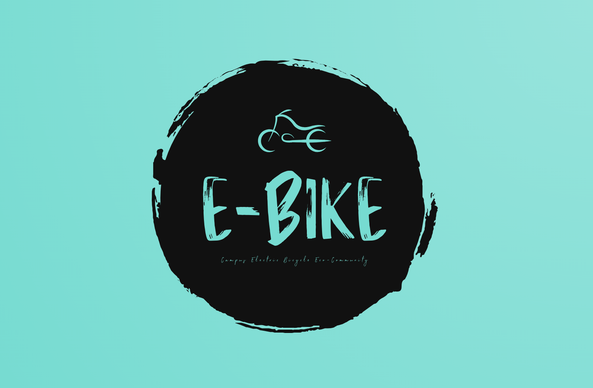

# 🤔 问题定义及可行性分析

## 1 引言

在如今的大学校园里，电动自行车作为一种快捷、便利的出行方式，已经成为越来越多学生的首选。然而，随着电动自行车的普及，一系列管理和服务方面的问题也随之而来。例如：购车渠道不透明导致学生购车风险增加，充电桩占用信息不明导致充电困难，缺乏与商家的沟通渠道导致无法及时维修车辆，停车位紧张影响了校园秩序，以及电动车安全问题引发的校内交通及消防事故频发等。

在此背景下，我们团队计划开发一个面向大学生的校园电动自行车生态社区小程序，旨在有效协助解决上述问题，为大学校园内电动车的使用提供便捷、安全的解决方案。在以下部分，我们将对该项目的问题定义及可行性进行具体分析，详细阐述项目的最终构想。

## 2 问题定义

在这一部分，我们将呈现项目构想阶段的最终成果，即对当前面临的问题进行定义，并确定我们的解决方案。

### 2.1 待开发的工程项目名称及logo设计

#### 2.1.1 项目名称

我们将要开发的小程序名称定为“易拜 E-bike”，该名称的设计考虑了多个因素，以确保能够清晰地传达我们的服务理念和特点：

* **E-bike：**我们取小程序英文名为“E-bike”，这也是电动自行车的简称。将其作为名称的一部分，使用户能够直观地理解我们的服务对象和核心功能。
* **易拜（YiBai）：**这个中文名称首先传达了一种轻松、简便的使用体验。在现代生活中，便利性成为了用户选择服务的关键因素之一。同时，“易拜”不仅是小程序英文名“E-bike”的谐音，它的另外一个中文谐音“一百”还暗示了我们对服务质量的百分百承诺。我们致力于让用户在使用我们的平台时，感受到100%的满意度和便捷性。
* **易记易懂：**“易拜 E-bike”这个名称简洁明了，易于记忆和传播。在校园内推广我们的服务时，一个易于记忆的名称能够帮助我们更快地建立品牌认知度，吸引更多用户使用我们的平台。
* **跨文化传播：**“易拜”这个名称不仅在中文中富有含义，而且发音清晰，易于跨文化传播。无论是中国本土的用户还是国际留学生，都能够轻松理解并接受这个名称，使我们的服务更具包容性和通用性。

#### 2.1.2 logo设计

如下图所示，对于 logo 设计，我们计划采用一个简洁而富有现代感的电动自行车图标作为主要标识。图标下方使用大写的“E-bike”以突出其电动自行车的特性，并与我们的小程序英文名相呼应。

此外，我们还将配备一个引人注目的slogan，即“Campus Electric Bicycle Eco-Community”，中文标语是“校园电动自行车生态社区”，以突显我们小程序的主题和目标，让用户一眼就能理解我们的服务内容和宗旨。

<figure><figcaption>
“易拜 E-bike”小程序logo设计
</figcaption></figure>

### 2.2 软件项目使用部门和用户群体

在本项目中，小程序（以下均简称“易拜”）的主要使用单位为：**以中山大学深圳校区为代表的经常使用电动自行车作为出行工具的各个大学**，主要涵盖以下使用部门和用户群体：

<table><thead><tr><th width="232" align="center">使用部门和用户群体</th><th align="center">描述</th></tr></thead><tbody><tr><td align="center"><strong>在校大学生</strong></td><td align="center">作为电动自行车的主要使用者和受益者，他们将是我们小程序的主要用户群体，通过该平台管理和享受电动自行车的便利服务。大学生可以借助我们的平台轻松了解各类车辆信息、预约维修服务、了解充电桩情况等，提升出行效率和体验。</td></tr><tr><td align="center"><strong>学校周边电动自行车车行</strong></td><td align="center">作为电动自行车的服务提供者，他们将通过我们的平台连接到学生用户，提供预约上门维修等相关服务。通过易拜平台，车行可以扩大业务范围，与大学生用户建立更紧密的联系，提高服务覆盖率和用户满意度。</td></tr><tr><td align="center"><strong>学校保卫处</strong></td><td align="center">作为学校的后勤管理机构，负责校园内的维护和管理工作，他们将是我们合作的重要部门之一，与我们共同合作解决校园电动自行车管理中的各项问题。保卫处可以通过易拜平台实现对电动车辆的消防反馈监控、优化停车位分配等，提高管理效率和校园环境质量。</td></tr><tr><td align="center"><strong>学生事务办公室</strong></td><td align="center">负责学生生活和服务的机构，将在活动组织、信息发布等方面与我们的平台合作，提供更加全面的服务体验给学生用户。通过易拜平台，学生事务办公室可以发布校园电动车辆活动信息、提供交通出行建议、与学生用户互动等，丰富校园生活体验，增强学校服务的吸引力和影响力。</td></tr></tbody></table>

### 2.3 软件项目开发单位

本项目由中山大学深圳校区智能工程学院的软件工程小组“**SevenAutomen**”负责开发。团队的指导老师是**王帅**，邮箱：wangsh368@mail.sysu.edu.cn。小组成员包括**沈鹏飞、刘书睿、刘畅、吴恺云、黄楚丹、刘子豪和唐锦洲**，成员的具体信息如下：

<table data-view="cards"><thead><tr><th data-type="users" data-multiple></th><th></th><th></th></tr></thead><tbody><tr><td><a href="https://app.gitbook.com/u/WDLjcnYaJZOnTaxPipybuPYEI153">shenpf3</a></td><td><strong>姓名：</strong>沈鹏飞</td><td><strong>学号：</strong>21312188</td></tr><tr><td><a href="https://app.gitbook.com/u/PcGO1DW7MZVbMxHRPMyWROKZzwn1">刘书睿</a></td><td><strong>姓名：</strong>刘书睿</td><td><strong>学号：</strong>21312295</td></tr><tr><td><a href="https://app.gitbook.com/u/YRJxqSSYRWVX7Q0psj7XxEMwVbL2">刘畅</a></td><td><strong>姓名：</strong>刘畅</td><td><strong>学号：</strong>21312177</td></tr><tr><td><a href="https://app.gitbook.com/u/AQ6nuwfgkYc0IYRPpl20FomZGiU2">吴恺云</a></td><td><strong>姓名：</strong>吴恺云</td><td><strong>学号：</strong>21312537</td></tr><tr><td><a href="https://app.gitbook.com/u/38TEZLZFTeapfDVwbsEy94kt0rq2">黄楚丹</a></td><td><strong>姓名：</strong>黄楚丹</td><td><strong>学号：</strong>21312024</td></tr><tr><td><a href="https://app.gitbook.com/u/bw4Ev4MapOPvz8RNNkgkZ1rgLHh1">liuzh297</a></td><td><strong>姓名：</strong>刘子豪</td><td><strong>学号：</strong>21312439</td></tr><tr><td><a href="https://app.gitbook.com/u/eDuOQyxxq5RjDyaODgK5zwjGuh33">唐锦洲</a></td><td><strong>姓名：</strong>唐锦洲</td><td><strong>学号：</strong>21312238</td></tr></tbody></table>

“**SevenAutomen**”是一支由经验丰富、技术精湛的学生和指导老师组成的团队，专注于软件开发和智能系统工程。团队成员在多次项目中积累了丰富的实践经验和技术储备，能够胜任从需求分析、系统设计到开发实施的全过程。团队致力于通过高效、创新的技术手段，开发出功能完善、用户体验优良的校园电动自行车生态社区小程序，满足用户需求并提升校园生活质量。

### 2.4 问题的概括定义

当前，大学校园内的电动自行车使用频率高，但缺乏一个集成的平台来管理车辆的各项服务，如维修、充电以及使用反馈。这种管理的缺失导致了多个问题，包括车辆维修不及时、充电设施使用效率低下、用户无法方便地获取和分享使用体验等。

为解决这些问题，我们拟开发“易拜”小程序，旨在构建一个综合的电动自行车生态社区，提升管理效率和用户体验。该小程序将提供一站式服务，涵盖电动自行车的使用反馈、车型品牌排行、维修预约、充电桩信息和二手交易等功能。通过这一平台，用户可以便捷地管理和使用电动自行车，享受更加安全、便利的出行服务，同时学校也可以更高效地进行车辆和设施的管理，优化校园交通环境。

### 2.5 软件项目的用途和目标

#### 2.5.1 项目用途

“易拜 E-bike”小程序的主要用途是为大学生提供一个便捷智能的电动自行车维修、管理、反馈和交流平台。该平台将整合多项功能，为用户提供全面的服务，旨在提升电动自行车的使用体验和管理效率。我们计划在小程序中主要提供以下功能：

<table><thead><tr><th width="217" align="center">主要功能</th><th align="center">描述</th></tr></thead><tbody><tr><td align="center"><strong>电动自行车喜爱度排行</strong></td><td align="center">展示校园内最受欢迎的电动自行车排名，帮助用户了解热门车型。</td></tr><tr><td align="center"><strong>电动自行车评论动态贴</strong></td><td align="center">用户可以对电动自行车发表评价和动态贴，分享使用心得和经验，增强社区氛围。</td></tr><tr><td align="center"><strong>车辆充电桩/柜信息展示</strong></td><td align="center">实时展示校园内各充电桩和充电柜的位置信息及使用状态。用户可以通过小程序轻松查找和使用充电设施，减少等待时间和充电困难。</td></tr><tr><td align="center"><strong>车辆维修预约</strong></td><td align="center">提供在线上门预约维修服务，用户可以方便地安排电动自行车的维修时间，查看维修进度，保障车辆的正常使用。</td></tr><tr><td align="center"><strong>二手转让</strong></td><td align="center">为用户提供二手电动自行车的交易平台，促进资源循环利用。</td></tr></tbody></table>

通过这些功能，“易拜 E-bike”小程序将有效提升校园内电动自行车的使用和管理效率，改善学生的出行体验，倡导安全出行理念。

#### 2.5.2 项目目标

“易拜 E-bike”小程序的目标是提高电动自行车的使用率和管理效率，并提供一个集成化的服务平台，涵盖车辆维修、充电服务及用户互动。具体目标包括：

* **提高管理效率：**为学校后勤管理处和相关部门提供一个高效的电动自行车管理工具，简化车辆管理流程，优化停车位分配，实时监控车辆使用和充电状态，提高整体管理效率。
* **改善出行体验：**为学生提供便捷的电动自行车服务，通过喜爱度排行和评论动态贴等功能，帮助用户选择合适的电动车型。通过充电桩/柜信息展示，用户可以快速找到可用的充电设施，并通过在线维修预约功能及时解决车辆故障，提升出行的舒适度和安全性。
* **促进资源利用：**通过提供二手电动自行车的交易平台，促进车辆的循环利用，减少资源浪费。用户可以在平台上买卖二手电动自行车，充分利用现有资源，降低购车成本。
* **提升消防安全：**通过平台的管理和监控功能，提高电动自行车的充电和停放安全，防止因电动车辆管理不当引发的火灾隐患。提供安全充电建议和规范的充电设施使用信息，增强用户的安全意识，确保校园内电动车辆的消防安全。

### 2.6 软件项目的类型和规模

#### 2.6.1 项目类型

“易拜”小程序属于综合管理类小程序。通过集成多种功能模块，满足大学生、学校管理部门和电动自行车服务商的多样化需求。

#### 2.6.2 项目规模

本项目规模为中型，主要涵盖以下模块：

<table><thead><tr><th width="132" align="center">模块</th><th align="center">模块描述</th></tr></thead><tbody><tr><td align="center"><strong>用户管理</strong></td><td align="center">处理用户注册、登录、权限管理及用户信息维护，确保用户数据的安全和准确。该模块为平台提供稳定的用户基础和安全保障。</td></tr><tr><td align="center"><strong>充电管理</strong></td><td align="center">展示校园内充电桩和充电柜的位置信息及使用状态，提供充电信息的实时展示，优化充电资源的利用率。</td></tr><tr><td align="center"><strong>维修管理</strong></td><td align="center">实现车辆维修的在线预约，确保车辆能够及时维修和保养，提升用户满意度。</td></tr><tr><td align="center"><strong>交流平台</strong></td><td align="center">提供用户之间的互动交流功能，包括电动自行车评论动态贴和电动自行车喜爱度排行等。</td></tr><tr><td align="center"><strong>数据分析</strong></td><td align="center">对用户行为、车辆使用情况、维修记录、充电数据等进行分析，提供数据支持，帮助优化管理决策和服务改进。</td></tr></tbody></table>

### 2.7 软件项目开发的开始时间和预计交付使用时间

* **项目开始时间：**2024年04月03日
* **预计交付使用时间：**2024年05月20日

### 2.8 软件项目使用单位和开发单位双方确认信息

<table><thead><tr><th width="174" align="center">详情</th><th width="261" align="center">使用单位确认信息</th><th align="center">开发单位确认信息</th></tr></thead><tbody><tr><td align="center"><strong>单位名称</strong></td><td align="center">
中山大学深圳校区

后勤保卫处
</td><td align="center">
中山大学智能工程学院

软件工程小组“SevenAutomen”
</td></tr><tr><td align="center"><strong>负责人姓名</strong></td><td align="center">经端</td><td align="center">刘书睿</td></tr><tr><td align="center"><strong>负责人职务</strong></td><td align="center">后勤保卫处主任</td><td align="center">“易拜 E-bike”项目进度负责人</td></tr><tr><td align="center"><strong>确认状态</strong></td><td align="center">已确认</td><td align="center">已确认</td></tr></tbody></table>

## 3 可行性分析

可行性分析旨在评估项目是否值得完成，我们具体将从技术可行性、经济可行性、操作可行性和社会可行性这四个方面对我们的“易拜”项目进行详细分析。

### 3.1 技术可行性

在评估“易拜”项目的技术可行性时，我们将从资源、技术和效率等三个方面进行详细分析：

**1) 资源分析：**&#x20;

<table><thead><tr><th width="185" align="center">方面</th><th align="center">分析</th></tr></thead><tbody><tr><td align="center"><strong>前端资源</strong></td><td align="center">前端开发基于HTML、CSS和JavaScript实现。学校提供的开发设备和环境能够完全支持这些前端技术的应用，确保开发过程的顺利进行。</td></tr><tr><td align="center"><strong>后端资源</strong></td><td align="center">小程序后端基于Django框架实现。Django作为一个高效的Web框架，具有强大的数据处理和管理能力，适合我们的项目需求。</td></tr><tr><td align="center"><strong>服务器和网络设施</strong></td><td align="center">学校提供的服务器和网络设施能够满足小程序的数据存储和传输需求，支持高并发访问和数据的安全性。</td></tr><tr><td align="center"><strong>开发团队</strong></td><td align="center">团队成员具备前后端开发的丰富经验，熟悉HTML、CSS、JavaScript和Django等技术，能够胜任项目的开发需求。</td></tr></tbody></table>

&#x20;**2) 技术分析：**

<table><thead><tr><th width="130" align="center">方面</th><th align="center">分析</th></tr></thead><tbody><tr><td align="center"> <strong>已有技术</strong></td><td align="center">我们将利用微信小程序开发技术、数据库管理技术和信息管理系统开发经验，构建“易拜”小程序。微信小程序作为一种轻量级应用，具有跨平台、低成本、快速开发等优势，非常适合我们的项目需求。且团队成员熟悉微信小程序的开发规范和接口，积累了丰富的技术经验。</td></tr><tr><td align="center"><strong>技术水平</strong></td><td align="center">前端开发成员具备HTML、CSS、JavaScript的深厚技术基础，能够设计出用户友好的界面和交互。而团队中的后端开发成员精通Django框架，能够高效地进行业务逻辑的实现和数据管理。与此同时，全组成员都具备全栈开发能力，能够协调前后端的开发工作，提高开发效率。</td></tr><tr><td align="center"><strong>工作基础</strong></td><td align="center">团队之前成功开发过类似的小规模管理系统，积累了一定的技术储备和经验。与此同时，团队成员积极学习新技术，具备较强的技术更新和学习能力。我们可以借鉴和应用以往的经验，提高开发效率和项目质量。</td></tr></tbody></table>

**3) 效率分析：**&#x20;

<table><thead><tr><th width="169" align="center">方面</th><th align="center">分析</th></tr></thead><tbody><tr><td align="center"> <strong>开发周期计划</strong></td><td align="center">项目计划在2024年4月3日开始开发，预计在2024年5月20日交付使用，开发周期为1个半月。根据团队的经验和项目计划，这个时间安排是合理的。此外，我们拟定的开发计划中，将项目分解为多个阶段，每个阶段都有明确的目标和时间节点。这样可以确保项目按时交付，提高开发效率。</td></tr><tr><td align="center"><strong>项目管理</strong></td><td align="center">项目采用敏捷开发方法，分阶段进行需求分析、设计、开发和测试，确保项目按时交付。小组预计每周定期开会进行迭代和回顾，及时发现和解决问题。</td></tr><tr><td align="center"><strong>团队协作能力</strong></td><td align="center">我们的开发团队具有良好的团队协作能力，成员分工明确，前后端开发、测试和项目管理各司其职，充分发挥每个团队成员的专业优势，保证开发工作的高效进行，提高工作效率。</td></tr><tr><td align="center"><strong>设备和资金</strong></td><td align="center">项目预算充足，硬件设备和软件工具齐全，能够支持高效的开发工作。开发环境配置完备，能够保障开发过程的顺利进行。一旦项目上线运行，我们将提供持续的技术支持和维护服务，及时解决可能出现的技术问题和Bug，确保系统稳定运行。</td></tr></tbody></table>

在开发周期计划中，我们团队还制定了详细的项目开发计划表，明确了每项任务的具体负责人和截止时间，以帮助项目高效推进，团队开发计划详情见所给链接：


团队开发计划详情


<figure><figcaption>
项目开发计划表
</figcaption></figure>

### 3.2 经济可行性

经济可行性分析旨在从经济角度评估“易拜”小程序项目的开发是否具有投资价值，以协助我们做出是否投资于该项目开发的决策。我们将综合考虑成本估计和效益估计两个方面进行具体分析。

#### 3.2.1 工作量及成本估算：

首先需要对“易拜”项目开发的工作量进行估算，我们使用代码行估计和功能点技术度量两种方法来评估软件开发所需的工作量：

* **代码行估计：**此方法是通过估计开发团队编写的代码行数来评估工作量。根据项目的规模和复杂程度，以及开发人员的平均编码速度，可以估算出开发团队需要编写的代码行数。通过初步估算，我们预计项目需要开发10,000行代码，开发周期为1个半月（约45天）。
* **功能点技术度量：**这种方法是通过对项目功能进行分类和计数，然后根据功能点的数量和复杂程度来评估工作量。功能点可以分为简单、中等和复杂三个等级，根据不同等级的功能点所需的工作量来进行估算。我们预计项目会包含50个功能点，其中分为30个简单功能点，20个中等功能点和10个复杂功能点。简单功能点的工作量估计为1人/天，中等估计为2人/天，复杂估计为3人/天。

根据我们对软件开发工作量的分析，可以进一步对“易拜”小程序的开发成本进行估算。假设开发周期为45天，结合下表所示的开发项目成本估计，预计“易拜”项目的总开发成本为300×1.5+7,000+(300+500)×1.5÷12+600+1,500=9,650元左右：

<table><thead><tr><th width="184" align="center">成本项目</th><th width="308" align="center">详细说明</th><th align="center">成本估计</th></tr></thead><tbody><tr><td align="center"><strong>硬件成本</strong></td><td align="center">包括云服务器租用费用或购置服务器的成本。</td><td align="center">
300元/月

（云服务器租用费用）
</td></tr><tr><td align="center"><strong>开发费用</strong></td><td align="center">包括开发团队的人力成本，开发人员、设计师、测试人员的工资和福利。前期受项目经费限制，团队成员一致决定不做过多投入。</td><td align="center">
共计约7000元

（开发团队的总工资）
</td></tr><tr><td align="center"><strong>系统运行费用</strong></td><td align="center">包括服务器租用费、域名注册费、安全认证费等。</td><td align="center">
300元/年

（域名注册费用）
</td></tr><tr><td align="center"><strong>维护费用</strong></td><td align="center">包括小程序更新、bug修复、安全漏洞修补等费用。</td><td align="center">500元/年</td></tr><tr><td align="center"><strong>人员培训费用</strong></td><td align="center">包括为用户、后勤管理人员和电动自行车服务商提供培训的费用。</td><td align="center">600元/次</td></tr><tr><td align="center"><strong>运营成本</strong></td><td align="center">包括市场营销费用、客户服务费用、广告费用等。</td><td align="center">共计约1500元</td></tr></tbody></table>

#### 3.2.2 效益估计：

**1)   直接效益：**

* **商家入驻费用：**通过商家在“易拜”小程序上的入驻，我们可以收取一定的入驻费用，从而带来直接的收益。假设每家商家入驻费用为1000元，若平均每月有3家商家入驻，那么每月可获得的收入为：1,000×3=3,000元。
* **用户部分功能使用权限：**对于新用户，我们提供一定期限内（例如1个月）的免费使用付费功能的权限，超过新人期后则需要付费购买。这样的策略可以增加用户的黏性，并且为我们带来一定的收入。假设每月新用户付费功能的购买率为10%，付费金额为15元/月，而且有500名新用户，那么每月可获得的收入为：15×800×10%=1,200元/月。
* **投资及页面广告费：**我们可以通过投放页面广告来获取收益，吸引商家和其他机构进行投资合作，从而获得一定的广告费用。假设每月投放页面广告，广告费用为500元/月，那么每年可获得的收入为：500×12=6,000元/年。
* **用户成本节省：**通过小程序的推广，可以显著提高校园电动自行车的管理效率。用户之间的交流反馈和在线预约维修功能，有助于及时解决车辆问题，减少损坏和丢失的风险，从而降低维护和更换成本。预计每年可以为全体用户节省约10,000元的相关费用。
* **校园人力成本节省：**小程序的高效服务功能使得学生和学校管理部门能够更加便捷地管理车辆和服务，减少人工干预和手动管理所需的时间和精力。预计每年可以节省约5,000元的人力成本。

**2)   间接效益：**

* 提高学校的管理水平和学生的满意度，提升学校的整体形象和声誉。
* 通过提供便捷的维修和充电服务，以及学生的出行及消防安全反馈，减少电动自行车的安全隐患，增强校园的安全意识。
* 增强学生之间的互动和交流，营造良好的校园文化氛围。

**3)   综合分析**

结合上述分析，“易拜”小程序具有较高的经济可行性。通过收取商家入驻费用、用户付费功能使用费以及页面广告费，项目能够带来可观的直接收益。同时，通过提高电动自行车的管理效率，降低维护和人力成本，能够进一步节省费用。此外，间接效益还包括提升学校管理水平和学生满意度，增强校园安全意识和文化氛围。因此，从经济角度来看，“易拜”小程序项目具有较高的投资价值，能够实现多方共赢。

### 3.3 操作可行性

在设计“易拜”小程序时，我们充分考虑了用户的操作体验和技术接受程度，确保软件的运行和使用方式便于用户接受和使用。以下是针对小程序操作可行性的详细分析。

#### 3.3.1 目标用户

“易拜”小程序的主要目标用户是在校大学生，其他用户还包括学校后勤管理人员以及电动自行车服务商的。下表是对各类用户的使用习惯和技术水平的分析：

<table><thead><tr><th width="183" align="center">目标用户</th><th width="258" align="center">技术水平</th><th align="center">使用习惯</th></tr></thead><tbody><tr><td align="center"><strong>在校大学生</strong></td><td align="center">大学生普遍对智能手机和移动应用有较高的接受度和使用能力，尤其是在微信小程序方面，他们已经熟悉基本的操作。</td><td align="center">大学生习惯于通过手机应用获取信息和完成各种事务，如社交、购物、学习等，他们对操作简便、功能齐全的小程序有较高的接受度和依赖性。</td></tr><tr><td align="center"><strong>学校后勤管理人员</strong></td><td align="center">后勤管理人员对信息化管理工具有一定的使用经验，但可能对新技术的接受度稍低，需要简单易懂的操作界面。</td><td align="center">他们习惯于通过电脑或手机进行日常管理工作，要求系统的操作方式能够高效地完成任务，减少学习成本和操作复杂度。</td></tr><tr><td align="center"><strong>电动自行车服务商</strong></td><td align="center">服务商对线上服务平台有基本的操作能力，但需要简洁明了的操作流程。</td><td align="center">他们需要通过平台及时处理用户的预约和反馈，要求系统响应迅速、信息展示清晰。</td></tr></tbody></table>

#### 3.3.2 小程序的使用操作方式

在设计“易拜”小程序的使用操作方式时，我们注重简洁易用、友好直观的原则，以确保用户能够轻松上手并高效使用我们的平台。下表是我们针对目标用户群体设计的操作方式特点：

<table><thead><tr><th width="163" align="center">操作特点</th><th align="center">描述</th></tr></thead><tbody><tr><td align="center"><strong>简便操作</strong></td><td align="center">小程序的使用操作方式简单，符合大学生和其他用户的使用习惯。用户只需通过微信搜索“易拜”小程序，即可进入平台进行操作，无需下载和安装额外的应用。这种便捷的访问方式确保用户能够快速上手，减少了技术障碍。</td></tr><tr><td align="center"><strong>界面设计友好</strong></td><td align="center">小程序的界面设计遵循用户体验原则，计划采用简洁直观的设计风格。主要功能模块清晰分布，用户能够快速找到所需功能并进行操作。通过使用图标、颜色和文字说明，使界面更加直观和易于理解。</td></tr><tr><td align="center"><strong>功能模块清晰</strong></td><td align="center">我们计划将小程序的功能按模块清晰展示，让用户能够直观地了解每个功能的用途和操作方法。各功能模块之间通过明确的导航和页面链接相互连接，确保用户能够顺利地浏览和使用。</td></tr><tr><td align="center"><strong>技术支持和培训</strong></td><td align="center">对于学校后勤管理人员和电动自行车服务商，我们可以提供详细的操作手册和在线培训资源，帮助他们快速掌握小程序的使用方法。此外，设立专门的技术支持团队，及时解答用户在使用过程中遇到的问题，保障用户的操作体验。</td></tr></tbody></table>

### 3.4  社会可行性

对于“易拜”小程序的社会可行性分析，我们旨在评估目标软件系统在当前法律和道德环境下的合理性、合法性，以及是否存在违规、侵权等潜在问题，从多个方面考虑项目的社会影响和合规性：

**1)  法律和道德分析**

* 目标软件系统的运行和操作方式在法律和道德上是合理合法的。我们将严格遵守国家相关的法律法规，包括但不限于互联网信息服务管理办法、个人信息保护法等，确保项目的合法性和规范性。
* 同时，我们将尊重用户的隐私权和个人信息保护，不会擅自收集、使用或泄露用户的个人信息，以保障用户权益和社会公共利益。

**2)  隐私保护**

* “易拜”小程序将采取必要的技术措施保护用户隐私，确保用户信息的安全。我们将建立健全的信息安全管理制度，采用加密传输、数据脱敏、权限控制等技术手段，防止用户信息被非法获取或篡改。
* 同时，我们将在用户注册、登录等环节明确告知用户隐私政策和使用条款，用户可以自主选择是否同意提供个人信息，并随时行使访问、修改、删除等权利。
* 此外，我们将建立专门的数据安全管理团队，负责监测和应对可能存在的安全风险，确保用户数据得到充分的保护。

**3)  消防安全防控**

* “易拜”小程序的实施有助于推动校内消防安全防控工作。通过及时发现和处理违停、违规拉线充电等行为，减少火灾和安全事故的发生。
* 同时，我们预计建立与学校后勤管理部门的联动机制，将校园电动自行车管理纳入消防安全监管体系，加强对校园消防设施和车辆管理的协调和监督，提升校园消防安全防控水平。

**4)  社会效益**

* “易拜”小程序的推出将为大学生提供便捷、安全的电动自行车出行服务，改善校园出行环境，促进安全出行理念的普及。通过提供车辆维修预约、充电桩信息等功能，我们能够优化电动自行车的使用体验，提高管理效率，有助于缓解校园停车难题和交通拥堵现象。
* 此外，“易拜”小程序还将促进二手车辆的转让和资源循环利用，减少资源浪费，推动可持续发展。因此，该项目具有积极的社会效益，有利于提升校园生活质量和社会环境的改善。

### 3.5 结论

综合技术、经济、操作和社会等各方面的可行性分析，我们得出结论：“易拜”小程序开发项目具有较高的可行性和投资价值，对校园电动自行车管理和校园生活的改善具有重要意义，值得进行立项并启动开发。
