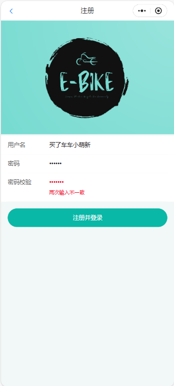
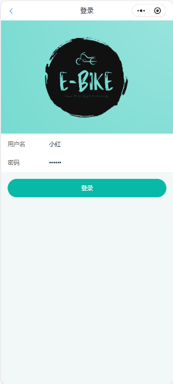
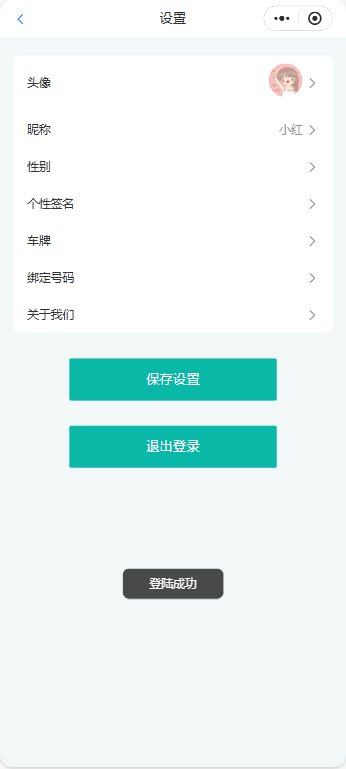
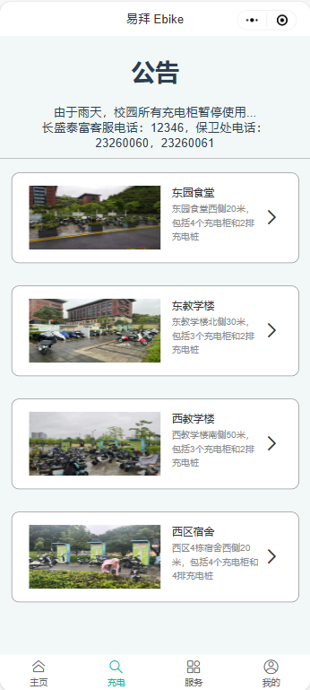
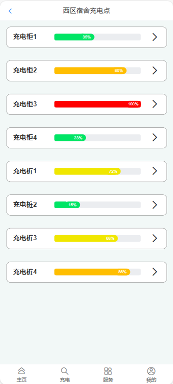
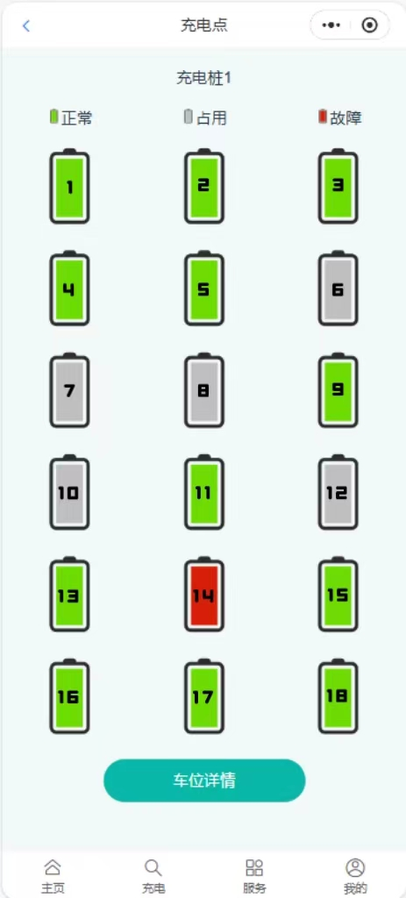
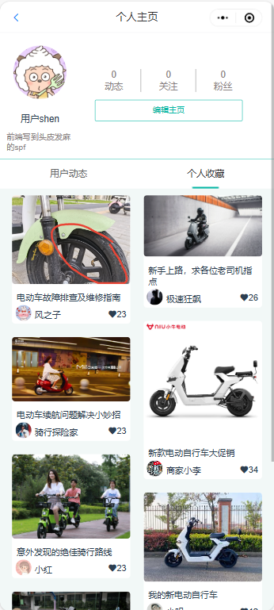

# 💂‍♀️ 用户手册

## 1 引言

欢迎使用“易拜 E-bike”小程序！

我们非常高兴能够为您提供便捷的电动车服务平台。“易拜 E-bike”小程序旨在为用户提供一站式的电动车使用和服务体验，包括车辆信息查询、维修预约、二手交易、安全信息发布等多种功能。

本用户手册旨在帮助您快速上手“易拜 E-bike”小程序，详细介绍小程序的各项功能和使用方法，确保您能够充分利用我们的服务，为您的电动车生活带来更多便利和乐趣。

## 2 注册登录

若用户是首次使用“易拜 E-bike”小程序，则需要先注册账号。其中，在进行注册操作时，需要确保两次输入的密码相同，方可成功注册并直接登陆。

若用户此前已注册过账号，则可以直接使用注册过的账号登录我们的“易拜 E-bike”小程序，登陆成功后会跳转到【我的】-【设置】界面，进行个人隐私的设置修改。【设置】页详情将在后续的用户手册中详细介绍，此处仅提供界面展示。

<figure><figcaption>
【注册】
</figcaption></figure>

 

<figure><figcaption>
【登录】
</figcaption></figure>

 

<figure><figcaption>
【登陆成功】
</figcaption></figure>

## 3 广场动态

### 3.1 浏览动态

#### 3.1.1 主页推荐

用户可以浏览实时更新的动态，如图：

<figure><figcaption>
【首页】界面
</figcaption></figure>

动态来源说明：广场动态来源为所有满足身份认定的用户。本平台主要面向对象为在校学生，故会对第三方商家的动态发布进行数量和内容上的一定限制，以保证在校学生的用户体验。

动态推荐算法说明：本平台采用先进的动态推荐算法，根据用户的兴趣偏好、浏览历史、点赞和评论行为等多维度数据进行综合分析，智能推荐符合用户兴趣的动态内容。算法会优先展示与用户相关性较高的动态，同时兼顾时效性和多样性，以确保用户能够及时获取到最新、最热门的电动车资讯和话题，提升用户的整体体验。

#### 3.1.2 热榜

用户可以通过“热榜”栏查看当前排行榜，包括“车型评分榜”和“品牌热度榜”，<mark style="color:blue;">如图（展示榜单）：</mark>

热榜规则算法说明：热榜根据用户的评分、点赞数、评论数以及转发次数等多维度数据进行综合排名。车型评分榜主要依据用户对电动车各方面性能的评分进行排名，而品牌热度榜则根据品牌在平台上的综合活跃度、讨论热度和用户关注度进行排序。此规则确保榜单能够反映出当前最受用户欢迎和讨论度最高的车型和品牌，帮助用户快速了解市场趋势。

#### 3.1.3 搜索动态

用户可以通过搜索框来搜索已发布过的动态内容，<mark style="color:blue;">如图：（点进搜索框前的样子和搜索出来后的效果）</mark>

该搜索功能基于标题、标签和内容的关键词匹配，通过对用户输入的关键词进行智能解析，快速返回相关的动态结果。搜索算法会优先显示与关键词高度匹配的内容，同时支持模糊搜索以提升用户搜索体验。为了确保内容的合规性和平台环境的健康，搜索功能内置了敏感词屏蔽机制，自动过滤违禁词汇和不适当内容。此外，搜索结果会依据发布时间和用户互动数据（如点赞数和评论数）进行排序，确保用户能够看到最新且最受欢迎的动态内容。

### 3.2 发布动态与转让

用户可以通过【我的】-【发布】-【发布动态】功能来发布自己的动态，如图：

<figure><figcaption>
【我的】-【发布】-【发布动态】界面
</figcaption></figure>

每条动态支持图片上传，用户可以自定义标题与正文描述，并且可以选择添加标签，以发现更多共同话题。

同样，用户可以通过【我的】-【发布】-【发布转让】功能来发布自己的电动自行车转让信息，如图：

<figure><figcaption>
【我的】-【发布】-【发布转让】界面
</figcaption></figure>

比之于【发布动态】，【发布转让】功能添加了价格描述，用户可以添加自己的电动车预期转让价格，如图中红框圈出内容。

注意：本平台仅支持电动自行车转让信息发布，不支持交易，请根据发布者联系方式自行商定最终价格和实施交易。关于交易过程中的任何问题，属于用户个人行为，本平台概不负责。

## 4 充电

本平台提供关于充电桩是否可用的公告，会及时反馈由于天气、施工、电力等问题造成的充电桩使用问题，以便利用户。

用户可以查看东园食堂、东教学楼、西教学楼、西园宿舍共四处充电桩的信息。我们还在【充电】页最上方添加了公告信息，用于即使反馈特殊情况的充电桩/柜信息，如图：

<figure><figcaption>
【充电】
</figcaption></figure>

用户可以点开每个充电桩集群查看具体的占用情况，我们用进度条和颜色信息对不同充电桩/柜当前的占用情况进行了直观的视觉区分，如图：

<figure><figcaption>
【充电】-【西区宿舍】
</figcaption></figure>

进一步点开其中一个充电柜按键，可得到该充电柜的所有充电口的具体占用状态。我们在图中给出了图例，红色代表故障，灰色代表已被占用，而绿色代表可以正常使用的具体充电口。此外，我们还添加了查看充电柜附近监控图像的按键，点击可以查看充电柜的周边环境信息，如图：

<figure><figcaption>
【充电】-【西区宿舍】-【充电桩1】
</figcaption></figure>

## 5 服务

【服务】界面如下：

<figure><figcaption>
【服务】界面
</figcaption></figure>

### 5.1 易维修

用户可以通过【服务】-【易维修】功能来查看校园周边电动车维修点和预约维修。其中，地图中标注出了校园周边维修点，用户可以点开维修点标识符，查看每个维修商家的具体信息和联系方式。如图：

<figure><figcaption>
【服务】-【易维修】功能界面
</figcaption></figure>

用户可以填写信息进行电动车维修预约，商家会及时接单。比如，选择维修地点：

<figure><figcaption>
【服务】-【易维修】-“选择维修地点”界面
</figcaption></figure>

商家接单后，会在下面的聊天框中与用户联系。<mark style="color:blue;">如图（展示下面的聊天框与聊天具体界面）：</mark>

### 5.2 易反馈

发现电动自行车违规停放、违规充电等情况，用户可以通过该平台的【服务】-【易反馈】功能进行反馈，如图：

<figure><figcaption>
【服务】-【易反馈】功能界面
</figcaption></figure>

用户必须添加反馈描述，否则页面会提示“请填写反馈描述”，如图中红字。

该反馈信息将交至学校保卫处，保卫处会第一时间处理。

### 5.3 易安行

【服务】-【易安行】功能专为校方发布关于校园电动车通知与文件所设计。如校园电动车停放地点安排、电动车安全隐患统一排查、充电桩的维修公示等。点击待查看内容可跳转到官方发布的对应文件发布详情页，<mark style="color:blue;">如图：</mark>

### 5.4 易转让

用户可以通过【服务】-【易转让】功能查看用户发布的电动自行车转让信息，<mark style="color:blue;">如图（展示整体界面和点开某一条后的界面）：</mark>

## 6 我的

【我的】页面如下：

<figure><figcaption>
【我的】页面
</figcaption></figure>

### 6.1 个人主页

用户点击自我的头像或昵称即可进入个人主页。主页展示有动态数、关注数、粉丝数、发布的动态、个人收藏以及个性签名等信息。在个人主页中再次点击头像，还可以进行放大查看功能，如图：

<figure><figcaption>
【个人主页】
</figcaption></figure>

 

<figure><figcaption>
【个人主页】-点击查看个人头像
</figcaption></figure>

点击其他用户的头像或昵称即可进入其个人主页<mark style="color:blue;">如图（展示别的用户的个人主页）：</mark>

### 6.2 个人信息

#### 6.2.1 收藏

点击收藏图标即可查看个人收藏内容，<mark style="color:blue;">如图（展示点击收藏、收藏夹内容界面）：</mark>

#### 6.2.2 消息

点击消息图标即可查看互动消息（包括私信、点赞、收藏、关注等），<mark style="color:blue;">如图（展示点击消息、互动消息内容界面）：</mark>

#### 6.2.3 发布

详见【3.2 发布动态与转让】。

#### 6.2.4 设置

点击【我的】-【设置】图标即可进行用户设置，如图：

<figure><figcaption>
【我的】-【设置】界面
</figcaption></figure>

比如，“个性签名”选项的修改：

<figure><figcaption>
“个性签名”选项修改界面
</figcaption></figure>

#### 6.2.5 用户协议

软件用户协议是一份法律文件，用于明确软件开发者和用户之间的权利和义务。它规定了用户在使用软件时必须遵守的条款和条件，包括许可使用范围、用户行为规范、隐私保护、知识产权以及责任限制等内容。用户协议的目的是保护双方的利益，确保软件的合法和规范使用，同时为可能的争议提供解决依据。用户可以在【我的】-【用户协议】中查看，如图：

<figure><figcaption>
用户协议界面
</figcaption></figure>

#### 6.2.6 隐私政策

用户可以点击【我的】-【隐私政策】查看小程序的隐私政策：

<figure><figcaption>
“隐私政策”界面
</figcaption></figure>

#### 6.2.7 使用手册

即本文档所展示内容，本手册介绍了小程序的按键使用逻辑，如下图：

<figure><figcaption>
“使用手册”示意图
</figcaption></figure>

#### 6.2.8 客服&#x20;

用户可以点击客服图标与客服沟通，<mark style="color:blue;">如图（展示点击客服图标与客服详情页）：</mark>

#### 6.2.9 关于我们

关于我们的团队介绍如下：

<figure><figcaption>
“关于我们”界面
</figcaption></figure>

## 7 互动

### 7.1 点赞

点击点赞图标即可对动态内容进行点赞，动态页面会展示点赞数量。<mark style="color:blue;">如图（点击点赞图标和点赞数量展示）：</mark>

### 7.2 收藏

点击收藏图标即收藏动态内容，动态页面会展示收藏数量，个人收藏内容可以在【我的】-【收藏】，或者在【我的】界面点击个人头像，进入到个人主页里查看。<mark style="color:blue;">如图（点击收藏图标、收藏数量展示、收藏夹展示）：</mark>

### 7.3 关注与粉丝

点击关注图标即可关注其他用户，个人关注的用户可以在【我的】-【关注】里看到，个人自己的粉丝可以在【我的】-【粉丝】中查看。<mark style="color:blue;">如图（点击关注图标、粉丝数量展示、主页中关注的用户展示，粉丝展示）：</mark>

### 7.4 私信

点开其他用户的主页，即可通过【私信】按键与该用户私聊，<mark style="color:blue;">如图（展示点击私信图标与私聊详情页）：</mark>

### 7.5 评论

在动态下，用户可以评论和回复评论，<mark style="color:blue;">如图（展示评论效果）：</mark>\

## 8 总结

以上用户手册介绍了“易拜 E-bike”小程序的各项功能，提供操作步骤和常见问题解答，帮助您解决在使用过程中遇到的各种问题。

我们希望通过本用户手册，您能够充分了解并掌握“易拜 E-bike”小程序的使用方法，享受更加安全、便捷和愉快的电动车体验。

再次感谢您选择“易拜 E-bike”小程序，祝您使用愉快！
