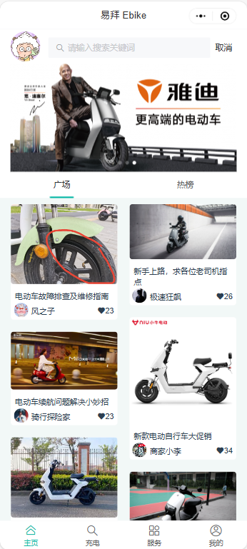
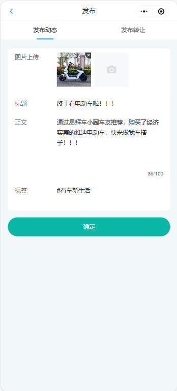
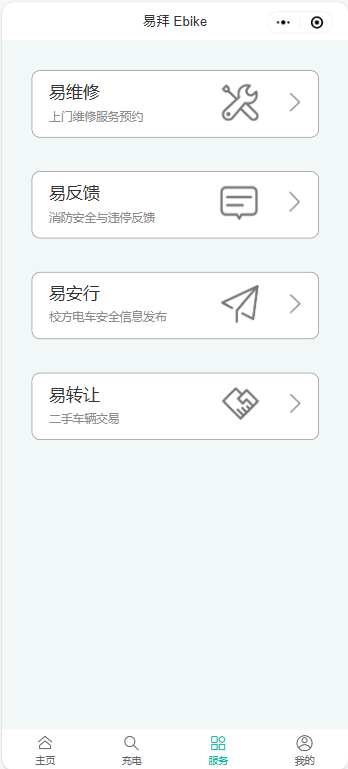
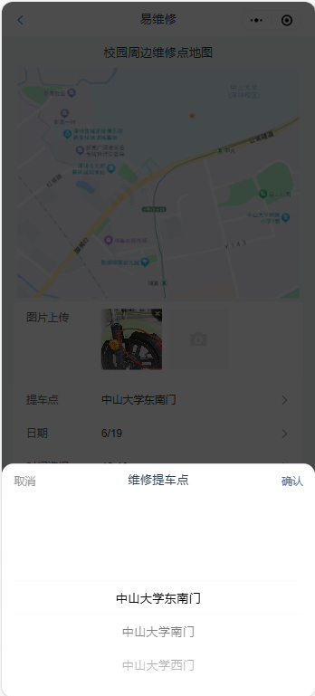
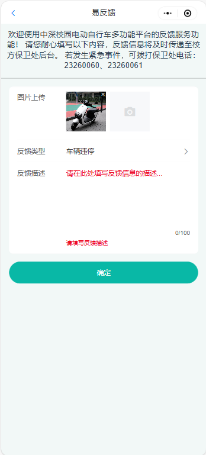
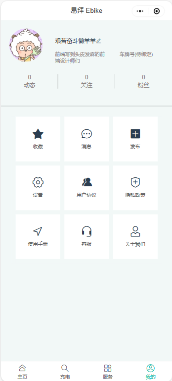
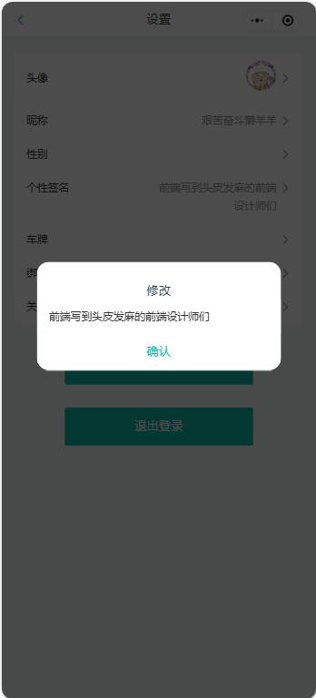
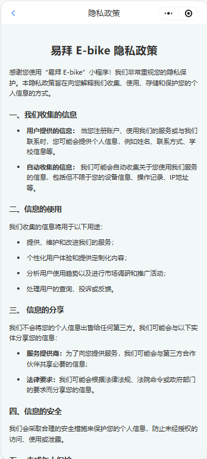
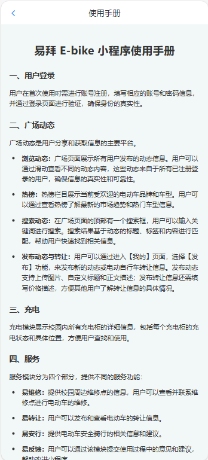
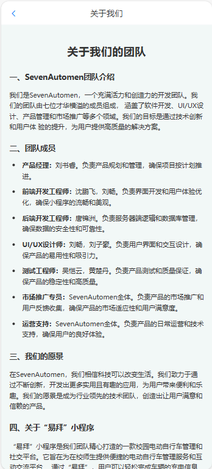

# 💂‍♀️ 用户手册

定位：指导使用；规则说明

思路：以功能为导向；这种非专业性的软件应该不需要太多技术指导，主要是覆盖功能就行

<mark style="color:red;">存在问题：</mark>登录页面？

说明：<mark style="color:orange;">橙色为需要确定的功能</mark>；<mark style="color:blue;">蓝色为完善界面后的图片；</mark><mark style="color:red;">红色为需要商定的问题</mark>

## 1 登录与身份认定

学生，老师，在校职工，第三方商家

<mark style="color:orange;">需要等待登陆界面效果</mark>

## 2 广场动态

### 2.1 浏览动态

#### 2.1.1 主页推荐

用户可以浏览实时更新的动态，如图：

<figure><figcaption>
【首页】界面
</figcaption></figure>

动态来源说明：广场动态来源为所有满足身份认定的用户。本平台主要面向对象为在校学生，故会对第三方商家的动态发布进行数量和内容上的一定限制，以保证在校学生的用户体验。

动态推荐算法说明：<mark style="color:orange;">后端是否有推荐算法？</mark>

#### 2.1.2 热榜

用户可以通过“热榜”栏查看当前排行榜，包括“车型评分榜”和“品牌热度榜”，<mark style="color:blue;">如图（展示榜单）：</mark>

热榜规则说明：<mark style="color:orange;">后端是否有相关规则？</mark>

#### 2.1.3 搜索动态

用户可以通过搜索框来搜索已发布过的动态内容，<mark style="color:blue;">如图：（点进搜索框前的样子和搜索出来后的效果）</mark>

该搜索功能基于标题、标签和内容的关键词匹配。（<mark style="color:orange;">会有一些敏感词屏蔽？后端搜索算法说明</mark>）

### 2.2 发布动态与转让

用户可以通过【我的】-【发布】-【发布动态】功能来发布自己的动态，如图：

<figure><figcaption>
【我的】-【发布】-【发布动态】界面
</figcaption></figure>

每条动态支持图片上传，用户可以自定义标题与正文描述，并且可以选择添加标签，以发现更多共同话题。

同样，用户可以通过【我的】-【发布】-【发布转让】功能来发布自己的电动自行车转让信息，如图：

<figure><figcaption>
【我的】-【发布】-【发布转让】界面
</figcaption></figure>

比之于【发布动态】，【发布转让】功能添加了价格描述，用户可以添加自己的电动车预期转让价格，如图中红框圈出内容。

注意：本平台仅支持电动自行车转让信息发布，不支持交易，请根据发布者联系方式自行商定最终价格和实施交易。关于交易过程中的任何问题，属于用户个人行为，本平台概不负责。

## 3 充电

本平台提供关于充电桩是否可用的公告，会及时反馈由于天气、施工、电力等问题造成的充电桩使用问题，以便利用户。

用户可以查看东园食堂、东教学楼、医学园、西园宿舍共四处充电桩的信息。<mark style="color:blue;">如图（展示整体图，标记出“公告部分”）：</mark>

<mark style="color:red;">这里的具体功能可能还需要商议。</mark>用户可以点开每个充电桩集群查看具体的占用情况，包括每个充电柜的使用状态，以及充电桩的监控图像，<mark style="color:blue;">如图：</mark>

## 4 服务

【服务】界面如下：

<figure><figcaption>
【服务】界面
</figcaption></figure>

### 4.1 易维修

用户可以通过【服务】-【易维修】功能来查看校园周边电动车维修点和预约维修。如图：

<figure><figcaption>
【服务】-【易维修】功能界面
</figcaption></figure>

本平台提供了校园周边维修点地图，用户可以点开维修点标识符，查看每个维修商家的具体信息和联系方式，<mark style="color:blue;">如图（展示地图和地图点开维修点标识后的页面）：</mark><mark style="color:red;">（我觉得这个功能我们没有时间做了，可能只能做个示意图出来或者含糊过去了\~）</mark>

用户可以填写信息进行电动车维修预约，商家会及时接单。比如，选择维修地点：

<figure><figcaption>
【服务】-【易维修】-“选择维修地点”界面
</figcaption></figure>

商家接单后，会在下面的聊天框中与用户联系。<mark style="color:blue;">如图（展示下面的聊天框与聊天具体界面）：</mark>

### 4.2 易反馈

发现电动自行车违规停放、违规充电等情况，用户可以通过该平台的【服务】-【易反馈】功能进行反馈，如图：

<figure><figcaption>
【服务】-【易反馈】功能界面
</figcaption></figure>

用户必须添加反馈描述，否则页面会提示“请填写反馈描述”，如图中红字。

该反馈信息将交至学校保卫处，保卫处会第一时间处理。

### 4.3 易安行

【服务】-【易安行】功能专为校方发布关于校园电动车通知与文件所设计。如校园电动车停放地点安排、电动车安全隐患统一排查、充电桩的维修公示等。<mark style="color:blue;">如图（展示整体界面）：</mark>

### 4.4 易转让

用户可以通过【服务】-【易转让】功能查看用户发布的电动自行车转让信息，<mark style="color:blue;">如图（展示整体界面和点开某一条后的界面）：</mark>

## 5 我的

【我的】页面如下：

<figure><figcaption>
【我的】页面
</figcaption></figure>

### 5.1 个人主页

<mark style="color:red;">这里点击头像或者昵称进入自己或他人的个人主页吧，修改昵称和头像放在设置中</mark>

用户点击自我的头像或昵称即可进入个人主页。主页展示有动态数、关注数、粉丝数、发布的动态和转让、个性签名等，<mark style="color:blue;">如图（展示自己的个人主页）：</mark>

点击其他用户的头像或昵称即可进入其个人主页<mark style="color:blue;">如图（展示别的用户的个人主页）：</mark>

### 5.2 个人信息

#### 5.2.1 收藏

点击收藏图标即可查看个人收藏内容，<mark style="color:blue;">如图（展示点击收藏、收藏夹内容界面）：</mark>

#### 5.2.2 消息

点击消息图标即可查看互动消息（包括私信、点赞、收藏、关注等），<mark style="color:blue;">如图（展示点击消息、互动消息内容界面）：</mark>

#### 5.2.3 发布

详见【2.2 发布动态与转让】。

#### 5.2.4 设置

点击【我的】-【设置】图标即可进行用户设置，如图：

<figure><figcaption>
【我的】-【设置】界面
</figcaption></figure>

比如，“个性签名”选项的修改：

<figure><figcaption>
“个性签名”选项修改界面
</figcaption></figure>

#### 5.2.5 用户协议

软件用户协议是一份法律文件，用于明确软件开发者和用户之间的权利和义务。它规定了用户在使用软件时必须遵守的条款和条件，包括许可使用范围、用户行为规范、隐私保护、知识产权以及责任限制等内容。用户协议的目的是保护双方的利益，确保软件的合法和规范使用，同时为可能的争议提供解决依据。用户可以在【我的】-【用户协议】中查看，如图：

<figure><figcaption>
用户协议界面
</figcaption></figure>

#### 5.2.6 隐私政策

用户可以点击【我的】-【隐私政策】查看小程序的隐私政策：

<figure><figcaption>
“隐私政策”界面
</figcaption></figure>

#### 5.2.7 使用手册

即本文档所展示内容，本手册介绍了小程序的按键使用逻辑，如下图：

<figure><figcaption>
“使用手册”示意图
</figcaption></figure>

#### 5.2.8 客服&#x20;

用户可以点击客服图标与客服沟通，<mark style="color:blue;">如图（展示点击客服图标与客服详情页）：</mark>

#### 5.2.9 关于我们

关于我们的团队介绍如下：

<figure><figcaption>
“关于我们”界面
</figcaption></figure>

## 6 互动

### 6.1 点赞

点击点赞图标即可对动态内容进行点赞，动态页面会展示点赞数量。<mark style="color:blue;">如图（点击点赞图标和点赞数量展示）：</mark>

### 6.2 收藏

点击收藏图标即收藏动态内容，动态页面会展示收藏数量，个人收藏内容可以在【我的】-【收藏】里看到。<mark style="color:blue;">如图（点击收藏图标、收藏数量展示、收藏夹展示）：</mark>

### 6.3 关注与粉丝

点击关注图标即可关注其他用户，个人关注的用户可以在【我的】-【关注】里看到，个人自己的粉丝可以在【我的】-【粉丝】中查看。<mark style="color:blue;">如图（点击关注图标、粉丝数量展示、主页中关注的用户展示，粉丝展示）：</mark>

### 6.4 私信

点开其他用户的主页，即可通过【私信】按键与该用户私聊，<mark style="color:blue;">如图（展示点击私信图标与私聊详情页）：</mark>

### 6.5 评论

在动态下，用户可以评论和回复评论，<mark style="color:blue;">如图（展示评论效果）：</mark>\
